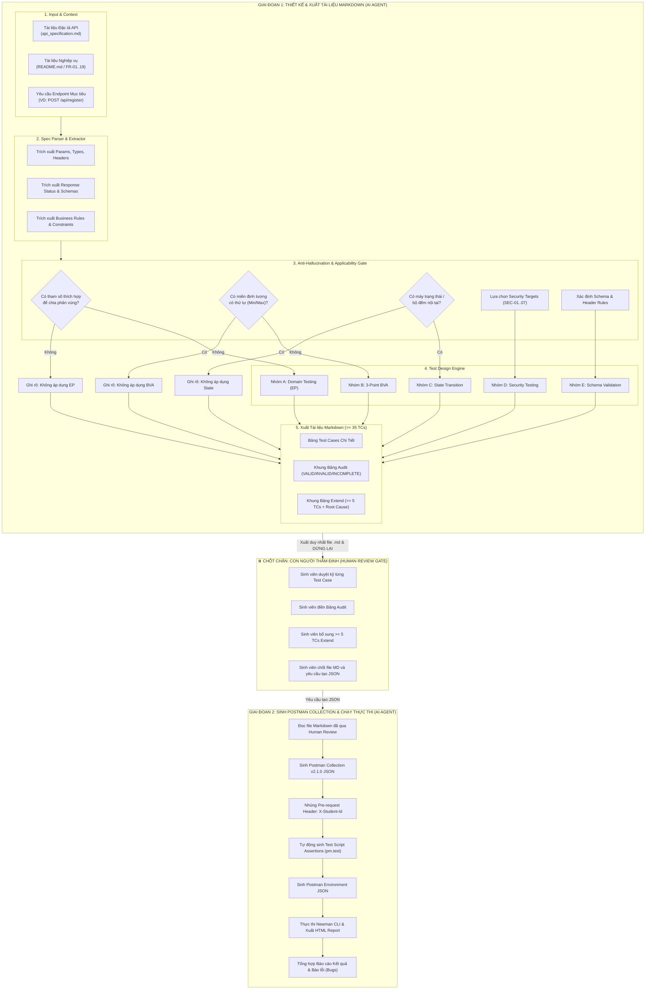

# SƠ ĐỒ THIẾT KẾ KIẾN TRÚC AGENT SKILL (AI-DRIVEN API TEST GENERATOR)

**Sinh viên thực hiện:** Ngô Thế Đạt - MSSV: 23127340  
**Môn học:** Software Testing (HW06 – API Testing)  
**Hệ thống (SUT):** EShop Backend API  

---

## 1. Sơ đồ Kiến trúc & Quy trình 2 Giai đoạn (2-Phase Interactive Flowchart)

---

## 2. Giải thích Các Quyết định Thiết kế Kiến trúc (Design Decisions)

1. **Phân tách 2 Giai đoạn độc lập:**
   * **Giai đoạn 1:** AI hỗ trợ phân tích và thiết kế test case, xuất ra tài liệu Markdown.
   * **Chốt chặn Human Gate:** Dừng lại bắt buộc để sinh viên làm chủ chất lượng kiểm thử, thực hiện Audit và Extend.
   * **Giai đoạn 2:** Chỉ khi có lệnh từ sinh viên, AI mới chuyển đổi bộ test case đã duyệt thành file Postman JSON và thực thi với Newman.
2. **Khối Anti-Hallucination Gate:**
   * Đảm bảo tính trung thực khoa học, chỉ áp dụng kỹ thuật khi có cơ sở trong tài liệu đặc tả, không tự bịa đặt dữ liệu.
3. **Tuân thủ quy định Anti-Cheat:**
   * Tự động nhúng mã định danh sinh viên `X-Student-Id: Ngô Thế Đạt - 23127340` vào mọi request Postman.
