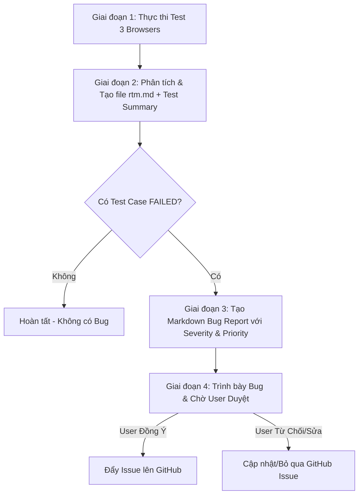

# Playwright Test Runner & Bug Reporter Skill

Skill này hướng dẫn Agent cách thực thi bộ test suite Playwright trên đa trình duyệt, tổng hợp báo cáo HTML, phân tích các test case bị lỗi (FAIL), tự động tạo file ma trận truy xuất nguồn gốc độc lập (**`rtm.md`**), tạo báo cáo lỗi **Markdown Bug Report**, và thực hiện quy trình duyệt an toàn trước khi đẩy **GitHub Issues**.

---

## 1. Yêu cầu tuân thủ & Luồng làm việc (Workflow Overview)

Quy trình thực thi gồm 4 giai đoạn chính:



---

## 2. Giai đoạn 1: Thực thi Test Suite (Execution)

1. Agent chuyển vào thư mục dự án `playwright/`.
2. Chạy lệnh kiểm thử trên cả **3 trình duyệt** (Chromium, Firefox, WebKit):
   ```bash
   npx playwright test --project=chromium --project=firefox --project=webkit
   ```
3. Đảm bảo Playwright tự động xuất file HTML Report tại `playwright/playwright-report/index.html` và lưu trữ hình ảnh/trace lỗi trong `playwright/test-results/`.

---

## 3. Giai đoạn 2: Tạo File Ma Trận RTM Độc Lập (`rtm.md`) & Test Summary

Agent đọc kết quả hiển thị từ Terminal log và sinh ra file RTM độc lập tại:
`playwright/reports/rtm.md` (đồng thời tạo bản sao tại thư mục nộp bài `25127340_HW04_AI_Automation_100/rtm.md` nếu có).

### Cấu trúc file `playwright/reports/rtm.md`:

```markdown
# 🗺️ Requirements Traceability Matrix (RTM)

**MSSV (Run by):** 23127340  
**Ngày thực thi:** <Date_Time>  
**Browsers Tested:** Chromium, Firefox, WebKit  

---

### 📊 Test Execution Summary
- **Total Features:** <Total_Features>
- **Total Test Cases:** <Total_Cases>
- **Total Browser Runs:** <Total_Runs>
- **Passed:** <Passed_Count> | **Failed:** <Failed_Count> | **Skipped:** <Skipped_Count>

---

### 📋 Detailed Traceability Matrix

| Requirement ID | Feature Name | Test Case ID | Test Type | Automation Script | Chromium | Firefox | WebKit | Linked Bug ID |
| :--- | :--- | :--- | :--- | :--- | :---: | :---: | :---: | :--- |
| FR-03 | Forgot Password | TC_FR03_01 | Positive | `tests/FR03.spec.js` | ✅ PASS | ✅ PASS | ✅ PASS | N/A |
| FR-03 | Forgot Password | TC_FR03_02 | Negative | `tests/FR03.spec.js` | ❌ FAIL | ❌ FAIL | ❌ FAIL | `BUG-FR03-01` |
| FR-03 | Forgot Password | TC_FR03_03 | Edge Case | `tests/FR03.spec.js` | ✅ PASS | ✅ PASS | ✅ PASS | N/A |
```

> **Lưu ý Reference:** Trong các file `README.md` và `main_report.md`, nhúng bảng RTM hoặc trỏ link reference tới file này:
> `👉 Xem chi tiết [Requirements Traceability Matrix (RTM)](rtm.md)`

---

## 4. Giai đoạn 3: Tạo File Báo Cáo Lỗi (Markdown Bug Report)

Nếu phát hiện có ít nhất 1 test case bị **FAILED**, Agent sẽ đọc thông tin lỗi chi tiết trong log và thư mục `test-results/`, sau đó tạo file Markdown báo cáo lỗi tại:
`playwright/reports/bug_report_<Feature_ID>.md` (Ví dụ: `playwright/reports/bug_report_FR03.md`).

### Mẫu cấu trúc File Bug Report (`bug_report_<Feature_ID>.md`):

> **⚠️ LƯU Ý ĐƯỜNG DẪN ẢNH SCREENSHOT:**
> - Báo cáo lưu tại `playwright/reports/bug_report_<Feature_ID>.md`.
> - Thư mục ảnh nằm tại `playwright/test-results/<folder-name>/test-failed-1.png`.
> - **Đường dẫn tương đối CHUẨN phải là `../test-results/`** (chỉ đi lên 1 cấp thư mục từ `reports/` lên `playwright/`). KHÔNG dùng `../../test-results/`.
> - Đảm bảo `playwright.config.js` đã bật `use: { screenshot: 'only-on-failure' }` để tự động chụp ảnh `.png` khi test FAIL.
> - Sau khi tạo file Markdown, phải kiểm tra sự tồn tại của file ảnh `.png` thực tế trước khi hoàn tất.

```markdown
# 🐛 Báo Cáo Lỗi Kiểm Thử (Bug Report) - Feature <Feature_ID>

**Ngày tạo:** <Date_Time>  
**Người thực hiện:** 23127340  

---

## [BUG-01] <Tóm tắt tiêu đề lỗi ngắn gọn>

- **Bug ID:** BUG-<Feature_ID>-01
- **Test Case liên quan:** <TC_ID> (<Mô tả test case>)
- **Trình duyệt bị lỗi:** Chromium / Firefox / WebKit
- **Severity (Mức độ nghiêm trọng kỹ thuật):** Critical / Major / Minor / Low
- **Priority (Mức độ ưu tiên xử lý kinh doanh):** P1 (High) / P2 (Medium) / P3 (Low)
- **Trạng thái:** New

### 1. Các bước tái hiện (Steps to Reproduce)
1. Truy cập trang `<URL>`
2. Nhập dữ liệu đầu vào: `<Input_Data>`
3. Nhấn nút `<Button_Name>`

### 2. Kết quả thực tế (Actual Result)
`<Mô tả lỗi thực tế hoặc Error Message từ Playwright log>`

### 3. Kết quả kỳ vọng (Expected Result)
`<Mô tả kết quả đúng theo yêu cầu đặc tả>`

### 4. Bằng chứng lỗi (Evidence Screenshot)

```

---

## 5. Giai đoạn 4: Quy Trình An Toàn & Kỹ Thuật Đẩy GitHub Issues (Human-in-the-Loop)

⚠️ **QUY TẮC AN TOÀN TUYỆT ĐỐI:** Agent **KHÔNG BẤT KỲ LÚC NÀO** tự ý gọi công cụ đẩy Issue lên GitHub mà chưa có sự đồng ý rõ ràng của người dùng!

### Các bước thực hiện:

1. **Bước 1 (Hiển thị xem trước):** Agent hiển thị tóm tắt danh sách các Bug tìm được lên cửa sổ chat theo dạng:
   > 📢 **Phát hiện <X> lỗi trong quá trình chạy test:**
   > - **Bug 1:** `[HW04][BUG-FR03-01] Nút Quên mật khẩu không phản hồi khi bấm`
   >   - **Severity:** Major | **Priority:** P1 (High)
   >   - **Trình duyệt bị lỗi:** Firefox
   >   - **Báo cáo RTM đã tạo tại:** `playwright/reports/rtm.md`
   >   - **Bug Report đã tạo tại:** `playwright/reports/bug_report_FR03.md`
   > 
   > ❓ **Bạn có muốn tôi tự động tạo GitHub Issue cho <X> lỗi này lên repository không?** (Hãy trả lời 'Đồng ý' hoặc 'Không').

2. **Bước 2 (Xử lý phản hồi của User):**
   - **Trường hợp B (User từ chối / Muốn chỉnh sửa):** Agent chỉ lưu file Markdown cục bộ mà KHÔNG thực hiện tạo GitHub Issue.
   - **Trường hợp A (User đồng ý / Approve):** Thực hiện quy trình tạo Issue chuẩn theo các bước kỹ thuật bên dưới.

---

### 💡 Quy trình Kỹ thuật Tạo Issue & Xử lý Ảnh Screenshot Minh Chứng

#### A. Định dạng Tiêu đề Issue (Title Prefix Requirement):
- **Bắt buộc thêm tiền tố `[HW04]` vào trước mỗi tiêu đề Issue.**
- Cấu trúc tiêu đề chuẩn: `[HW04][<Bug_ID>] <Tóm tắt tiêu đề lỗi ngắn gọn>`  
  *(Ví dụ: `[HW04][BUG-FR03-01] SUT sinh mã OTP gồm 4 chữ số thay vì 6 chữ số theo đúng yêu cầu đặc tả SRS`)*

#### B. Xử lý Ảnh Screenshot để Không Bị Lỗi Hiển Thị (Broken Image Link):
1. **Lý do:** Thư mục `test-results/` bị `.gitignore` loại trừ, nếu dùng link trong `test-results/` trên GitHub Issue sẽ bị 404 / broken image.
2. **Quy trình chuẩn:**
   - Copy các ảnh screenshot lỗi từ `test-results/.../test-failed-1.png` vào thư mục `reports/assets/` với tên chuẩn ASCII (ví dụ: `assets/bug-fr03-01.png`).
   - Cập nhật link ảnh trong file `bug_report_<Feature_ID>.md` trỏ tương đối về `assets/bug-<Feature_ID>-01.png`.
   - Thực hiện `git add reports/`, `git commit -m "docs: add evidence screenshots for <Feature_ID> bug reports"` và `git push origin <current-branch>` (ví dụ branch `HW02/Dat`).
   - Trong body của GitHub Issue, sử dụng đường dẫn Raw GitHub CDN chính thức của file ảnh đã push:
     `https://raw.githubusercontent.com/<owner>/<repo>/<branch>/<path_to_assets>/bug-<Feature_ID>-01.png`

#### C. Phương pháp Tạo Issue qua GitHub REST API (Handling Token & MCP):
1. **Về GitHub MCP Tool:**
   - Nếu GitHub MCP Tool bị lỗi `Resource not accessible by personal access token` (do MCP PAT chỉ ở chế độ Read-only), Agent sử dụng Token được lưu trong Git Credential Manager cục bộ.
2. **Lấy Token & Đẩy Issue bằng Lệnh / Node.js Script:**
   - Chạy lệnh lấy token:
     ```bash
     powershell -Command "echo 'url=https://github.com/<owner>/<repo>.git' | git credential fill"
     ```
   - Sử dụng Token thu được (`password`) để gọi GitHub REST API `POST /repos/<owner>/<repo>/issues` (hoặc `PATCH /repos/<owner>/<repo>/issues/<issue_number>` nếu cập nhật) với Body chứa tiêu đề đã có tiền tố `[HW04]`, nhãn (`bug`, `Severity`, `Priority`), mô tả lỗi và đường dẫn Raw CDN của ảnh bằng chứng.

