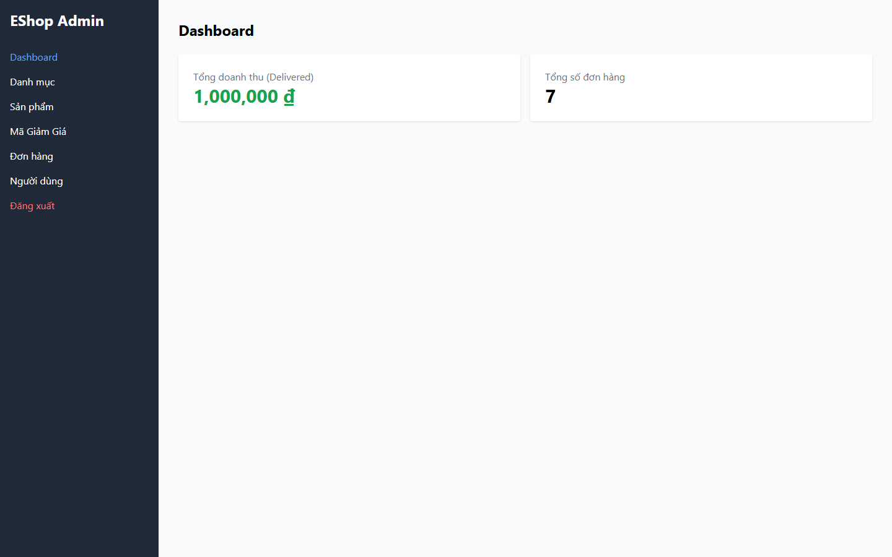
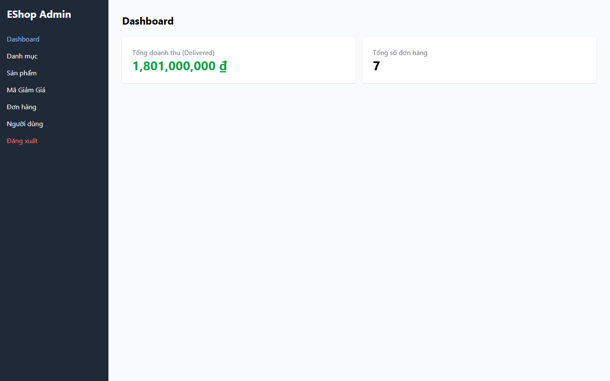

# [BUG][Admin Dashboard] Doanh thu đã giao trên Dashboard bị tính gấp đôi

## Found by Test Case

- GUI-012
- GUI-052

## Related Requirements

FR-13; SCOPE-05

## Severity / Priority

High / P1

Doanh thu đã giao bị tính gấp đôi, có thể dẫn đến quyết định kinh doanh và báo cáo sai.

## Environment

- SUT: EShop
- Module: Admin Dashboard
- Browser: Playwright Chromium (không ghi nhận browser version)
- OS: Windows 11 Home Single Language, build 26200
- Viewport: 1440 x 900
- Zoom: 100%
- Admin URL: `http://localhost:5174`
- Backend URL: `http://localhost:3000`
- Dataset/fixture: fixture 7 đơn hàng thật khi áp dụng; controlled response khi nêu bên dưới
- Ngày thực thi: 2026-08-01
- SUT commit: `85af3ba875c88283615e22cb108f13e2fccaf0e9`

## Preconditions

Fixture có delivered baseline 500.000 ₫ và order #5 giá 900.000.000 ₫.

## Steps to Reproduce

1. Đăng nhập Web Admin bằng tài khoản admin hợp lệ khi cần.
2. Mở Dashboard, giao order #5, rồi so sánh doanh thu.
3. Quan sát hành vi giao diện.

## Expected Result

Baseline là 500.000 ₫; giao order #5 tăng 900.000.000 ₫.

## Actual Result

Baseline hiển thị 1.000.000 ₫; order #5 làm doanh thu tăng 1.800.000.000 ₫.

## Reproducibility

Luôn tái hiện được (quan sát trên Live SUT).

## Impact

Admin nhận số liệu doanh thu gấp đôi.

## Evidence

## Execution Notes

Live SUT
## Related Checklist Result

| Checklist ID | Status | Actual Result |
| ------------ | ------ | ------------- |
| GUI-012 | Failed | Dashboard hiển thị doanh thu đã giao 1.000.000 ₫, trong khi baseline độc lập là 500.000 ₫. |
| GUI-052 | Failed | Số order 7 → 7; doanh thu 1.000.000 → 1.801.000.000 ₫, tăng 1.800.000.000 ₫ sau khi giao order #5 trị giá 900.000.000 ₫. |

## Suggested Labels

- `type:bug`
- `status:new`
- `found-by:gui-checklist`
- `module:admin-dashboard`
- `severity:high`
- `priority:p1`

## Human Confirmation

- Confirmed by student: Yes
- Confirmation date: 2026-08-02
- Evidence reviewed: GUI-012-observed.png, GUI-052-observed.png
- GitHub issue: Not created
