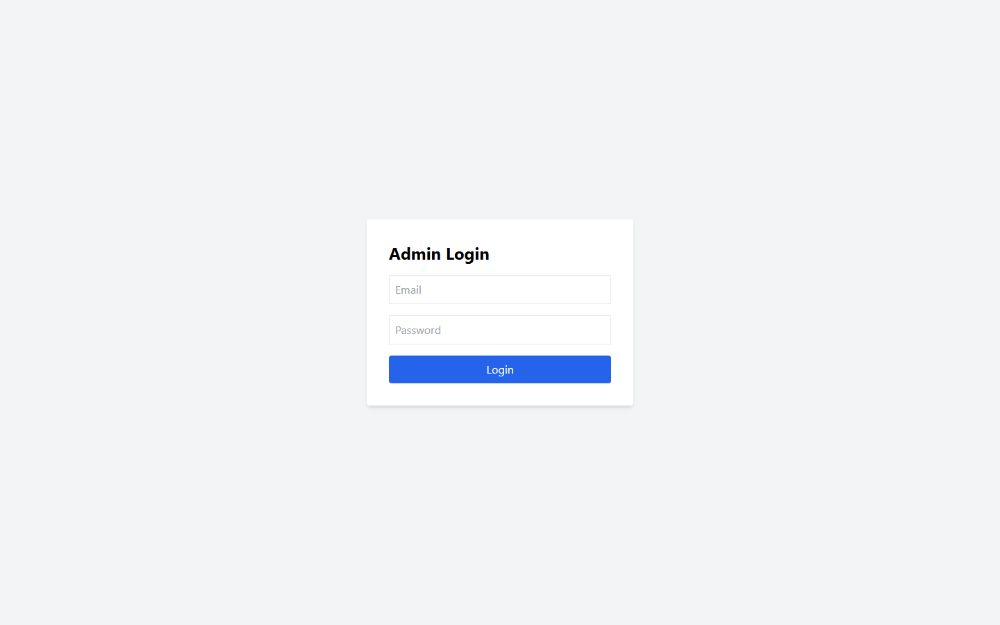

# [BUG][Admin Login] Trường bắt buộc rỗng vẫn gửi request đăng nhập

## Found by Test Case

- GUI-019

## Related Requirements

FR-12; SCOPE-01

## Severity / Priority

Medium / P2

Form không chặn trường bắt buộc rỗng trước khi gửi request, gây feedback kém cụ thể và request không cần thiết.

## Environment

- SUT: EShop
- Module: Admin Login
- Browser: Playwright Chromium (không ghi nhận browser version)
- OS: Windows 11 Home Single Language, build 26200
- Viewport: 1440 x 900
- Zoom: 100%
- Admin URL: `http://localhost:5174`
- Backend URL: `http://localhost:3000`
- Dataset/fixture: fixture 7 đơn hàng thật khi áp dụng; controlled response khi nêu bên dưới
- Ngày thực thi: 2026-08-01
- SUT commit: `85af3ba875c88283615e22cb108f13e2fccaf0e9`

## Preconditions

Login response được mock để không thay đổi trạng thái tài khoản.

## Steps to Reproduce

1. Đăng nhập Web Admin bằng tài khoản admin hợp lệ khi cần.
2. Để trống Email/Password rồi chọn Đăng nhập.
3. Quan sát hành vi giao diện.

## Expected Result

Validation phía client phải chặn submit trước khi gửi request.

## Actual Result

Một request được gửi; hai thuộc tính required đều null.

## Reproducibility

Cần điều kiện mock; một controlled run.

## Impact

Tạo request xác thực không cần thiết và feedback chung chung.

## Evidence

## Execution Notes

Controlled mocked response
> Mock chỉ được dùng để tạo trạng thái đầu vào có kiểm soát. Kết luận bug dựa trên phản hồi của GUI, không phải tuyên bố rằng backend thật đã trả lỗi này.

## Related Checklist Result

| Checklist ID | Status | Actual Result |
| ------------ | ------ | ------------- |
| GUI-019 | Failed | Form rỗng tạo 1 request; các thuộc tính required là [null, null]; dialog là Đăng nhập thất bại. |

## Suggested Labels

- `type:bug`
- `status:new`
- `found-by:gui-checklist`
- `module:admin-login`
- `severity:medium`
- `priority:p2`

## Human Confirmation

- Confirmed by student: Yes
- Confirmation date: 2026-08-02
- Evidence reviewed: GUI-019-observed.png
- GitHub issue: Not created
