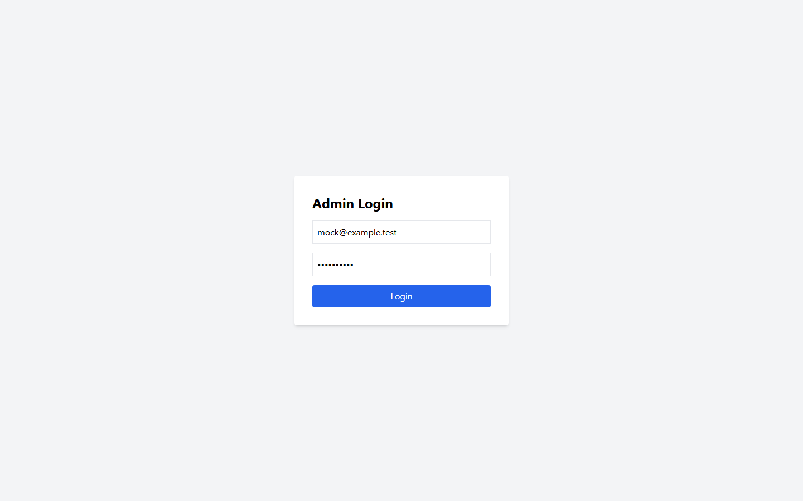

# [BUG][Admin Login] Đăng nhập cho phép gửi trùng khi request đang pending

## Found by Test Case

- GUI-017

## Related Requirements

FR-12; SCOPE-01

## Severity / Priority

Medium / P2

Gửi trùng request đăng nhập khi pending có thể tăng tải và gây phản hồi xác thực khó hiểu.

## Environment

- SUT: EShop
- Module: Admin Login
- Browser: Playwright Chromium (không ghi nhận browser version)
- OS: Windows 11 Home Single Language, build 26200
- Viewport: 1440 x 900
- Zoom: 100%
- Admin URL: `http://localhost:5174`
- Backend URL: `http://localhost:3000`
- Dataset/fixture: fixture 7 đơn hàng thật khi áp dụng; controlled response khi nêu bên dưới
- Ngày thực thi: 2026-08-01
- SUT commit: `85af3ba875c88283615e22cb108f13e2fccaf0e9`

## Preconditions

Login response bị delay có kiểm soát.

## Steps to Reproduce

1. Đăng nhập Web Admin bằng tài khoản admin hợp lệ khi cần.
2. Double-click Đăng nhập khi request đang pending.
3. Quan sát hành vi giao diện.

## Expected Result

Chỉ một request được gửi và nút phải được guard.

## Actual Result

Double-click tạo hai request; nút không disabled.

## Reproducibility

Cần điều kiện mock; một controlled run.

## Impact

Tăng tải và có thể gây feedback đăng nhập khó hiểu.

## Evidence

## Execution Notes

Controlled mocked response
> Mock chỉ được dùng để tạo trạng thái đầu vào có kiểm soát. Kết luận bug dựa trên phản hồi của GUI, không phải tuyên bố rằng backend thật đã trả lỗi này.

## Related Checklist Result

| Checklist ID | Status | Actual Result |
| ------------ | ------ | ------------- |
| GUI-017 | Failed | Double-click tạo 2 request đăng nhập; disabled state của nút là false. |

## Suggested Labels

- `type:bug`
- `status:new`
- `found-by:gui-checklist`
- `module:admin-login`
- `severity:medium`
- `priority:p2`

## Human Confirmation

- Confirmed by student: Yes
- Confirmation date: 2026-08-02
- Evidence reviewed: GUI-017-observed.png
- GitHub issue: Not created
