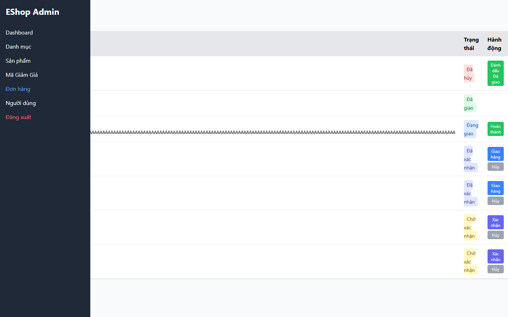

# [BUG][Admin Orders] Cập nhật trạng thái cho phép gửi request trùng khi pending

## Found by Test Case

- GUI-026

## Related Requirements

FR-10, FR-18; SCOPE-14 đến SCOPE-18

## Severity / Priority

High / P2

Gửi trùng cập nhật trạng thái có thể tạo race condition hoặc xử lý trạng thái đơn hàng lặp.

## Environment

- SUT: EShop
- Module: Admin Orders
- Browser: Playwright Chromium (không ghi nhận browser version)
- OS: Windows 11 Home Single Language, build 26200
- Viewport: 1440 x 900
- Zoom: 100%
- Admin URL: `http://localhost:5174`
- Backend URL: `http://localhost:3000`
- Dataset/fixture: fixture 7 đơn hàng thật khi áp dụng; controlled response khi nêu bên dưới
- Ngày thực thi: 2026-08-01
- SUT commit: `85af3ba875c88283615e22cb108f13e2fccaf0e9`

## Preconditions

Có row action hợp lệ; update response bị delay có kiểm soát.

## Steps to Reproduce

1. Đăng nhập Web Admin bằng tài khoản admin hợp lệ khi cần.
2. Double-click action trạng thái khi request đầu tiên pending.
3. Quan sát hành vi giao diện.

## Expected Result

Chỉ một update request được gửi và action phải được guard.

## Actual Result

Double-click tạo hai update request; action không disabled.

## Reproducibility

Cần điều kiện mock; một controlled run.

## Impact

Có rủi ro trạng thái đơn bị xử lý lặp.

## Evidence

## Execution Notes

Controlled mocked response
> Mock chỉ được dùng để tạo trạng thái đầu vào có kiểm soát. Kết luận bug dựa trên phản hồi của GUI, không phải tuyên bố rằng backend thật đã trả lỗi này.

## Related Checklist Result

| Checklist ID | Status | Actual Result |
| ------------ | ------ | ------------- |
| GUI-026 | Failed | Double-click tạo 2 mocked update request; disabled state là false. |

## Suggested Labels

- `type:bug`
- `status:new`
- `found-by:gui-checklist`
- `module:admin-orders`
- `severity:high`
- `priority:p2`

## Human Confirmation

- Confirmed by student: Yes
- Confirmation date: 2026-08-02
- Evidence reviewed: GUI-026-observed.png
- GitHub issue: Not created
