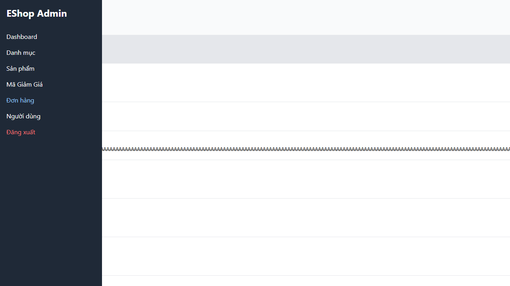

# [BUG][Admin Navigation] Điều hướng sidebar không thể truy cập bằng bàn phím

## Found by Test Case

- GUI-033
- GUI-034
- GUI-035
- GUI-057

## Related Requirements

FR-12, FR-18; SCOPE-02, SCOPE-03, SCOPE-24

## Severity / Priority

Medium / P2

Keyboard-only user không thể dùng sidebar để điều hướng giữa các màn hình Admin chính.

## Environment

- SUT: EShop
- Module: Admin Navigation
- Browser: Playwright Chromium (không ghi nhận browser version)
- OS: Windows 11 Home Single Language, build 26200
- Viewport: 1440 x 900; kèm review 1280 x 720 ở 200% zoom
- Zoom: 100% và 200%
- Admin URL: `http://localhost:5174`
- Backend URL: `http://localhost:3000`
- Dataset/fixture: fixture 7 đơn hàng thật khi áp dụng; controlled response khi nêu bên dưới
- Ngày thực thi: 2026-08-01
- SUT commit: `85af3ba875c88283615e22cb108f13e2fccaf0e9`

## Preconditions

Admin đã đăng nhập Dashboard hoặc Orders.

## Steps to Reproduce

1. Đăng nhập Web Admin bằng tài khoản admin hợp lệ khi cần.
2. Nhấn Tab ở 100% và 200% zoom, thử focus Dashboard/Đơn hàng.
3. Quan sát hành vi giao diện.

## Expected Result

Sidebar phải nhận focus và kích hoạt được ở cả hai mức zoom.

## Actual Result

Dashboard và Đơn hàng là LI tabIndex -1; Tab bỏ qua sidebar. Ở 200%, reflow, horizontal scrolling và action bảng vẫn dùng được.

## Reproducibility

Luôn tái hiện được (manual accessibility review).

## Impact

Người dùng bàn phím không thể điều hướng bằng sidebar.

## Evidence

## Execution Notes

Manual accessibility review
## Related Checklist Result

| Checklist ID | Status | Actual Result |
| ------------ | ------ | ------------- |
| GUI-033 | Failed | Dashboard và Đơn hàng là LI có tabIndex -1. |
| GUI-034 | Failed | Sidebar không thể nhận keyboard focus nên không có focus indicator. |
| GUI-035 | Failed | Focus Tab đầu tiên không đi qua sidebar; text được focus là Đánh dấu Đã giao. |
| GUI-057 | Failed | Đã chụp baseline 1280 x 720; manual review 200% xác nhận sidebar vẫn không nhận keyboard focus. |

## Suggested Labels

- `type:bug`
- `status:new`
- `found-by:gui-checklist`
- `module:admin-navigation`
- `severity:medium`
- `priority:p2`

## Human Confirmation

- Confirmed by student: Yes
- Confirmation date: 2026-08-02
- Evidence reviewed: GUI-033-observed.png, GUI-034-observed.png, GUI-035-observed.png, GUI-057-1280x720-manual-zoom.png
- GitHub issue: Not created
