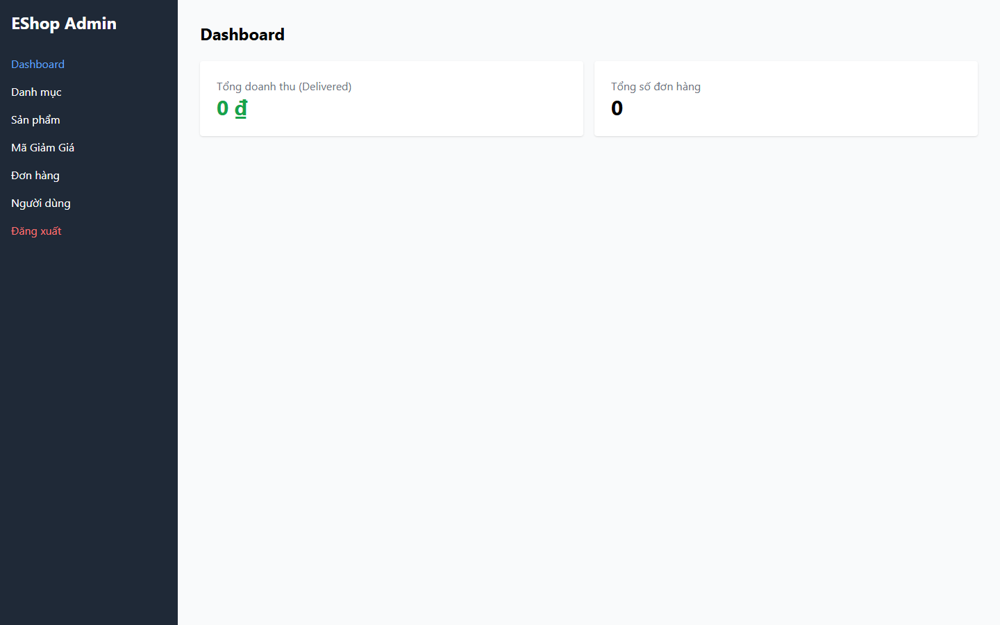

# [BUG][Admin Dashboard] Loading dữ liệu ban đầu không phân biệt được với dữ liệu bằng 0

## Found by Test Case

- GUI-040

## Related Requirements

FR-13; SCOPE-05, SCOPE-06

## Severity / Priority

Medium / P3

Giá trị 0 trong lúc loading có thể bị admin hiểu nhầm là dữ liệu kinh doanh thật.

## Environment

- SUT: EShop
- Module: Admin Dashboard
- Browser: Playwright Chromium (không ghi nhận browser version)
- OS: Windows 11 Home Single Language, build 26200
- Viewport: 1440 x 900
- Zoom: 100%
- Admin URL: `http://localhost:5174`
- Backend URL: `http://localhost:3000`
- Dataset/fixture: fixture 7 đơn hàng thật khi áp dụng; controlled response khi nêu bên dưới
- Ngày thực thi: 2026-08-01
- SUT commit: `85af3ba875c88283615e22cb108f13e2fccaf0e9`

## Preconditions

Initial orders fetch bị delay có kiểm soát.

## Steps to Reproduce

1. Đăng nhập Web Admin bằng tài khoản admin hợp lệ khi cần.
2. Mở Dashboard trước khi request hoàn tất.
3. Quan sát hành vi giao diện.

## Expected Result

Loading state phải phân biệt dữ liệu đang chờ với giá trị 0 thật.

## Actual Result

Không có loading indicator; giá trị 0 đang hiển thị.

## Reproducibility

Cần điều kiện mock; một controlled run.

## Impact

Admin có thể hiểu nhầm loading là không có dữ liệu.

## Evidence

## Execution Notes

Controlled mocked response
> Mock chỉ được dùng để tạo trạng thái đầu vào có kiểm soát. Kết luận bug dựa trên phản hồi của GUI, không phải tuyên bố rằng backend thật đã trả lỗi này.

## Related Checklist Result

| Checklist ID | Status | Actual Result |
| ------------ | ------ | ------------- |
| GUI-040 | Failed | Trong initial fetch bị delay: có 0 loading indicator và 1 giá trị 0 hiển thị. |

## Suggested Labels

- `type:bug`
- `status:new`
- `found-by:gui-checklist`
- `module:admin-dashboard`
- `severity:medium`
- `priority:p3`

## Human Confirmation

- Confirmed by student: Yes
- Confirmation date: 2026-08-02
- Evidence reviewed: GUI-040-observed.png
- GitHub issue: Not created
