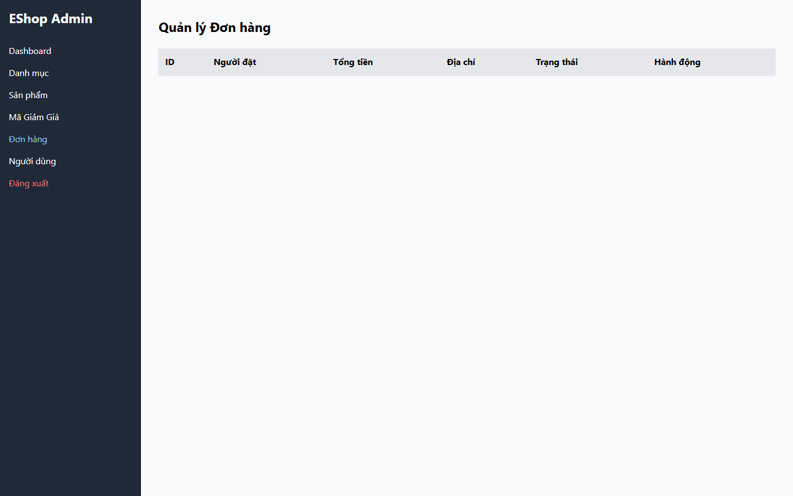

# [BUG][Admin Orders] Response Orders rỗng không có empty-state message

## Found by Test Case

- GUI-041

## Related Requirements

FR-18; SCOPE-08

## Severity / Priority

Medium / P3

Bảng trống không giải thích rằng không có đơn hàng, làm mơ hồ giữa empty state và lỗi hiển thị.

## Environment

- SUT: EShop
- Module: Admin Orders
- Browser: Playwright Chromium (không ghi nhận browser version)
- OS: Windows 11 Home Single Language, build 26200
- Viewport: 1440 x 900
- Zoom: 100%
- Admin URL: `http://localhost:5174`
- Backend URL: `http://localhost:3000`
- Dataset/fixture: fixture 7 đơn hàng thật khi áp dụng; controlled response khi nêu bên dưới
- Ngày thực thi: 2026-08-01
- SUT commit: `85af3ba875c88283615e22cb108f13e2fccaf0e9`

## Preconditions

Orders response được mock là `[]`.

## Steps to Reproduce

1. Đăng nhập Web Admin bằng tài khoản admin hợp lệ khi cần.
2. Mở Đơn hàng và quan sát bảng.
3. Quan sát hành vi giao diện.

## Expected Result

Phải có empty-state message.

## Actual Result

Có 0 row và 0 empty-state message.

## Reproducibility

Cần điều kiện mock; một controlled run.

## Impact

Không phân biệt được dataset trống với lỗi hiển thị.

## Evidence

## Execution Notes

Controlled mocked response
> Mock chỉ được dùng để tạo trạng thái đầu vào có kiểm soát. Kết luận bug dựa trên phản hồi của GUI, không phải tuyên bố rằng backend thật đã trả lỗi này.

## Related Checklist Result

| Checklist ID | Status | Actual Result |
| ------------ | ------ | ------------- |
| GUI-041 | Failed | Mocked response rỗng tạo 0 row và 0 empty-state message. |

## Suggested Labels

- `type:bug`
- `status:new`
- `found-by:gui-checklist`
- `module:admin-orders`
- `severity:medium`
- `priority:p3`

## Human Confirmation

- Confirmed by student: Yes
- Confirmation date: 2026-08-02
- Evidence reviewed: GUI-041-observed.png
- GitHub issue: Not created
