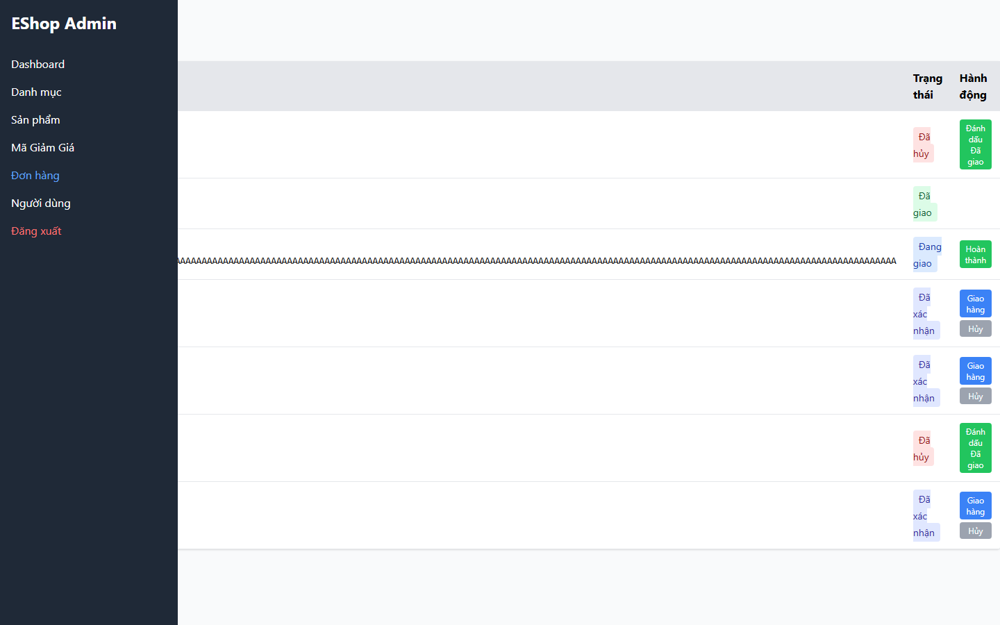
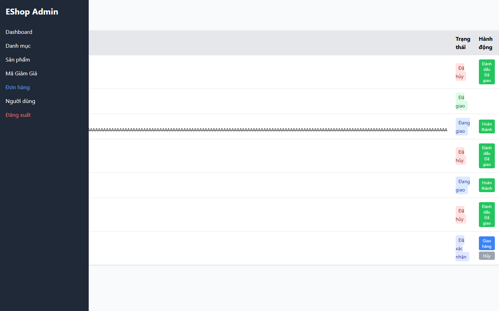

# [BUG][Admin Orders] Đơn đã hủy vẫn có action chuyển sang đã giao

## Found by Test Case

- GUI-047
- GUI-049
- GUI-051

## Related Requirements

FR-10, FR-18; SCOPE-20

## Severity / Priority

High / P1

Canceled là final state nhưng UI vẫn cho action chuyển sang delivered, làm sai state machine đơn hàng.

## Environment

- SUT: EShop
- Module: Admin Orders
- Browser: Playwright Chromium (không ghi nhận browser version)
- OS: Windows 11 Home Single Language, build 26200
- Viewport: 1440 x 900
- Zoom: 100%
- Admin URL: `http://localhost:5174`
- Backend URL: `http://localhost:3000`
- Dataset/fixture: fixture 7 đơn hàng thật khi áp dụng; controlled response khi nêu bên dưới
- Ngày thực thi: 2026-08-01
- SUT commit: `85af3ba875c88283615e22cb108f13e2fccaf0e9`

## Preconditions

Có ít nhất một order canceled.

## Steps to Reproduce

1. Đăng nhập Web Admin bằng tài khoản admin hợp lệ khi cần.
2. Mở Đơn hàng và quan sát action của row canceled.
3. Quan sát hành vi giao diện.

## Expected Result

Canceled là final state và không có action chuyển tiếp.

## Actual Result

Row Đã hủy vẫn có Đánh dấu Đã giao; row delivered không có action.

## Reproducibility

Luôn tái hiện được (quan sát trên Live SUT).

## Impact

Có thể áp dụng transition không hợp lệ.

## Evidence

## Execution Notes

Live SUT
## Related Checklist Result

| Checklist ID | Status | Actual Result |
| ------------ | ------ | ------------- |
| GUI-047 | Failed | Order #2 chuyển sang Đã hủy nhưng vẫn còn action Đánh dấu Đã giao. |
| GUI-049 | Failed | Order #4 chuyển trực tiếp sang Đã hủy nhưng vẫn còn action Đánh dấu Đã giao. |
| GUI-051 | Failed | Delivered order không có action; canceled order có action Đánh dấu Đã giao. |

## Suggested Labels

- `type:bug`
- `status:new`
- `found-by:gui-checklist`
- `module:admin-orders`
- `severity:high`
- `priority:p1`

## Human Confirmation

- Confirmed by student: Yes
- Confirmation date: 2026-08-02
- Evidence reviewed: GUI-047-observed.png, GUI-049-observed.png, GUI-051-observed.png
- GitHub issue: Not created
