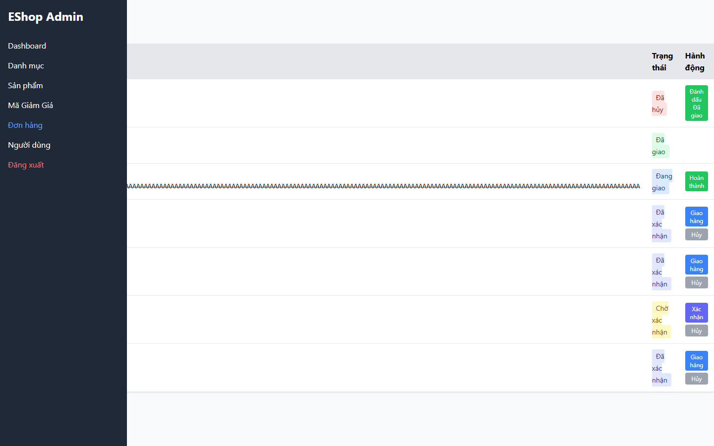

# [BUG][Admin Orders] Focus bị mất sau khi cập nhật trạng thái inline

## Found by Test Case

- GUI-038
- GUI-056

## Related Requirements

FR-10, FR-18; SCOPE-22, SCOPE-24

## Severity / Priority

Medium / P2

Focus bị mất sau cập nhật, khiến keyboard và screen-reader user mất ngữ cảnh thao tác.

## Environment

- SUT: EShop
- Module: Admin Orders
- Browser: Playwright Chromium (không ghi nhận browser version)
- OS: Windows 11 Home Single Language, build 26200
- Viewport: 1440 x 900
- Zoom: 100%
- Admin URL: `http://localhost:5174`
- Backend URL: `http://localhost:3000`
- Dataset/fixture: fixture 7 đơn hàng thật khi áp dụng; controlled response khi nêu bên dưới
- Ngày thực thi: 2026-08-01
- SUT commit: `85af3ba875c88283615e22cb108f13e2fccaf0e9`

## Preconditions

Order #1 có thể chuyển pending sang confirmed.

## Steps to Reproduce

1. Đăng nhập Web Admin bằng tài khoản admin hợp lệ khi cần.
2. Cập nhật trạng thái order #1 và kiểm tra active element sau rerender.
3. Quan sát hành vi giao diện.

## Expected Result

Focus phải ở control/feedback gắn với row vừa cập nhật.

## Actual Result

document.activeElement là BODY.

## Reproducibility

Luôn tái hiện được (manual accessibility review).

## Impact

Người dùng bàn phím và screen reader mất vị trí.

## Evidence

## Execution Notes

Manual accessibility review
## Related Checklist Result

| Checklist ID | Status | Actual Result |
| ------------ | ------ | ------------- |
| GUI-038 | Failed | Sau cập nhật trạng thái order #1, focus chuyển đến BODY thay vì row/feedback liên quan. |
| GUI-056 | Failed | Sau cập nhật trạng thái order #1, focus chuyển đến BODY thay vì row/feedback liên quan. |

## Suggested Labels

- `type:bug`
- `status:new`
- `found-by:gui-checklist`
- `module:admin-orders`
- `severity:medium`
- `priority:p2`

## Human Confirmation

- Confirmed by student: Yes
- Confirmation date: 2026-08-02
- Evidence reviewed: GUI-046-observed.png
- GitHub issue: Not created
