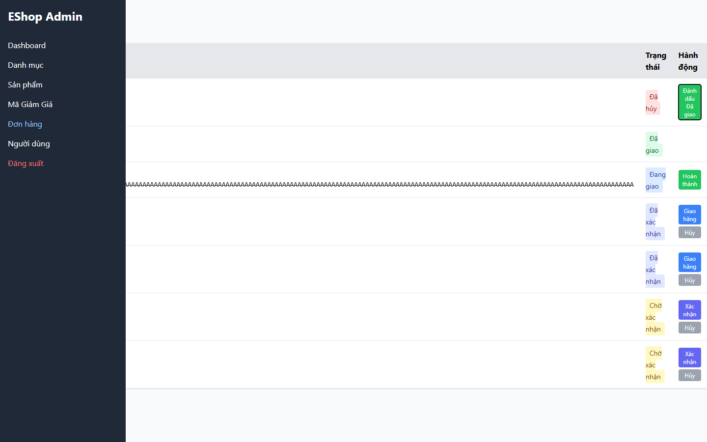

# [BUG][Admin Orders] Tên accessible của row action lặp không có ngữ cảnh đơn hàng độc lập

## Found by Test Case

- GUI-054

## Related Requirements

FR-18; SCOPE-24

## Severity / Priority

Medium / P3

Tên action lặp không có order context khi được đọc hoặc liệt kê độc lập.

## Environment

- SUT: EShop
- Module: Admin Orders
- Browser: Playwright Chromium (không ghi nhận browser version)
- OS: Windows 11 Home Single Language, build 26200
- Viewport: 1440 x 900
- Zoom: 100%
- Admin URL: `http://localhost:5174`
- Backend URL: `http://localhost:3000`
- Dataset/fixture: fixture 7 đơn hàng thật khi áp dụng; controlled response khi nêu bên dưới
- Ngày thực thi: 2026-08-01
- SUT commit: `85af3ba875c88283615e22cb108f13e2fccaf0e9`

## Preconditions

Có nhiều row action cùng tên.

## Steps to Reproduce

1. Đăng nhập Web Admin bằng tài khoản admin hợp lệ khi cần.
2. So sánh accessible name của các action trong các row khác nhau.
3. Quan sát hành vi giao diện.

## Expected Result

Mỗi action phải tự chứa order ID hoặc ngữ cảnh đơn hàng.

## Actual Result

Hủy, Giao hàng, Xác nhận và Đánh dấu Đã giao lặp lại, không có order context.

## Reproducibility

Luôn tái hiện được (manual accessibility review).

## Impact

Screen reader khó chọn đúng action khi controls được đọc độc lập.

## Evidence

## Execution Notes

Manual accessibility review
## Related Checklist Result

| Checklist ID | Status | Actual Result |
| ------------ | ------ | ------------- |
| GUI-054 | Failed | Các button name lặp lại và không chứa order ID hoặc context của order. |

## Suggested Labels

- `type:bug`
- `status:new`
- `found-by:gui-checklist`
- `module:admin-orders`
- `severity:medium`
- `priority:p3`

## Human Confirmation

- Confirmed by student: Yes
- Confirmation date: 2026-08-02
- Evidence reviewed: GUI-054-observed.png
- GitHub issue: Not created
