# Bug Report – HW02 (EShop)

> Sinh viên: Lê Nhựt Duy – 23127178
> **Quy ước (theo slide quản lý Bug):** mỗi bug = 1 GitHub Issue trên repo fork nhóm, tiêu đề `[BUG][module: x] mô tả ngắn`, có **Found by Test Case**, Severity/Priority, Environment, Steps, Expected/Actual, **Evidence (screenshot)**. Bug chỉ Close sau khi retest pass.
> Labels gắn cho mỗi issue: `type: bug`, `module: <…>`, `severity: <…>`, `priority: <…>`, `status: new`, `found-by: test-case`.

## Bảng tổng hợp bug

| Bug ID | Tiêu đề Issue | Module | Found by | Severity | Priority | Status | Issue |
|--------|---------------|--------|----------|----------|----------|--------|-------|
| BUG-A1 | Regex mật khẩu đòi khoảng trắng & cấm ký tự đặc biệt | register | TC-REGISTER-001/006/011/012 | Critical | P0 | New | [#17](https://github.com/DuyITLOR/group05_eshop/issues/17) |
| BUG-A2 | API /register không validate đầu vào | register | TC-REGISTER-003/015/016/017/018/019 | Critical | P1 | New | [#18](https://github.com/DuyITLOR/group05_eshop/issues/18) |
| BUG-A3 | Email không duy nhất (cho phép trùng) | register | TC-REGISTER-004 | Major | P1 | New | [#19](https://github.com/DuyITLOR/group05_eshop/issues/19) |
| BUG-A4 | Form thiếu trường Xác nhận mật khẩu | register | TC-REGISTER-009 | Major | P2 | New | [#20](https://github.com/DuyITLOR/group05_eshop/issues/20) |
| BUG-A5 | Email field dùng type="text" thay vì type="email" | register | (kiểm thêm) | Minor | P3 | New | [#21](https://github.com/DuyITLOR/group05_eshop/issues/21) |
| BUG-A6 | Mật khẩu lưu plaintext (SEC-01) | register | TC-REGISTER-001 | Critical | P1 | New | [#22](https://github.com/DuyITLOR/group05_eshop/issues/22) |

---

## Chi tiết từng bug

### BUG-A1 — `[BUG][module: register] Regex mật khẩu đòi khoảng trắng & cấm ký tự đặc biệt`
- **Found by Test Case:** TC-REGISTER-001, TC-REGISTER-006, TC-REGISTER-011, TC-REGISTER-012
- **Requirement liên quan:** FR-01
- **Severity / Priority:** Critical / P0
- **Labels:** `type: bug` `module: register` `severity: critical` `priority: P0` `status: new` `found-by: test-case`
- **Environment:** Chrome / macOS / `http://localhost:5173/register` / commit fork `20a1243`
- **Steps to reproduce:**
  1. Mở `/register`.
  2. Nhập name + email mới + mật khẩu `Password123!` (đúng đặc tả FR-01) + xác nhận.
  3. Bấm **Đăng Ký**.
- **Expected result:** Đăng ký thành công (mật khẩu thỏa "≥8 ký tự, có hoa/thường/số/ký tự đặc biệt").
- **Actual result:** Form báo "Mật khẩu quá yếu!" và chặn. Ngược lại, mật khẩu `Password 1` (có khoảng trắng, thiếu ký tự đặc biệt) lại được chấp nhận. Regex `Register.jsx:15` là `/^(?=.*[a-z])(?=.*[A-Z])(?=.*\d)(?=.*\s)[A-Za-z\d\s]{8,}$/` — đòi `\s` và lớp ký tự không cho ký tự đặc biệt.
- **Evidence:**

  Mật khẩu mạnh đúng spec (`Password123!`, TC-REGISTER-001) bị từ chối "Mật khẩu quá yếu!":

  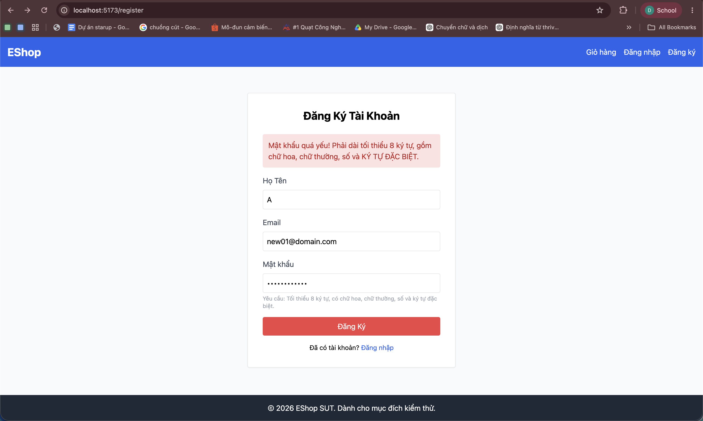

  Chiều ngược lại — mật khẩu yếu `Password 1` (có khoảng trắng, thiếu ký tự đặc biệt, TC-REGISTER-006) lại **được chấp nhận**:

  Payload gửi lên (mật khẩu yếu):

  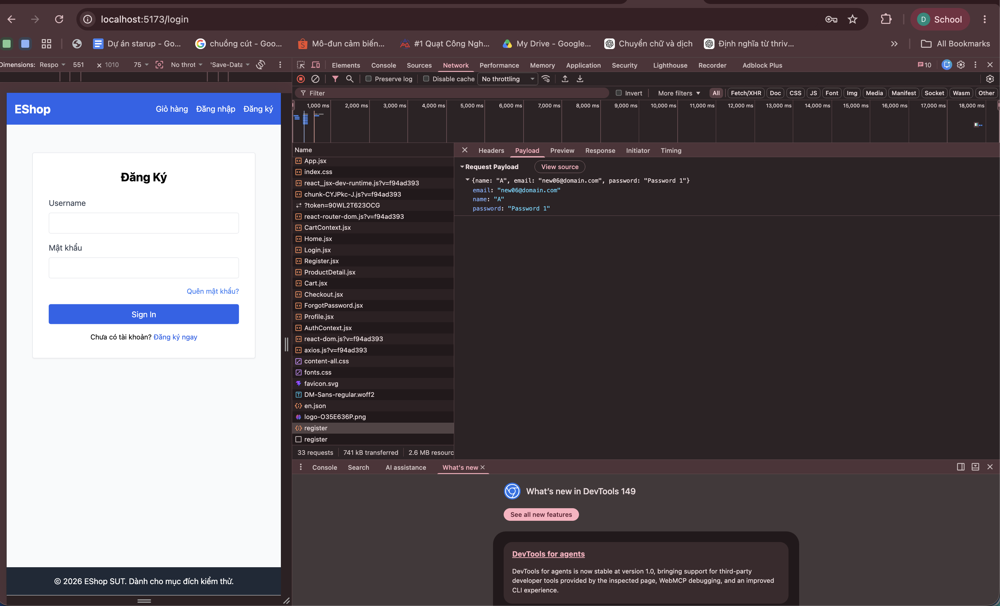

  Kết quả `POST /api/register` → `200 OK` (tạo user thành công, chuyển về /login):

  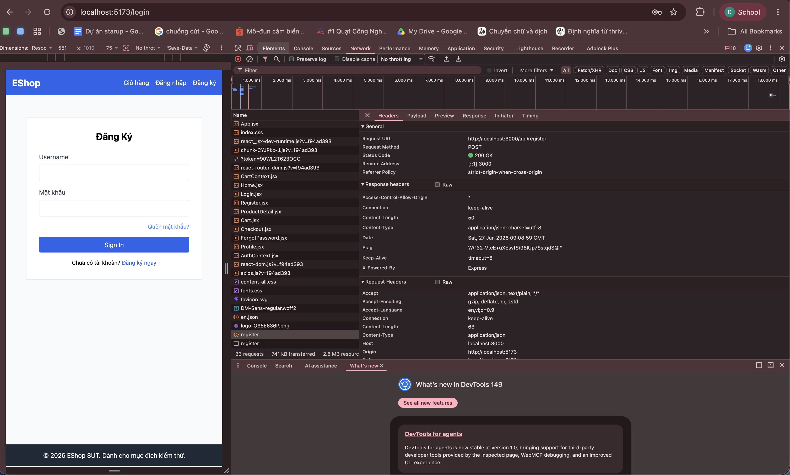

### BUG-A2 — `[BUG][module: register] API /register không validate đầu vào`
- **Found by Test Case:** TC-REGISTER-003, 015, 016, 017, 018, 019
- **Requirement liên quan:** FR-01
- **Severity / Priority:** Critical / P1
- **Environment:** API `POST http://localhost:3000/api/register` / commit fork `20a1243`
- **Steps to reproduce:**
  1. Mở `/register`, nhập name=`A`, email=`abc` (sai định dạng), password=`Password 1` (qua được regex form).
  2. Mở DevTools → tab **Network**, bấm **Đăng Ký**.
  3. Quan sát request `POST /api/register`.
  4. (Cách khác: gọi thẳng API `POST /api/register` với body `{"name":"","email":"a@b.com","password":"Password1"}` — riêng trường **rỗng** chỉ tái hiện được ở mức API, vì form chặn rỗng bằng HTML `required`.)
- **Expected result:** Backend từ chối (400) khi email sai định dạng / rỗng, mật khẩu yếu/rỗng, tên rỗng.
- **Actual result:** Trả `HTTP 200 {"message":"User registered successfully"}` cho đầu vào không hợp lệ. `server.js:20` insert thẳng vào DB, không kiểm tra.
- **Ghi chú:** Trên giao diện form, các trường **rỗng** bị HTML `required` chặn (TC-002/005/008 = Pass); lỗi này chỉ tái hiện với dữ liệu **không rỗng nhưng sai** (email sai định dạng, tên toàn số/HTML) hoặc khi gọi **thẳng API**.
- **Evidence:**

  Đầu vào: email `abc` sai định dạng (TC-REGISTER-003):

  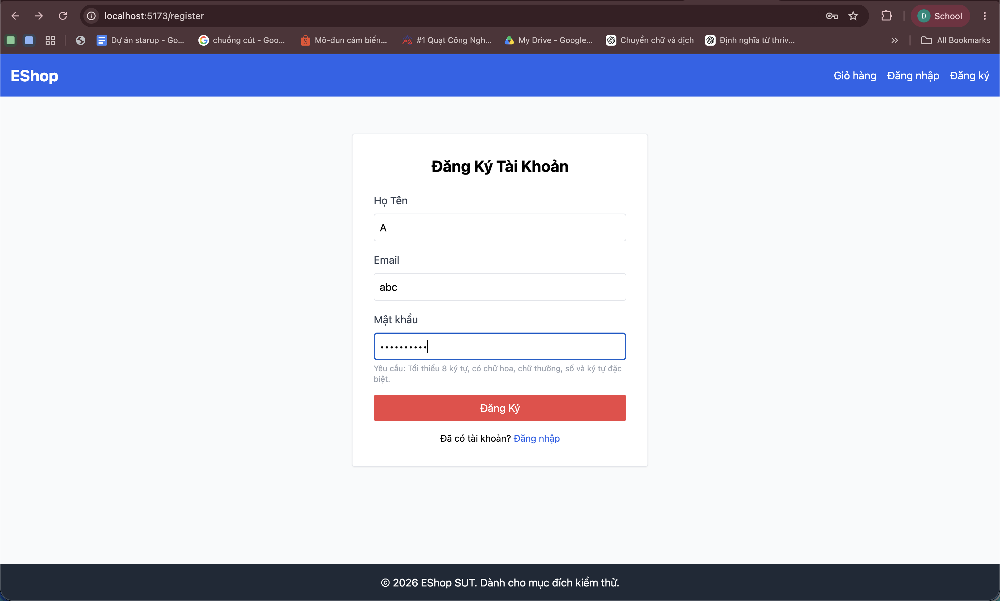

  Kết quả: `POST /api/register` trả `200 OK` → user vẫn được tạo:

  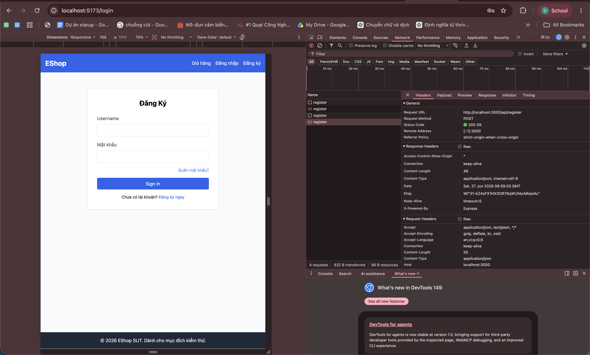

  **Bằng chứng bổ sung — nhiều kiểu đầu vào sai khác đều bị API chấp nhận** (cùng BUG-A2, payload gửi lên):

  TC-015 — tên chỉ gồm khoảng trắng `name:" "`:

  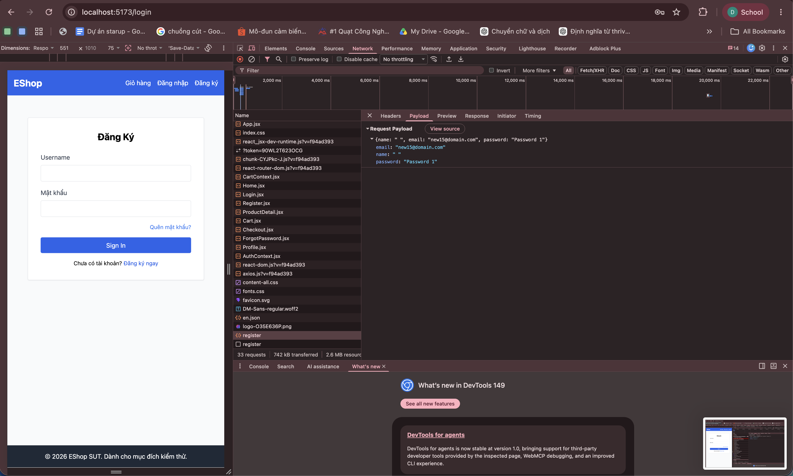

  TC-016 — tên toàn chữ số `name:"12345"`:

  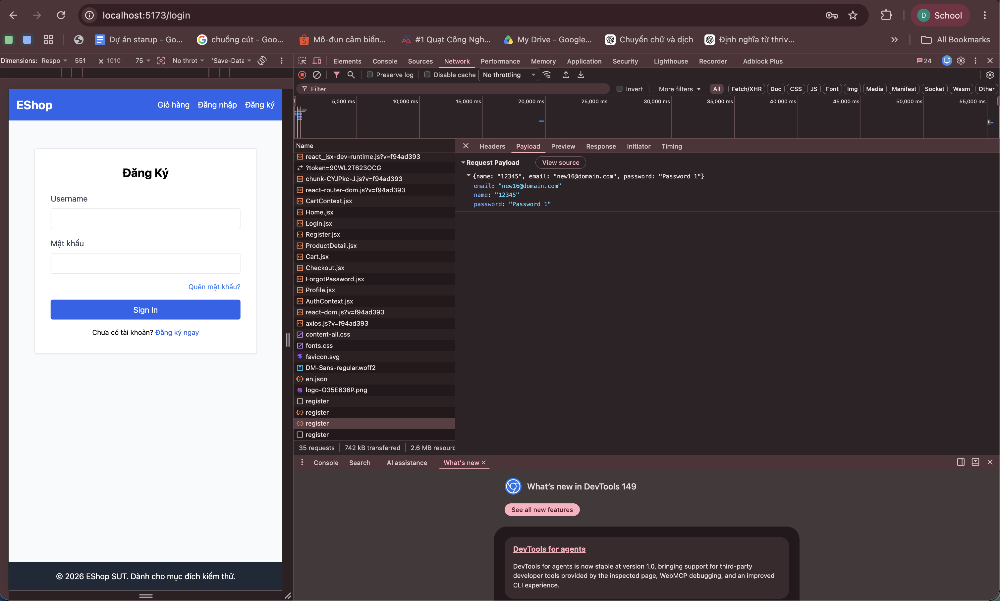

  TC-017 — tên chứa thẻ HTML `name:"<b>x</b>"` (nguy cơ stored XSS):

  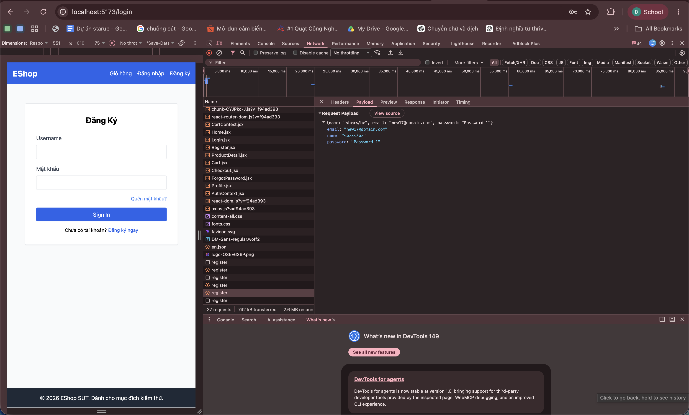

  TC-018 — email thiếu TLD `email:"user@domain"`:

  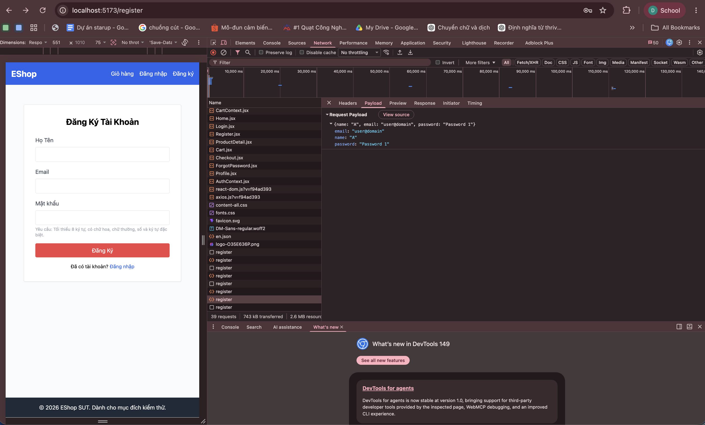

  TC-019 — email toàn chữ số `email:"12345"`:

  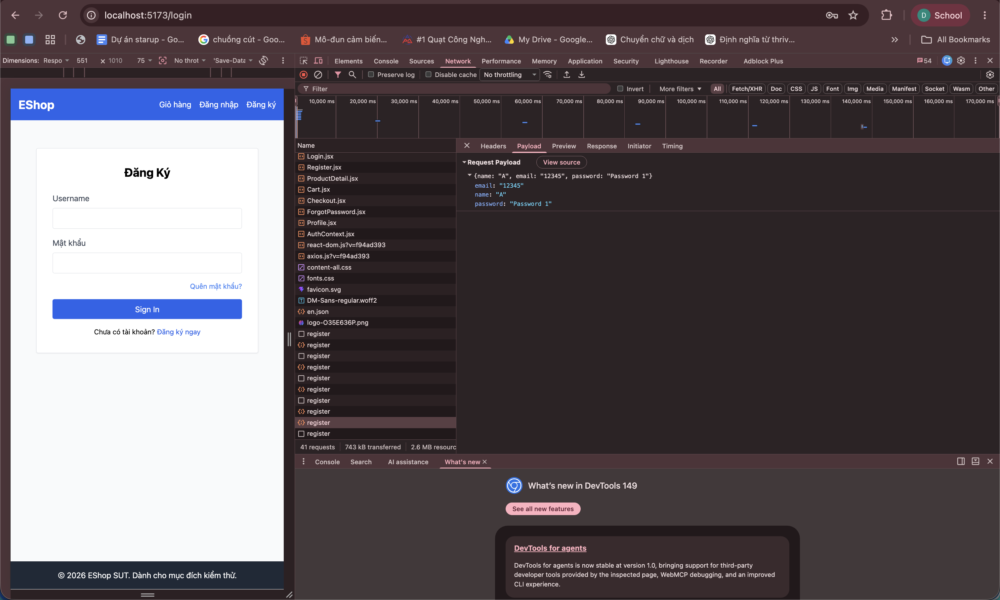

### BUG-A3 — `[BUG][module: register] Email không duy nhất (cho phép trùng)`
- **Found by Test Case:** TC-REGISTER-004
- **Requirement liên quan:** FR-01
- **Severity / Priority:** Major / P1
- **Steps to reproduce:**
  1. Đăng ký với email `test@eshop.com` (đã tồn tại sẵn — tài khoản seed).
  2. Đăng ký **lần nữa** cũng với `test@eshop.com`.
  3. Quan sát: cả 2 lần đều trả `200 OK` và tạo user mới.
- **Expected result:** Từ chối "Email đã tồn tại".
- **Actual result:** Tạo thêm tài khoản trùng email (id mới). DB thiếu `UNIQUE` (`database.js:50`), code không kiểm tra trùng.
- **Evidence:**

  Payload lần 1 — gửi email `test@eshop.com` (trùng tài khoản seed):

  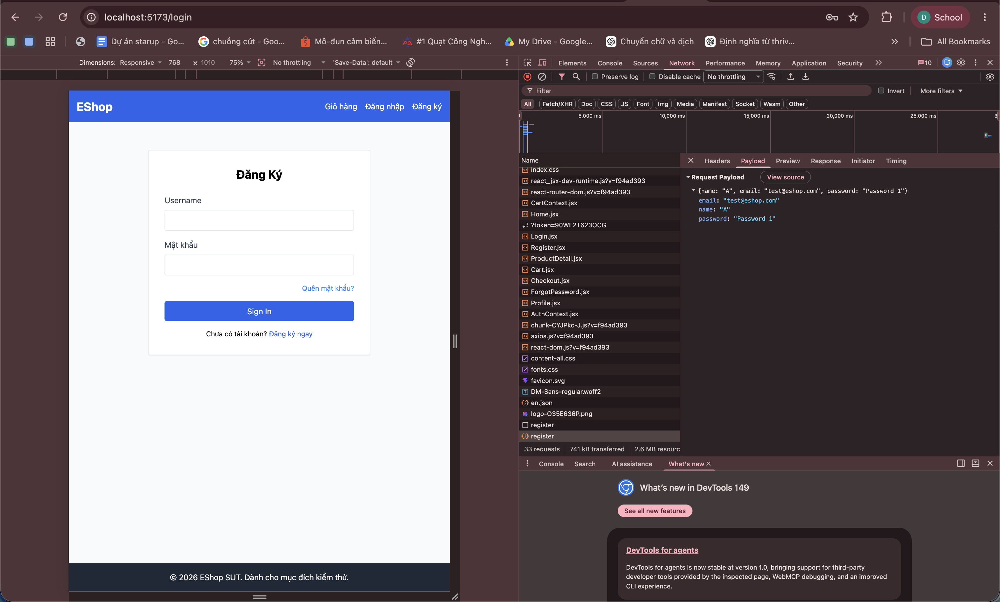

  Payload lần 2 — vẫn cùng email `test@eshop.com`:

  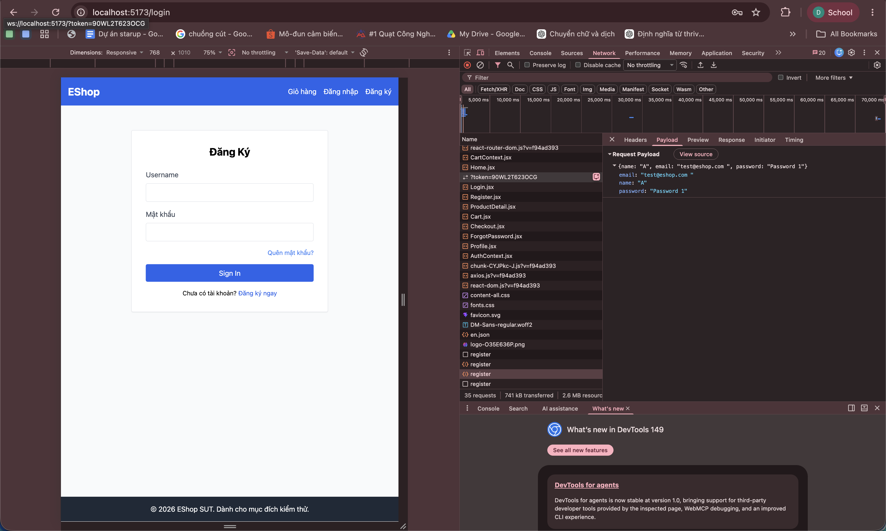

### BUG-A4 — `[BUG][module: register] Form thiếu trường Xác nhận mật khẩu`
- **Found by Test Case:** TC-REGISTER-009
- **Requirement liên quan:** FR-01
- **Severity / Priority:** Major / P2
- **Steps to reproduce:**
  1. Mở `/register` và quan sát các trường của form.
- **Expected result:** Có trường **Xác nhận mật khẩu**; từ chối khi không khớp.
- **Actual result:** Form chỉ có name/email/password — không có trường xác nhận mật khẩu.
- **Evidence:**

  Form `/register` chỉ có 3 ô (Họ Tên, Email, Mật khẩu), thiếu hẳn ô "Xác nhận mật khẩu":

  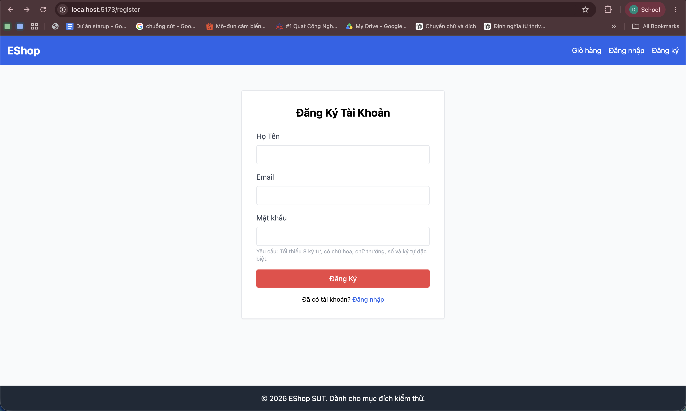

### BUG-A5 — `[BUG][module: register] Email field dùng type="text" thay vì type="email"`
- **Found by Test Case:** (kiểm thêm khi nộp)
- **Requirement liên quan:** FR-22 / FR-02
- **Severity / Priority:** Minor / P3
- **Steps to reproduce:**
  1. Inspect input Email ở `/register`.
- **Expected result:** `type="email"` (có HTML5 validate định dạng).
- **Actual result:** `type="text"` (`Register.jsx:49`) → không validate định dạng phía trình duyệt.
- **Evidence:** `screenshots/feature-A/bug-a5-input-type.png`

### BUG-A6 — `[BUG][module: register] Mật khẩu lưu plaintext (SEC-01)`
- **Found by Test Case:** TC-REGISTER-001
- **Requirement liên quan:** SEC-01
- **Severity / Priority:** Critical / P1
- **Steps to reproduce:**
  1. Đăng ký 1 user, sau đó gọi `GET /api/users/me` (hoặc xem DB `users`).
- **Expected result:** Mật khẩu được hash, không lộ plaintext.
- **Actual result:** Trường `password` trả về/lưu nguyên văn (`server.js:23`).
- **Evidence:** `screenshots/feature-A/bug-a6-plaintext.png`

---

## Feature B – FR-07 Giỏ hàng (module: cart)

> Actual dưới đây suy từ source code (`CartContext.jsx`, `Cart.jsx`, `ProductDetail.jsx`); cần chạy UI + chụp ảnh cho Evidence.

| Bug ID | Tiêu đề Issue | Module | Found by | Severity | Priority | Status | Issue |
|--------|---------------|--------|----------|----------|----------|--------|-------|
| BUG-B1 | Ô số lượng không validate (nhận 0/âm/thập phân/rỗng) | cart | TC-CART-003/004/005/006 | Major | P1 | New | [#51](https://github.com/DuyITLOR/group05_eshop/issues/51) |
| BUG-B2 | Thêm cùng sản phẩm không gộp (tạo dòng trùng) | cart | TC-CART-007 | Major | P2 | New | [#52](https://github.com/DuyITLOR/group05_eshop/issues/52) |
| BUG-B3 | Nút Xóa không có dialog xác nhận | cart | TC-CART-008 | Minor | P2 | New | [#53](https://github.com/DuyITLOR/group05_eshop/issues/53) |
| BUG-B4 | Nhãn tổng tiền sai ("Tổng tạm tính" thay vì "Tổng cộng") | cart | TC-CART-009 | Minor | P3 | New | [#54](https://github.com/DuyITLOR/group05_eshop/issues/54) |
| BUG-B5 | Thiếu nút +/- chỉnh số lượng trong giỏ | cart | TC-CART-010 | Major | P2 | New | [#55](https://github.com/DuyITLOR/group05_eshop/issues/55) |
| BUG-B6 | Giỏ hàng trống thiếu hình minh họa | cart | TC-CART-011 | Trivial | P3 | New | [#56](https://github.com/DuyITLOR/group05_eshop/issues/56) |

### BUG-B1 — `[BUG][module: cart] Ô số lượng không validate (nhận 0/âm/thập phân/rỗng)`
- **Found by Test Case:** TC-CART-003, 004, 005, 006
- **Requirement liên quan:** FR-06 (số nguyên dương, tối thiểu 1)
- **Severity / Priority:** Major / P1
- **Environment:** Chrome / macOS / `http://localhost:5173/products/:id`
- **Steps to reproduce:**
  1. Mở 1 sản phẩm, ở ô **Số lượng** nhập `0` (hoặc `-3`, `2.5`, để trống).
  2. Bấm **Thêm vào giỏ hàng** (nút này thuộc FR-06 — thực tế phải bấm 2 lần mới thêm).
  3. Mở `/cart`.
- **Expected result:** Từ chối; chỉ nhận số nguyên ≥ 1.
- **Actual result:** Ô `<input type="number">` **không có `min="1"`**, `ProductDetail.jsx` dùng `parseInt(quantity)` không kiểm → thêm vào giỏ qty=0 / âm (tổng tiền âm) / 2 (cắt thầm 2.5) / NaN (tổng = NaN).
- **Evidence:** giỏ hàng cùng lúc chứa qty=`0` (0đ), `-3` (-90.000.000đ), `2.5`→`2` (60.000.000đ), rỗng→`NaN` (NaN đ) → **Tổng = NaN đ**.

  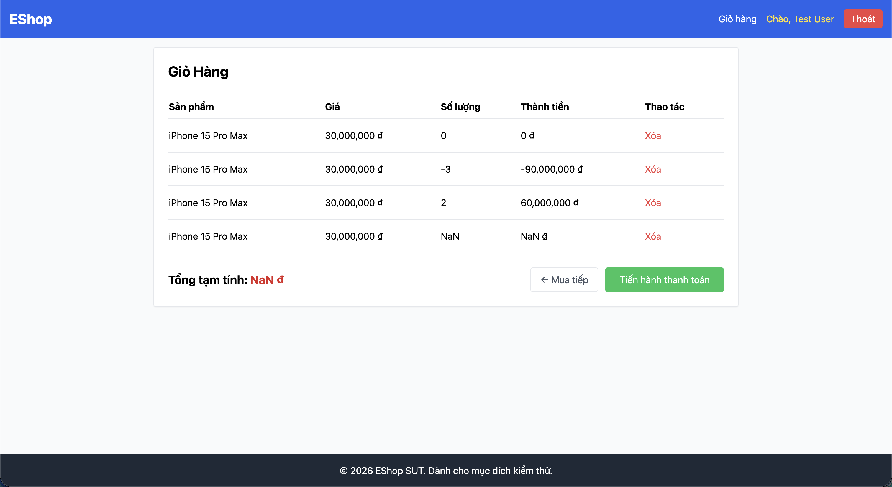

### BUG-B2 — `[BUG][module: cart] Thêm cùng sản phẩm không gộp (tạo dòng trùng)`
- **Found by Test Case:** TC-CART-007
- **Requirement liên quan:** FR-07 ("thêm cùng sản phẩm → tăng số lượng, không tạo dòng mới")
- **Severity / Priority:** Major / P2
- **Steps to reproduce:** Thêm iPhone vào giỏ 2 lần, mở `/cart`.
- **Expected result:** 1 dòng iPhone, qty cộng dồn.
- **Actual result:** `CartContext.addToCart` luôn `setCart([...cart, {...product, quantity}])` → **2 dòng trùng**.
- **Evidence:** giỏ hàng hiển thị **2 dòng "Samsung Galaxy S24 Ultra" riêng biệt** (mỗi dòng qty=1) thay vì 1 dòng qty=2 → tổng 56.000.000đ (28M×2).

  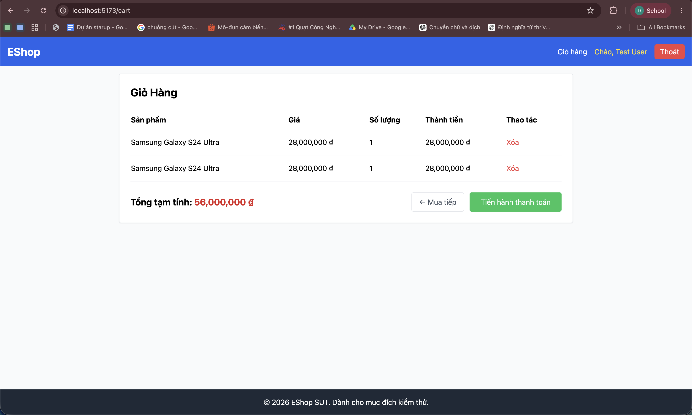

### BUG-B3 — `[BUG][module: cart] Nút Xóa không có dialog xác nhận`
- **Found by Test Case:** TC-CART-008
- **Requirement liên quan:** FR-07 ("Xóa phải có dialog xác nhận")
- **Severity / Priority:** Minor / P2
- **Steps to reproduce:** Trong `/cart`, bấm **Xóa** một sản phẩm.
- **Expected result:** Hiện hộp xác nhận rồi mới xóa.
- **Actual result:** `Cart.jsx` gọi `removeFromCart(index)` trực tiếp `onClick` → **xóa ngay, không hỏi**.
- **Evidence:** Đây là lỗi **thiếu chức năng** (hộp thoại không xuất hiện) → không chụp được 1 ảnh UI. Bằng chứng từ **source** `Cart.jsx` — nút Xóa gọi thẳng `removeFromCart`, **không có** `window.confirm()` / modal xác nhận:

  ```jsx
  <button
    onClick={() => removeFromCart(index)}   // xóa ngay, không có bước xác nhận
    className="text-red-500 hover:text-red-700"
  >
    Xóa
  </button>
  ```
  (Tùy chọn bổ sung: cặp ảnh before/after — giỏ có hàng → sau khi bấm Xóa mất ngay, không popup.)

### BUG-B4 — `[BUG][module: cart] Nhãn tổng tiền sai ("Tổng tạm tính" thay vì "Tổng cộng")`
- **Found by Test Case:** TC-CART-009
- **Requirement liên quan:** FR-07 ("nhãn chính xác: Tổng cộng")
- **Severity / Priority:** Minor / P3
- **Steps to reproduce:** Mở `/cart` có hàng, xem nhãn tổng tiền.
- **Expected result:** "Tổng cộng".
- **Actual result:** `Cart.jsx` hiển thị **"Tổng tạm tính"**.
- **Evidence:** giỏ hàng hiển thị nhãn **"Tổng tạm tính: 28.000.000 đ"** thay vì "Tổng cộng".

  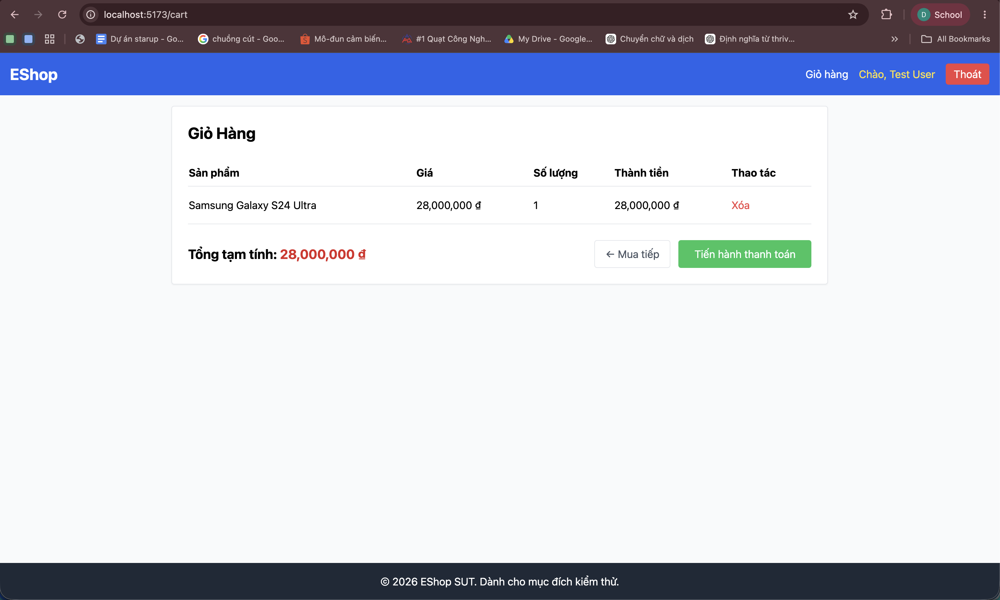

### BUG-B5 — `[BUG][module: cart] Thiếu nút +/- chỉnh số lượng trong giỏ`
- **Found by Test Case:** TC-CART-010
- **Requirement liên quan:** FR-07 ("cột Số lượng có nút +/-")
- **Severity / Priority:** Major / P2
- **Steps to reproduce:** Mở `/cart`, tìm nút +/- ở cột Số lượng.
- **Expected result:** Có nút +/- để tăng/giảm số lượng.
- **Actual result:** `Cart.jsx` chỉ in `{item.quantity}` (text); `CartContext` **không có** hàm cập nhật số lượng → không thể chỉnh trong giỏ.
- **Evidence:** cột "Số lượng" chỉ hiển thị số tĩnh **"1"**, không có nút **+/-** hay ô nhập để điều chỉnh.

  

### BUG-B6 — `[BUG][module: cart] Giỏ hàng trống thiếu hình minh họa`
- **Found by Test Case:** TC-CART-011
- **Requirement liên quan:** FR-07 ("giỏ trống phải có hình minh họa + thông báo")
- **Severity / Priority:** Trivial / P3
- **Steps to reproduce:** Mở `/cart` khi chưa có sản phẩm.
- **Expected result:** Có hình minh họa + thông báo.
- **Actual result:** Chỉ có text "Giỏ hàng của bạn đang trống" — **thiếu hình**.
- **Evidence:** trang giỏ trống chỉ hiển thị dòng chữ **"Giỏ hàng của bạn đang trống"** + link "Tiếp tục mua sắm", **không có hình minh họa** nào.

  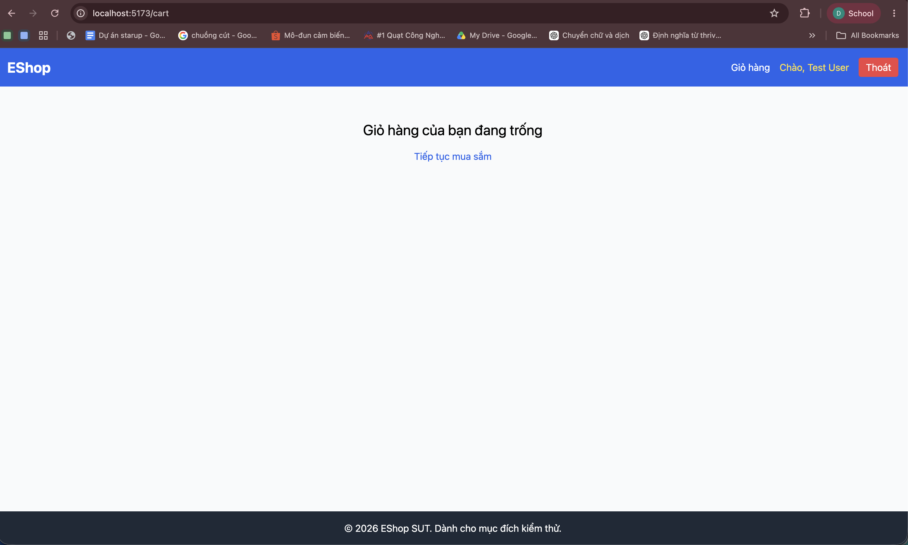

> **Ghi chú phạm vi:** Lỗi "nút Thêm vào giỏ hàng phải bấm 2 lần" (`ProductDetail.jsx` `clickCount`) **thuộc FR-06** (trang chi tiết sản phẩm), **không nằm trong phạm vi FR-07** nên không liệt kê là bug của Feature B.

## Feature C – FR-15 Quản lý Sản phẩm (module: product)

> Actual đối chiếu source (`frontend-admin/src/App.jsx`, `backend/server.js`) + đã xác nhận trên Admin UI `:5174`. GitHub Issues: **#78–#81**.

| Bug ID | Tiêu đề Issue | Module | Found by | Severity | Priority | Status | Issue |
|--------|---------------|--------|----------|----------|----------|--------|-------|
| BUG-C1 | Giá sản phẩm không validate (chấp nhận 0 / âm / rỗng) | product | TC-PRODUCT-004/005/006, TC-PRODUCT-014 | Major | P1 | New | [#78](https://github.com/DuyITLOR/group05_eshop/issues/78) |
| BUG-C2 | Sửa 1 sản phẩm làm đổi tên TẤT CẢ sản phẩm (mass-update) | product | TC-PRODUCT-008 | Critical | P1 | New | [#79](https://github.com/DuyITLOR/group05_eshop/issues/79) |
| BUG-C3 | Tên sản phẩm không giới hạn 255 ký tự | product | TC-PRODUCT-003, TC-PRODUCT-012 | Minor | P2 | New | [#80](https://github.com/DuyITLOR/group05_eshop/issues/80) |
| BUG-C4 | API sản phẩm không validate phía server (tên rỗng, danh mục không tồn tại) | product | TC-PRODUCT-002 (API), TC-PRODUCT-007 | Major | P1 | New | [#81](https://github.com/DuyITLOR/group05_eshop/issues/81) |

### BUG-C1 — `[BUG][module: product] Giá sản phẩm không validate (chấp nhận 0 / âm / rỗng)`
- **Found by Test Case:** TC-PRODUCT-004, 005, 006, TC-PRODUCT-014 (BVA biên 0)
- **Requirement liên quan:** FR-15 ("Giá: bắt buộc, số dương > 0")
- **Severity / Priority:** Major / P1
- **Environment:** Chrome / macOS / Admin `http://localhost:5174` (tab Sản phẩm)
- **Steps to reproduce:**
  1. Mở tab **Sản phẩm**, form Thêm sản phẩm mới.
  2. Nhập tên hợp lệ, ô **Giá tiền** nhập `0` (hoặc `-1000`, hoặc để trống).
  3. Bấm **Lưu sản phẩm**.
- **Expected result:** Từ chối; chỉ chấp nhận số > 0.
- **Actual result:** Ô Giá (`App.jsx`) là `type="number"` nhưng **không có `required` và `min`**; `POST /api/products` (`server.js`) **không validate** → tạo sản phẩm với giá 0 / âm / rỗng.
- **Evidence:** sản phẩm "Laptop Test" với **Giá = 0 đ**, **Giá = −10.000 đ (âm)** và **Giá rỗng** đều được lưu, hiển thị trong bảng quản lý sản phẩm (đủ 3 vùng invalid EP5/EP6/EP7).

  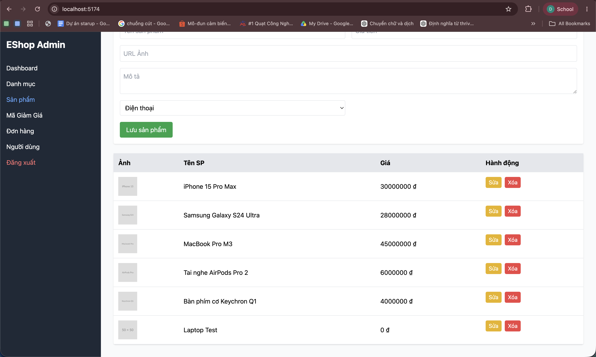

  

  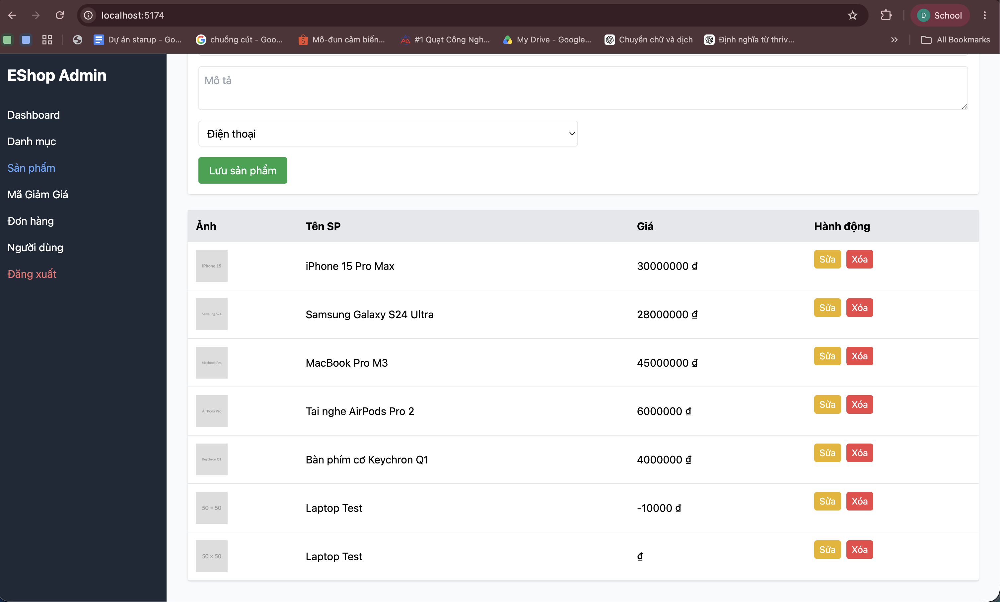

### BUG-C2 — `[BUG][module: product] Sửa 1 sản phẩm làm đổi tên TẤT CẢ sản phẩm (mass-update)`
- **Found by Test Case:** TC-PRODUCT-008
- **Requirement liên quan:** FR-15 ("Sửa một sản phẩm → chỉ sản phẩm đó bị thay đổi")
- **Severity / Priority:** Critical / P1
- **Steps to reproduce:**
  1. Tab Sản phẩm, bấm **Sửa** ở 1 sản phẩm, đổi **Tên** rồi **Lưu sản phẩm**.
  2. Quan sát bảng danh sách sản phẩm.
- **Expected result:** Chỉ sản phẩm vừa sửa đổi tên; các sản phẩm khác giữ nguyên.
- **Actual result:** `App.jsx` `handleProductSubmit` tạo `fakeMassUpdatedProducts = products.map(p => ({...p, name: productForm.name}))` → **gán tên mới cho TẤT CẢ sản phẩm** trên UI.
- **Evidence:** sau khi sửa tên **1 sản phẩm** thành "Test", **toàn bộ** sản phẩm trong bảng đều đổi tên thành "Test" (iPhone, Samsung, MacBook, AirPods, Keychron…) — trong khi **giá vẫn giữ nguyên khác nhau** (đúng đặc trưng mass-update chỉ ghi đè `name`).

  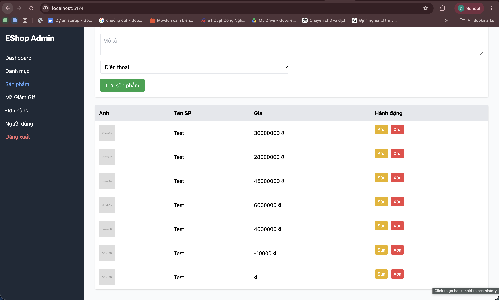

### BUG-C3 — `[BUG][module: product] Tên sản phẩm không giới hạn 255 ký tự`
- **Found by Test Case:** TC-PRODUCT-003, TC-PRODUCT-012 (BVA biên 256)
- **Requirement liên quan:** FR-15 ("Tên sản phẩm: tối đa 255 ký tự")
- **Severity / Priority:** Minor / P2
- **Steps to reproduce:** Nhập tên dài **256 ký tự**, Lưu sản phẩm.
- **Expected result:** Từ chối (tối đa 255).
- **Actual result:** Ô `name` **không có `maxLength`**, backend **không validate độ dài** → lưu nguyên chuỗi > 255. **Hệ quả thêm:** dòng sản phẩm bị kéo dài, bảng **không có horizontal scroll** → nút **Sửa/Xóa** bị đẩy ra ngoài viewport, **không thao tác được** (xem AI gap).
- **Evidence:** sản phẩm tên 256 ký tự (`0123…2345`) vẫn được lưu, hiển thị cuối bảng và tràn ngang.

  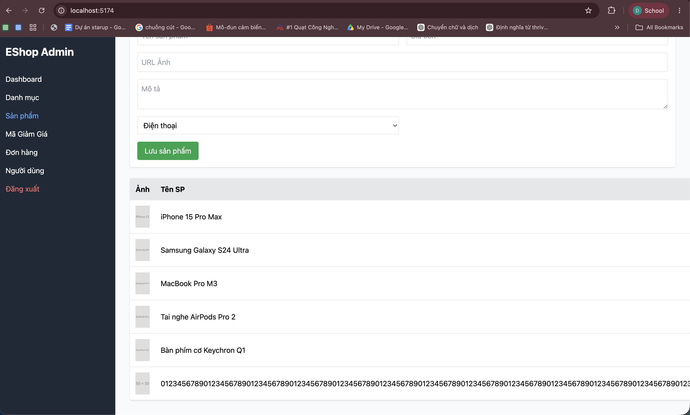

### BUG-C4 — `[BUG][module: product] API sản phẩm không validate phía server (tên rỗng, danh mục không tồn tại)`
- **Found by Test Case:** TC-PRODUCT-002 (gọi API), TC-PRODUCT-007
- **Requirement liên quan:** FR-15 ("Tên bắt buộc"; "Danh mục phải chọn từ danh sách có sẵn")
- **Severity / Priority:** Major / P1
- **Steps to reproduce:**
  1. Gọi trực tiếp `POST /api/products` với body `{"name":"","price":100,"category_id":9999}`.
- **Expected result:** Từ chối (tên rỗng / danh mục không tồn tại).
- **Actual result:** `server.js` `POST /api/products` **chèn thẳng vào DB**, không kiểm `name` rỗng, không kiểm `category_id` hợp lệ. Schema `database.js:70` khai báo `category_id INTEGER` **không có `FOREIGN KEY`**, cũng không bật `PRAGMA foreign_keys` → `category_id=9999` vẫn tạo SP **mồ côi danh mục**. **Lưu ý:** lỗi danh mục lạ **không tái hiện được qua Admin UI** (ô danh mục là `<select>` chỉ cho chọn giá trị có sẵn) → **chỉ test được bằng cách gọi API trực tiếp** (Postman/cURL). *(Ghi chú thêm: endpoint còn **thiếu `authenticateToken`** — ngoài phạm vi FR-15, xem AI gap.)*
- **Evidence:** `<!-- chụp Postman/cURL: API trả 200 với name rỗng -->`

## Feature D – D7 Mobile / FR-04 Hồ sơ cá nhân (module: profile)

> Actual đối chiếu source (`frontend-mobile/App.js` `handleUpdateProfile`, `backend/server.js` `PUT /api/users/me`) + xác nhận trên app Mobile / API. GitHub Issues: **#82–#85**.

| Bug ID | Tiêu đề Issue | Module | Found by | Severity | Priority | Status | Issue |
|--------|---------------|--------|----------|----------|----------|--------|-------|
| BUG-D1 | Validate SĐT sai spec (đòi đầu 1-9 + 9-10 số thay vì đầu 0 + 10-11 số) | profile | TC-PROFILE-001/002/003, 012-013 | Major | P1 | New | [#82](https://github.com/DuyITLOR/group05_eshop/issues/82) |
| BUG-D2 | Leo thang đặc quyền: user tự đổi `role` qua PUT /users/me | profile | TC-PROFILE-008 | Critical | P0 | New | [#83](https://github.com/DuyITLOR/group05_eshop/issues/83) |
| BUG-D3 | Địa chỉ giao hàng không lưu (lệch tên trường `shippingAddress`↔`shipping_address`) | profile | TC-PROFILE-009 | Major | P1 | New | [#84](https://github.com/DuyITLOR/group05_eshop/issues/84) |
| BUG-D4 | API /users/me không validate phía server (tên rỗng, SĐT sai) | profile | TC-PROFILE-011 | Major | P1 | New | [#85](https://github.com/DuyITLOR/group05_eshop/issues/85) |

### BUG-D1 — `[BUG][module: profile] Validate SĐT sai spec (đòi đầu 1-9 + 9-10 số)`
- **Found by Test Case:** TC-PROFILE-001, 002, 003, TC-PROFILE-012/013 (BVA)
- **Requirement liên quan:** FR-04 — "Số điện thoại hợp lệ: bắt đầu bằng `0`, 10–11 chữ số"
- **Severity / Priority:** Major / P1
- **Environment:** iOS / Expo Go / app Mobile · `frontend-mobile/App.js`
- **Steps to reproduce:**
  1. Đăng nhập app Mobile → màn **Hồ sơ**.
  2. Nhập SĐT `0912345678` (đúng spec: đầu 0, 10 số) → bấm **Cập nhật**.
- **Expected result:** Chấp nhận (đúng định dạng SRS).
- **Actual result:** Báo *"Số điện thoại không hợp lệ. Vui lòng nhập đúng 9-10 chữ số."* và chặn. Regex `App.js:287` = `^[1-9][0-9]{8,9}$` → **đòi đầu 1-9** (loại số `0` ở đầu) và **dài 9–10** (lệch SRS 10–11). Ngược lại số sai như `912345678` (đầu 9, 9 số) lại **được chấp nhận**.
- **Evidence:** app Mobile — nhập SĐT đầu `0` (đúng SRS) ở màn Hồ sơ → bấm Cập nhật → hộp thoại **"Số điện thoại không hợp lệ. Vui lòng nhập đúng 9-10 chữ số."** (từ chối số hợp lệ). *Ảnh này dùng chung cho **TC-PROFILE-001** (10 chữ số) và **TC-PROFILE-002** (11 chữ số) — cùng hành vi: mọi SĐT bắt đầu bằng `0` đều bị regex `^[1-9]…` từ chối.*

  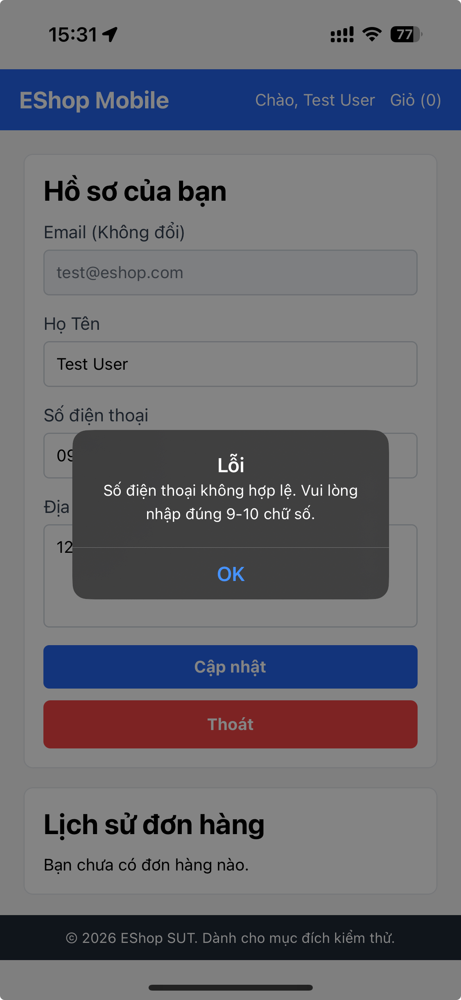

  **Chiều ngược lại (TC-PROFILE-003):** SĐT `912345678` (9 số, **không bắt đầu bằng `0`** — sai SRS) lại **được chấp nhận**. Nhập số sai:

  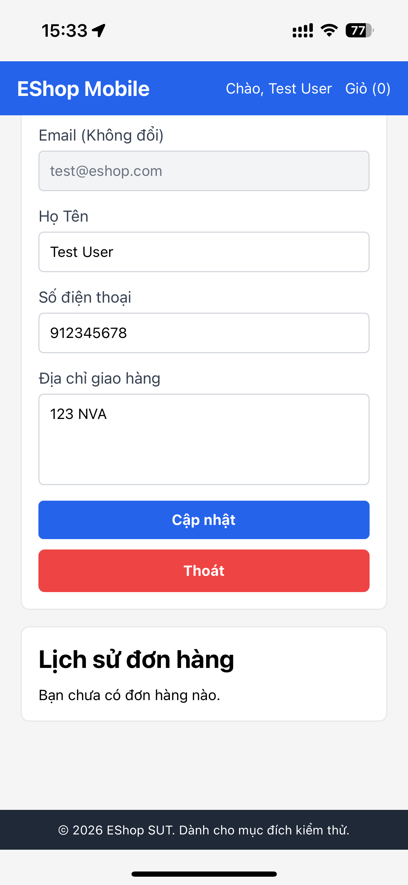

  Kết quả "Cập nhật thành công" (số sai vẫn được nhận):

  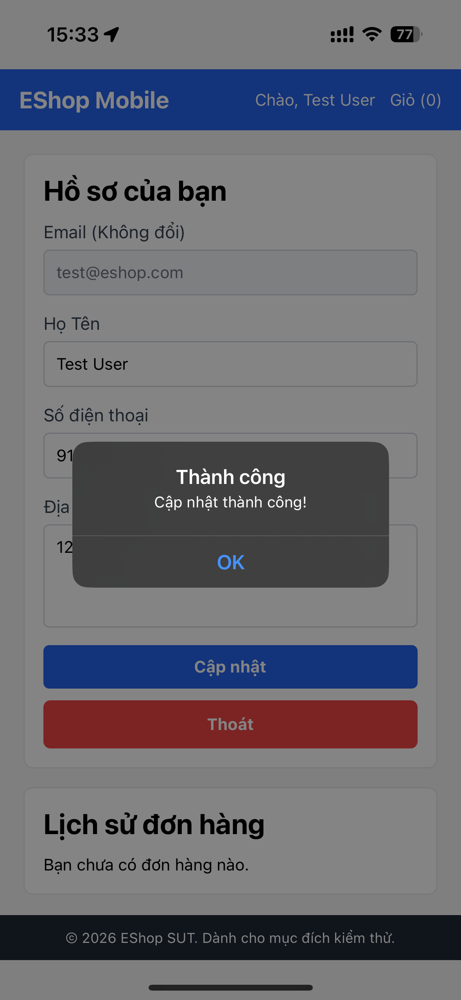

### BUG-D2 — `[BUG][module: profile] Leo thang đặc quyền: user tự đổi role`
- **Found by Test Case:** TC-PROFILE-008
- **Requirement liên quan:** FR-04 — "User không thể tự thay đổi thuộc tính `role`"
- **Severity / Priority:** Critical / P0 *(lỗi bảo mật — phân quyền)*
- **Environment:** API `PUT http://localhost:3000/api/users/me` (token user thường)
- **Steps to reproduce:**
  1. Đăng nhập user thường, lấy JWT.
  2. Gọi `PUT /api/users/me` body `{"name":"Test User","phone":"0912345678","role":"admin"}`.
- **Expected result:** Bỏ qua/từ chối `role` — user không được tự nâng quyền.
- **Actual result:** `server.js:124` `if (role) { query += ", role = ?" }` → cập nhật `role` theo body → **user thường tự thành `admin`**.
- **Evidence:** sau khi user thường (`test@eshop.com`) gọi `PUT /api/users/me` kèm `"role":"admin"`, request `GET /api/users/me` trả về **`"role": "admin"`** (HTTP 200) — leo thang đặc quyền thành công (test bằng REST Client, file `test-cases/feature-D/feature-D-api-tests.rest`).

  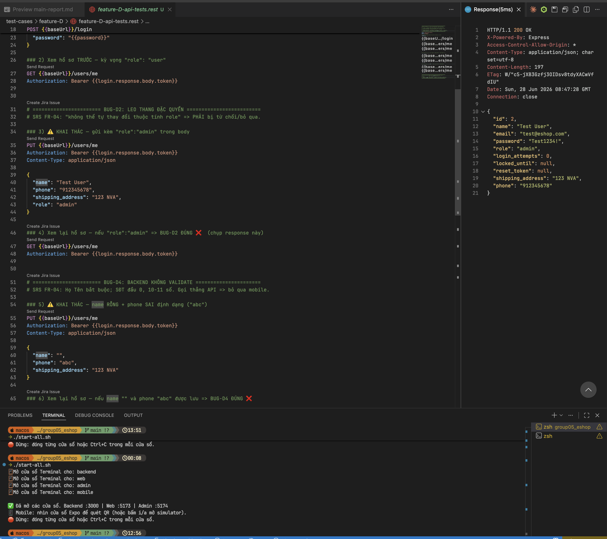

### BUG-D3 — `[BUG][module: profile] Địa chỉ giao hàng không lưu (lệch tên trường)`
- **Found by Test Case:** TC-PROFILE-009
- **Requirement liên quan:** FR-04 — "cập nhật Địa chỉ giao hàng mặc định"
- **Severity / Priority:** Major / P1
- **Steps to reproduce:**
  1. App Mobile → Hồ sơ → nhập **Địa chỉ giao hàng** → **Cập nhật** (báo "Thành công").
  2. **Đăng xuất → đăng nhập lại** (hoặc tải lại hồ sơ).
- **Expected result:** Địa chỉ vừa nhập được lưu và hiển thị lại.
- **Actual result:** Mobile gửi body `{... shippingAddress}` (camelCase) nhưng backend đọc `shipping_address` (snake_case) → giá trị `undefined` → DB lưu **NULL** → địa chỉ **biến mất sau reload** (dù app báo "Thành công" do `setUser` cục bộ).
- **Evidence:** video demo trên app Mobile — nhập địa chỉ → Cập nhật (báo "Thành công") → **đăng nhập lại** → ô địa chỉ trống (không lưu): [▶ Xem video](screenshots/feature-D/bug-d3-address-not-saved.mp4)
  *(Trên GitHub Issue: kéo-thả file video vào ô comment để phát inline.)*

### BUG-D4 — `[BUG][module: profile] API /users/me không validate phía server`
- **Found by Test Case:** TC-PROFILE-011
- **Requirement liên quan:** FR-04 (Họ Tên; SĐT hợp lệ)
- **Severity / Priority:** Major / P1
- **Steps to reproduce:**
  1. Gọi `PUT /api/users/me` body `{"name":"","phone":"abc"}` (token hợp lệ).
- **Expected result:** Từ chối (tên rỗng / SĐT sai định dạng).
- **Actual result:** `server.js` `PUT /users/me` UPDATE thẳng, **không validate** `name`/`phone` → lưu tên rỗng + phone `"abc"`. (Mobile có chặn SĐT nhưng gọi API trực tiếp thì bỏ qua hoàn toàn.)
- **Evidence:** gọi `PUT /api/users/me` với `{"name":"","phone":"abc"}` → backend trả **HTTP 200 `{"message":"Profile updated"}`** (chấp nhận, không từ chối):

  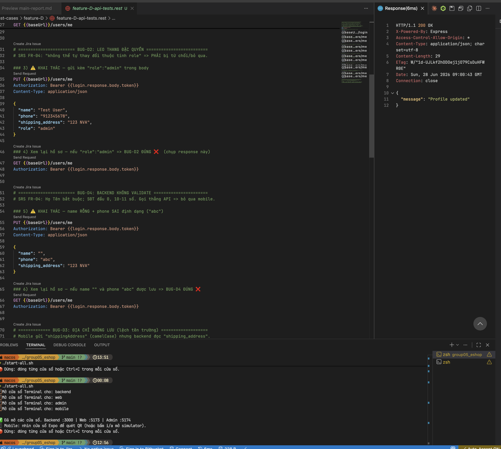

  *(Nên bổ sung thêm ảnh response `GET /api/users/me` — request 6 — hiển thị `"name":""` và `"phone":"abc"` đã lưu vào DB để evidence trọn vẹn.)*
