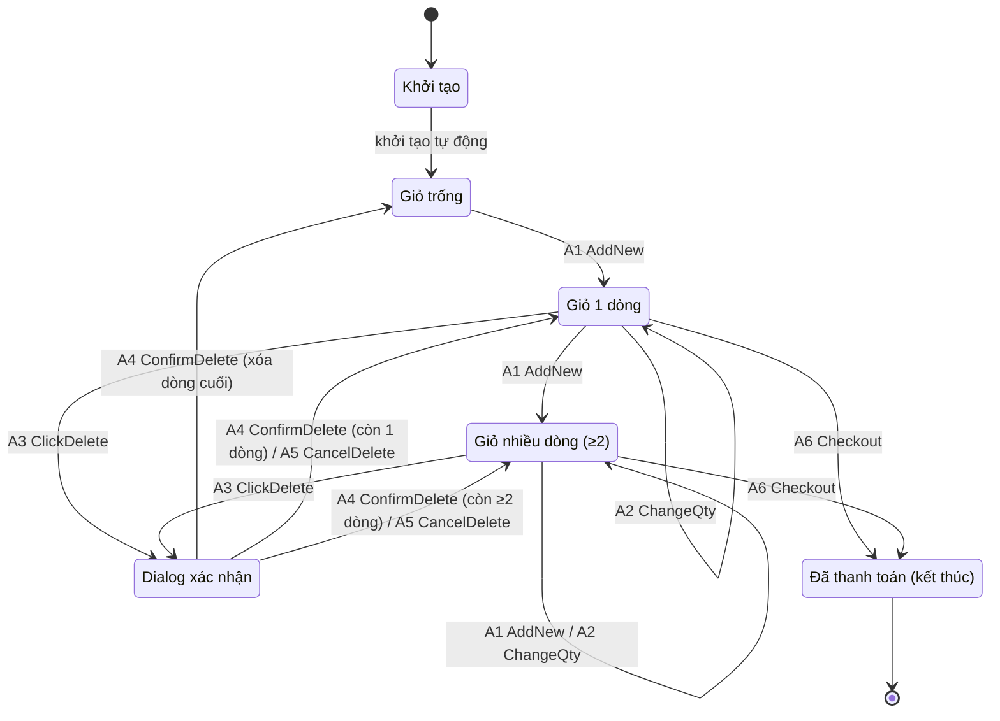
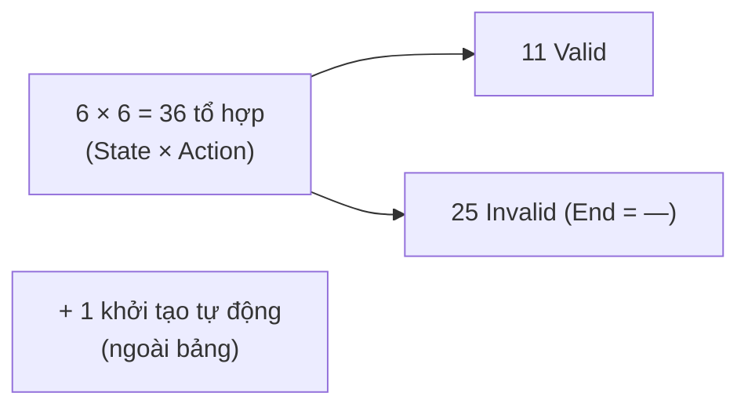

# ST-CART: Test Design — Giỏ hàng (Shopping Cart)

**Phương pháp:** State Transition Testing (Kiểm thử chuyển trạng thái)
**Yêu cầu tham chiếu:** FR-07 (Giỏ hàng) — tham chiếu chéo FR-06 (thêm vào giỏ), FR-08 (giỏ bị xóa sau thanh toán), FR-24 (dialog xác nhận, empty state)
**Module:** CART
**Labels:** `type: test-case` · `module: cart` · `technique: state-transition`
**Kỹ thuật thiết kế:** black-box — states/actions suy ra **chỉ từ đặc tả FR-07**, không dựa vào mã nguồn.

---

# BƯỚC 1 (B1): Xác định State và Event/Action

## 1.1. States — **6 trạng thái**

Có trạng thái **khởi tạo** và trạng thái **kết thúc** làm 2 biên; các trạng thái giữa mô tả theo số dòng sản phẩm trong giỏ + dialog xác nhận xóa.

| Trạng thái | Định nghĩa |
|---|---|
| **Khởi tạo** *(Initial)* | Điểm bắt đầu — ứng dụng chưa khởi tạo giỏ (chưa vào phiên mua sắm) |
| **Giỏ trống** *(Empty)* | Giỏ đã khởi tạo nhưng không có sản phẩm nào |
| **Giỏ 1 dòng** *(OneItem)* | Giỏ có đúng 1 dòng sản phẩm (số lượng ≥ 1) |
| **Giỏ nhiều dòng** *(ManyItems, ≥ 2 dòng)* | Giỏ có từ 2 dòng sản phẩm khác nhau trở lên |
| **Dialog xác nhận** *(ConfirmDialog)* | Đang mở dialog xác nhận xóa một dòng |
| **Đã thanh toán** *(Completed — kết thúc)* | Đã thanh toán thành công — **trạng thái kết thúc**, không chuyển đi đâu nữa |

> **Chuyển tiếp biên:** `[*] → Khởi tạo → Giỏ trống` là **chuyển tiếp khởi tạo tự động** (không do người dùng → không tính là action). **Đã thanh toán** là **trạng thái kết thúc**: sau khi thanh toán thành công, phiên mua sắm dừng lại, **không quay về Giỏ trống**.

## 1.2. Events / Actions — **6 hành động**

| Mã | Event / Action | Mô tả (theo spec FR-07) |
|---|---|---|
| **A1** | AddNew | Thêm vào giỏ một sản phẩm **chưa có** trong giỏ |
| **A2** | ChangeQty | Đổi số lượng của một dòng bằng nút **+ / −** (số lượng tối thiểu = 1) |
| **A3** | ClickDelete | Bấm nút **Xóa** trên một dòng → mở dialog xác nhận |
| **A4** | ConfirmDelete | Bấm **Xác nhận** trong dialog → xóa dòng |
| **A5** | CancelDelete | Bấm **Hủy** trong dialog → giữ nguyên |
| **A6** | Checkout | Thanh toán **thành công** → kết thúc phiên *(tham chiếu FR-08)* |

> Ghi chú: nút **"Tiếp tục mua sắm"** chỉ điều hướng về trang chủ, **không đổi trạng thái giỏ** → không tính là action chuyển trạng thái.

## 1.3. Sơ đồ trạng thái (Mermaid)

---

# BƯỚC 2 (B2): State Transition Table — Cách 1 (C1): States × Actions

Bảng liệt kê **mọi tổ hợp** (State × Action) = **6 × 6 = 36 dòng** (đúng nguyên tắc, không thêm dòng). *(Chuyển tiếp khởi tạo là tự động, không nằm trong bảng.)*

**Quy ước:**
- **End = "—"**: action **không hợp lệ** ở trạng thái đó → **không xảy ra chuyển tiếp** (KHÔNG phải tự quay về chính nó).
- 2 tổ hợp **Dialog xác nhận × A4** và **Dialog xác nhận × A5** có End **tùy số dòng còn lại** — ghi các End khả dĩ + điều kiện ngay ở cột **Ghi chú** (vẫn giữ đúng 36 dòng).

| # | Start (State) | Action | End (State) | Valid/Invalid | Ghi chú |
|:--:|:--|:--|:--|:--:|---|
| 1 | Khởi tạo | A1 AddNew | — | ❌ Invalid | Chưa khởi tạo giỏ |
| 2 | Khởi tạo | A2 ChangeQty | — | ❌ Invalid | Chưa khởi tạo giỏ |
| 3 | Khởi tạo | A3 ClickDelete | — | ❌ Invalid | Chưa khởi tạo giỏ |
| 4 | Khởi tạo | A4 ConfirmDelete | — | ❌ Invalid | Chưa khởi tạo giỏ |
| 5 | Khởi tạo | A5 CancelDelete | — | ❌ Invalid | Chưa khởi tạo giỏ |
| 6 | Khởi tạo | A6 Checkout | — | ❌ Invalid | Chưa khởi tạo giỏ |
| 7 | Giỏ trống | A1 AddNew | **Giỏ 1 dòng** | ✅ Valid | Thêm SP đầu tiên |
| 8 | Giỏ trống | A2 ChangeQty | — | ❌ Invalid | Không có dòng để chỉnh |
| 9 | Giỏ trống | A3 ClickDelete | — | ❌ Invalid | Không có gì để xóa |
| 10 | Giỏ trống | A4 ConfirmDelete | — | ❌ Invalid | Không đang mở dialog |
| 11 | Giỏ trống | A5 CancelDelete | — | ❌ Invalid | Không đang mở dialog |
| 12 | Giỏ trống | A6 Checkout | — | ❌ Invalid | Giỏ trống không thanh toán |
| 13 | Giỏ 1 dòng | A1 AddNew | **Giỏ nhiều dòng** | ✅ Valid | Thêm SP khác → 2 dòng |
| 14 | Giỏ 1 dòng | A2 ChangeQty | **Giỏ 1 dòng** | ✅ Valid | Đổi số lượng; − tại qty=1 giữ nguyên (min 1) |
| 15 | Giỏ 1 dòng | A3 ClickDelete | **Dialog xác nhận** | ✅ Valid | Mở dialog xác nhận |
| 16 | Giỏ 1 dòng | A4 ConfirmDelete | — | ❌ Invalid | Chưa mở dialog |
| 17 | Giỏ 1 dòng | A5 CancelDelete | — | ❌ Invalid | Chưa mở dialog |
| 18 | Giỏ 1 dòng | A6 Checkout | **Đã thanh toán** | ✅ Valid | Thanh toán → kết thúc (FR-08) |
| 19 | Giỏ nhiều dòng | A1 AddNew | **Giỏ nhiều dòng** | ✅ Valid | Thêm dòng nữa, vẫn nhiều |
| 20 | Giỏ nhiều dòng | A2 ChangeQty | **Giỏ nhiều dòng** | ✅ Valid | Đổi số lượng; min 1 |
| 21 | Giỏ nhiều dòng | A3 ClickDelete | **Dialog xác nhận** | ✅ Valid | Mở dialog xác nhận |
| 22 | Giỏ nhiều dòng | A4 ConfirmDelete | — | ❌ Invalid | Chưa mở dialog |
| 23 | Giỏ nhiều dòng | A5 CancelDelete | — | ❌ Invalid | Chưa mở dialog |
| 24 | Giỏ nhiều dòng | A6 Checkout | **Đã thanh toán** | ✅ Valid | Thanh toán → kết thúc (FR-08) |
| 25 | Dialog xác nhận | A1 AddNew | — | ❌ Invalid | Đang ở dialog |
| 26 | Dialog xác nhận | A2 ChangeQty | — | ❌ Invalid | Đang ở dialog |
| 27 | Dialog xác nhận | A3 ClickDelete | — | ❌ Invalid | Dialog đã mở sẵn |
| 28 | Dialog xác nhận | A4 ConfirmDelete | **Giỏ trống / Giỏ 1 dòng / Giỏ nhiều dòng** | ✅ Valid | Tùy số dòng **còn lại sau khi xóa**: 0 → Giỏ trống · 1 → Giỏ 1 dòng · ≥2 → Giỏ nhiều dòng |
| 29 | Dialog xác nhận | A5 CancelDelete | **Giỏ 1 dòng / Giỏ nhiều dòng** | ✅ Valid | Giữ nguyên giỏ: 1 dòng → Giỏ 1 dòng · ≥2 dòng → Giỏ nhiều dòng |
| 30 | Dialog xác nhận | A6 Checkout | — | ❌ Invalid | Đang ở dialog |
| 31 | Đã thanh toán | A1 AddNew | — | ❌ Invalid | Trạng thái kết thúc |
| 32 | Đã thanh toán | A2 ChangeQty | — | ❌ Invalid | Trạng thái kết thúc |
| 33 | Đã thanh toán | A3 ClickDelete | — | ❌ Invalid | Trạng thái kết thúc |
| 34 | Đã thanh toán | A4 ConfirmDelete | — | ❌ Invalid | Trạng thái kết thúc |
| 35 | Đã thanh toán | A5 CancelDelete | — | ❌ Invalid | Trạng thái kết thúc |
| 36 | Đã thanh toán | A6 Checkout | — | ❌ Invalid | Trạng thái kết thúc |

**Thống kê:** **36 tổ hợp** (State × Action) → **11 Valid** · **25 Invalid** (End = —). Cộng **1 chuyển tiếp khởi tạo tự động** (Khởi tạo → Giỏ trống, ngoài bảng).

---

# BƯỚC 3 (B3): Thiết kế Test Case theo End-to-End

**Độ phủ áp dụng: End-to-End Test.** Mỗi test case là **một kịch bản người dùng hoàn chỉnh** đi từ **Khởi tạo** đến **Đã thanh toán**, qua một **chuỗi chuyển tiếp liên tiếp**. Dùng **2 kịch bản** để phủ **11 tổ hợp valid** (gồm mọi nhánh kết quả của 2 tổ hợp có điều kiện là Dialog×A4, Dialog×A5) + chuyển tiếp khởi tạo + 2 lối vào trạng thái kết thúc.

## Kịch bản TC-CART-E2E-01 — Mua sắm, chỉnh sửa giỏ & thanh toán

| Bước | State trước | Sự kiện | State sau | Chuyển tiếp phủ |
|:--:|:--|---|:--|---|
| 0 | — | Mở app *(khởi tạo tự động)* | Giỏ trống | Khởi tạo → Giỏ trống |
| 1 | Giỏ trống | A1 AddNew (SP A) | Giỏ 1 dòng | Giỏ trống → Giỏ 1 dòng |
| 2 | Giỏ 1 dòng | A2 ChangeQty **+** (A: 1→2) | Giỏ 1 dòng | Giỏ 1 dòng → Giỏ 1 dòng (A2 +) |
| 3 | Giỏ 1 dòng | A2 ChangeQty **−** (A: 2→1) | Giỏ 1 dòng | Giỏ 1 dòng → Giỏ 1 dòng (A2 −) |
| 4 | Giỏ 1 dòng | A1 AddNew (SP B) | Giỏ nhiều dòng | Giỏ 1 dòng → Giỏ nhiều dòng |
| 5 | Giỏ nhiều dòng | A1 AddNew (SP C) | Giỏ nhiều dòng | Giỏ nhiều dòng → Giỏ nhiều dòng (A1) |
| 6 | Giỏ nhiều dòng | A2 ChangeQty (B +) | Giỏ nhiều dòng | Giỏ nhiều dòng → Giỏ nhiều dòng (A2) |
| 7 | Giỏ nhiều dòng | A3 ClickDelete (C) | Dialog xác nhận | Giỏ nhiều dòng → Dialog xác nhận |
| 8 | Dialog xác nhận | A5 CancelDelete (giỏ ≥2 dòng) | Giỏ nhiều dòng | Dialog → Giỏ nhiều dòng (Cancel) |
| 9 | Giỏ nhiều dòng | A3 ClickDelete (C) | Dialog xác nhận | Giỏ nhiều dòng → Dialog xác nhận |
| 10 | Dialog xác nhận | A4 ConfirmDelete (còn A, B) | Giỏ nhiều dòng | Dialog → Giỏ nhiều dòng (Confirm, còn ≥2) |
| 11 | Giỏ nhiều dòng | A3 ClickDelete (B) | Dialog xác nhận | Giỏ nhiều dòng → Dialog xác nhận |
| 12 | Dialog xác nhận | A4 ConfirmDelete (còn A) | Giỏ 1 dòng | Dialog → Giỏ 1 dòng (Confirm, còn 1) |
| 13 | Giỏ 1 dòng | A2 ChangeQty **−** (A: 1→1, biên) | Giỏ 1 dòng | Giỏ 1 dòng → Giỏ 1 dòng (min 1) |
| 14 | Giỏ 1 dòng | A6 Checkout | **Đã thanh toán** | Giỏ 1 dòng → Đã thanh toán (kết thúc) |

## Kịch bản TC-CART-E2E-02 — Xóa hết giỏ, mua lại & thanh toán

| Bước | State trước | Sự kiện | State sau | Chuyển tiếp phủ |
|:--:|:--|---|:--|---|
| 0 | — | Mở app *(khởi tạo tự động)* | Giỏ trống | Khởi tạo → Giỏ trống |
| 1 | Giỏ trống | A1 AddNew (SP A) | Giỏ 1 dòng | Giỏ trống → Giỏ 1 dòng |
| 2 | Giỏ 1 dòng | A3 ClickDelete (A) | Dialog xác nhận | Giỏ 1 dòng → Dialog xác nhận |
| 3 | Dialog xác nhận | A5 CancelDelete (giỏ 1 dòng) | Giỏ 1 dòng | Dialog → Giỏ 1 dòng (Cancel) |
| 4 | Giỏ 1 dòng | A3 ClickDelete (A) | Dialog xác nhận | Giỏ 1 dòng → Dialog xác nhận |
| 5 | Dialog xác nhận | A4 ConfirmDelete (dòng cuối) | Giỏ trống | Dialog → Giỏ trống (Confirm, còn 0) → empty state |
| 6 | Giỏ trống | A1 AddNew (SP A) | Giỏ 1 dòng | Giỏ trống → Giỏ 1 dòng |
| 7 | Giỏ 1 dòng | A1 AddNew (SP B) | Giỏ nhiều dòng | Giỏ 1 dòng → Giỏ nhiều dòng |
| 8 | Giỏ nhiều dòng | A6 Checkout | **Đã thanh toán** | Giỏ nhiều dòng → Đã thanh toán (kết thúc) |

## Bảng phủ chuyển tiếp (2 kịch bản E2E)

| Chuyển tiếp | E2E-01 | E2E-02 |
|---|:--:|:--:|
| Khởi tạo → Giỏ trống *(init)* | ✓ | ✓ |
| Giỏ trống → Giỏ 1 dòng (A1) | ✓ | ✓ |
| Giỏ 1 dòng → Giỏ 1 dòng (A2: +, −, biên min 1) | ✓ | |
| Giỏ 1 dòng → Giỏ nhiều dòng (A1) | ✓ | ✓ |
| Giỏ 1 dòng → Dialog xác nhận (A3) | | ✓ |
| Giỏ 1 dòng → Đã thanh toán (A6) *(kết thúc)* | ✓ | |
| Giỏ nhiều dòng → Giỏ nhiều dòng (A1) | ✓ | |
| Giỏ nhiều dòng → Giỏ nhiều dòng (A2) | ✓ | |
| Giỏ nhiều dòng → Dialog xác nhận (A3) | ✓ | |
| Giỏ nhiều dòng → Đã thanh toán (A6) *(kết thúc)* | | ✓ |
| Dialog → Giỏ trống (A4, còn 0 dòng) | | ✓ |
| Dialog → Giỏ 1 dòng (A4, còn 1 dòng) | ✓ | |
| Dialog → Giỏ nhiều dòng (A4, còn ≥2 dòng) | ✓ | |
| Dialog → Giỏ 1 dòng (A5, giỏ 1 dòng) | | ✓ |
| Dialog → Giỏ nhiều dòng (A5, giỏ ≥2 dòng) | ✓ | |

→ **2 kịch bản End-to-End phủ toàn bộ 11 tổ hợp valid** cùng mọi nhánh kết quả của Dialog×A4 / Dialog×A5, 2 lối vào trạng thái kết thúc và empty state.

**Ghi chú thực thi:** thiết kế black-box từ đặc tả; cột **Actual / Status** trong mỗi test case để **trống**, điền khi chạy trên hệ thống thật (`frontend-web` :5173, `backend` :3000). Với End-to-End, **chỉ cần 1 bước trong chuỗi sai** là cả kịch bản **Fail** tại bước đó → ghi rõ bước sai và lập Bug Report liên kết ngược.
