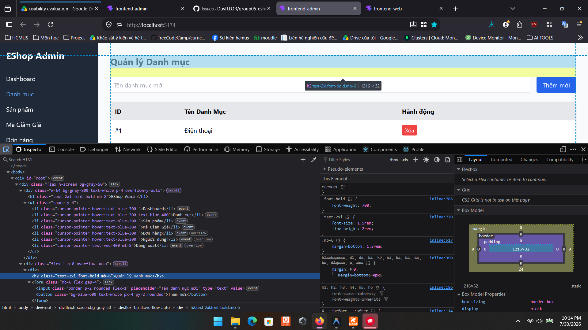

# Bug ID: `GUI-ADM-CAT-001`

## Bug description:
Trang Quản lý Danh mục của Admin sử dụng sai thẻ tiêu đề (Heading). Tiêu đề trang đang bọc trong thẻ `<h2>` thay vì `<h1>` theo đặc tả yêu cầu giao diện (FR-21).

## Test case coverage: 
- `GUI-ADM-CAT-001` (Kiểm tra thẻ tiêu đề H1 của trang Quản lý Danh mục)

## Preconditions: 
- Admin đã đăng nhập vào hệ thống Web Admin (`http://localhost:5174`).

## Test steps: 
1. Truy cập giao diện Admin và chọn tab "Danh mục" trên Sidebar.
2. Mở Developer Tools (F12) để kiểm tra (Inspect Element) thẻ tiêu đề "Quản lý Danh mục".

## Expected results: 
Tiêu đề chính của trang phải được bọc trong thẻ `<h1>` duy nhất (ví dụ: `<h1>Quản lý Danh mục</h1>`).

## Actual results: 
Tiêu đề "Quản lý Danh mục" đang bọc trong thẻ `<h2 className="text-2xl font-bold mb-6">`.

## Severity: 
Minor

## Priority: 
Low

### Bug screenshot: 

