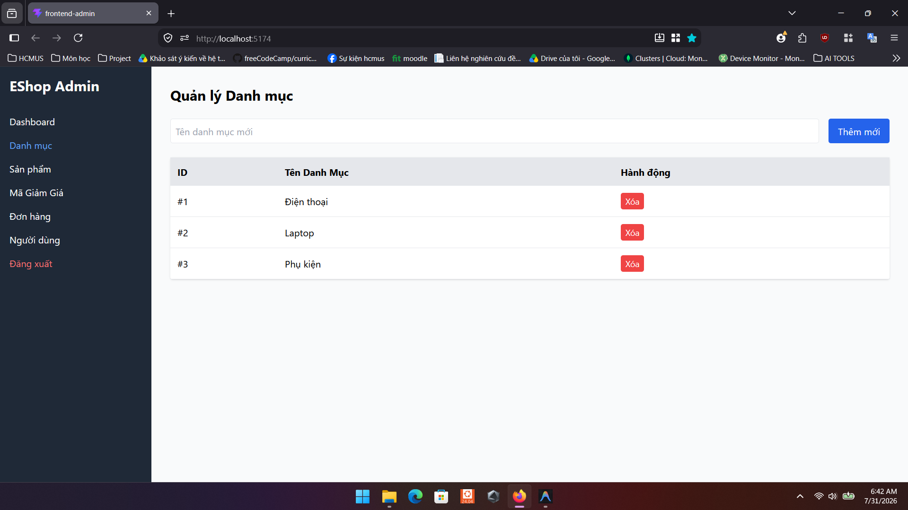

# Bug ID: `GUI-ADM-CAT-006`

## Bug description:
Form thêm danh mục mới thiếu thẻ nhãn `<label>` rõ ràng và không hiển thị ký hiệu `*` màu đỏ để đánh dấu đây là trường dữ liệu bắt buộc nhập (vi phạm tiêu chuẩn FR-22).

## Test case coverage: 
- `GUI-ADM-CAT-006` (Kiểm tra nhãn label và dấu * trường bắt buộc trong form Danh mục)

## Preconditions: 
- Admin đang ở màn hình Quản lý Danh mục.

## Test steps: 
1. Truy cập tab "Danh mục" trong Web Admin.
2. Quan sát ô nhập tên danh mục mới phía trên danh sách.

## Expected results: 
Ô nhập liệu phải có thẻ nhãn `<label>` đi kèm (ví dụ: `Tên danh mục *`) và ký hiệu `*` đỏ đánh dấu bắt buộc.

## Actual results: 
Ô nhập liệu chỉ sử dụng `placeholder="Tên danh mục mới"`, hoàn toàn không có thẻ `<label>` và dấu `*` bắt buộc.

## Severity: 
Minor

## Priority: 
Low

### Bug screenshot: 

