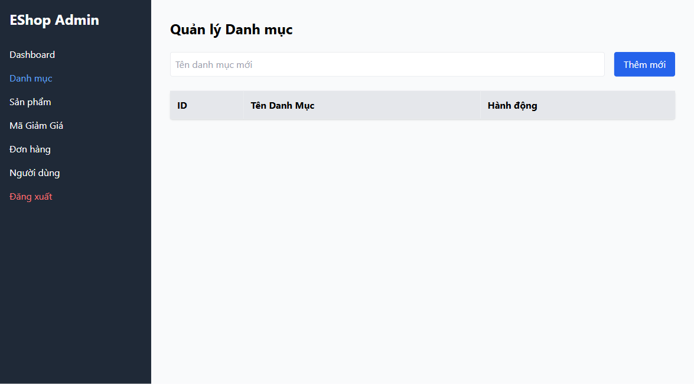

# Bug ID: `GUI-ADM-CAT-011`

## Bug description:
Khi hệ thống chưa có danh mục nào (danh sách rỗng), bảng dữ liệu hiển thị khung rỗng không có thông báo thân thiện và thiếu hình ảnh/icon minh họa trạng thái trống (vi phạm tiêu chuẩn FR-24).

## Test case coverage: 
- `GUI-ADM-CAT-011` (Kiểm tra giao diện Empty State của trang Quản lý Danh mục)

## Preconditions: 
- Cơ sở dữ liệu danh mục hiện đang trống (0 items).

## Test steps: 
1. Truy cập tab "Danh mục" trong Web Admin khi không có dữ liệu danh mục.
2. Quan sát phần hiển thị bảng danh sách.

## Expected results: 
Hiển thị giao diện Empty State với biểu tượng/hình minh họa trực quan và dòng thông báo thân thiện (ví dụ: "Chưa có danh mục nào. Hãy tạo danh mục đầu tiên!").

## Actual results: 
Bảng dữ liệu chỉ hiển thị phần header (`ID`, `Tên Danh Mục`, `Hành động`) và phần body rỗng hoàn toàn, không có thông báo hay hình ảnh minh họa.

## Severity: 
Minor

## Priority: 
Low

### Bug screenshot: 

