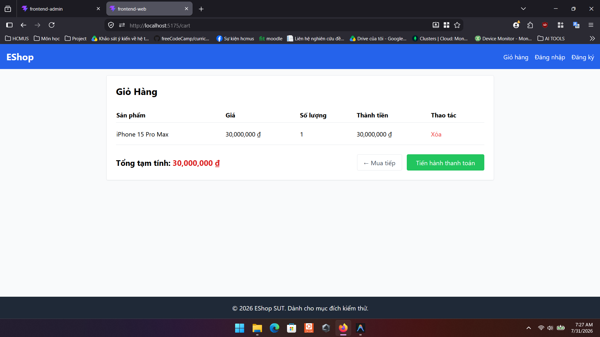

# Bug ID: `GUI-CART-011`

## Bug description:
Link "Giỏ hàng" trên thanh điều hướng (Navbar) không được Highlight khi active (khi người dùng đang ở trang `/cart`).

## Test case coverage: 

- `GUI-CART-011` (Kiểm tra highlight menu Giỏ hàng)

## Preconditions: 
- Ứng dụng Frontend đang chạy bình thường.

## Test steps: 
1. Click vào link "Giỏ hàng" trên thanh điều hướng (Navbar) để vào trang `/cart`.
2. Quan sát kiểu dáng (style) của link "Giỏ hàng" sau khi trang đã load.

## Expected results: 
Link "Giỏ hàng" phải được highlight (in đậm, đổi màu, hoặc gạch chân) để báo hiệu người dùng đang ở trang này.

## Actual results: 
Link "Giỏ hàng" không có trạng thái highlight (hiển thị giống hệt như lúc chưa click).

## Severity: 
Minor

## Priority: 
Low

### Bug screenshot: 

