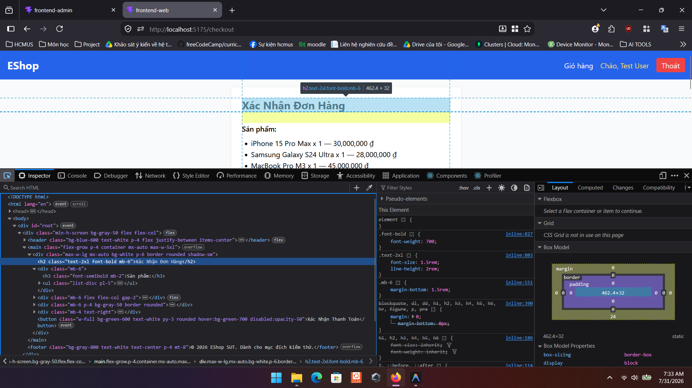

# Bug ID: `GUI-CHK-001`

## Bug description:
Trang Thanh toán (`/checkout`) sử dụng sai thẻ tiêu đề (Heading). Tiêu đề đang được bọc trong thẻ `<h2>` thay vì `<h1>` như đặc tả yêu cầu tiêu chuẩn giao diện.

## Test case coverage: 
- `GUI-CHK-001` (Kiểm tra thẻ tiêu đề H1 của trang Thanh toán)

## Preconditions: 
- Người dùng đã đăng nhập và điều hướng tới trang Thanh toán (`/checkout`).

## Test steps: 
1. Truy cập vào trang Thanh toán (`/checkout`).
2. Mở Developer Tools (F12) để kiểm tra (Inspect Element) thẻ tiêu đề "Xác Nhận Đơn Hàng".

## Expected results: 
Tiêu đề chính của trang phải được bọc trong thẻ `<h1>` duy nhất (ví dụ: `<h1>Xác Nhận Đơn Hàng</h1>`).

## Actual results: 
Tiêu đề "Xác Nhận Đơn Hàng" đang bọc trong thẻ `<h2 className="text-2xl font-bold mb-6">`.

## Severity: 
Minor

## Priority: 
Low

### Bug screenshot: 

