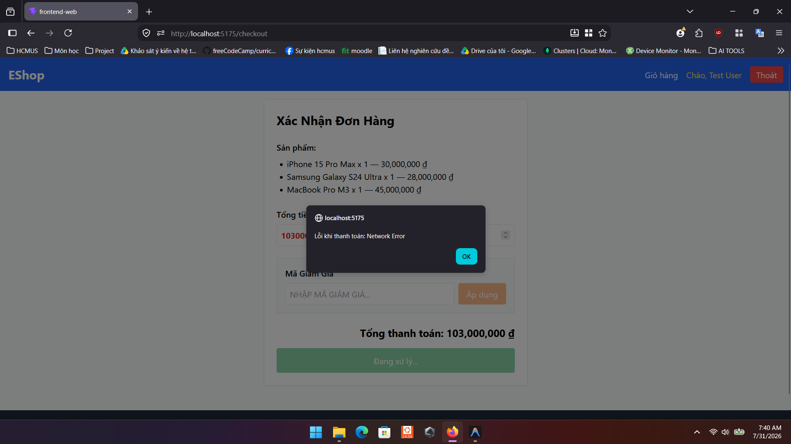

# Bug ID: `GUI-CHK-007`

## Bug description:
Khi có lỗi phát sinh trong quá trình thanh toán (ví dụ: lỗi mạng hoặc backend từ chối), hệ thống sử dụng hộp thoại `alert()` mặc định của trình duyệt để hiển thị thay vì render thông báo lỗi inline trên trang. Ngoài ra, thông báo lỗi áp dụng mã giảm giá lại hiển thị bên dưới khung nhập thay vì nằm phía trên nút submit theo tiêu chuẩn FR-22.

## Test case coverage: 
- `GUI-CHK-007` (Kiểm tra hình thức và vị trí hiển thị thông báo lỗi trên form)

## Preconditions: 
- Người dùng đang ở trang Thanh toán (`/checkout`).

## Test steps: 
1. Thực hiện thanh toán khi gặp lỗi (ví dụ: giỏ hàng rỗng hoặc token hết hạn).
2. Quan sát cách hệ thống hiển thị thông báo lỗi.

## Expected results: 
- Thông báo lỗi phải được render trực tiếp trên giao diện (inline UI alert), nằm ở vị trí phía **trên** nút Submit.
- Không được dùng `alert()` trình duyệt gây gián đoạn trải nghiệm người dùng.

## Actual results: 
- Hàm `handleCheckout` sử dụng `alert("Lỗi khi thanh toán: " + ...)` để hiển thị lỗi.
- Thông báo `couponError` hiển thị phía bên dưới dòng nhập mã giảm giá.

## Severity: 
Major

## Priority: 
Medium

### Bug screenshot: 

