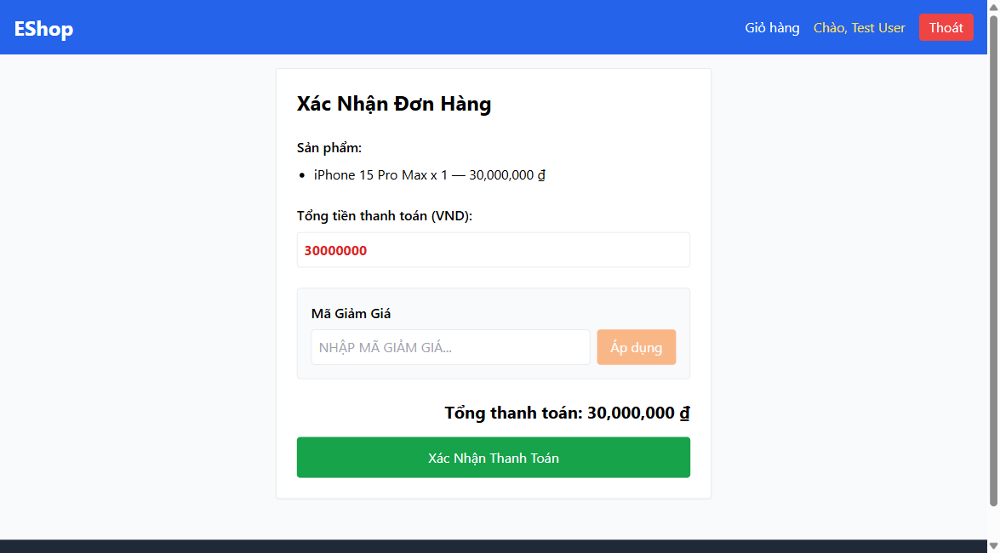

# Bug ID: `GUI-CHK-008`

## Bug description:
Nút Đăng xuất tài khoản trên thanh điều hướng chung (Navbar) hiển thị nhãn là "Thoát" thay vì chuẩn "Đăng xuất" theo quy định thiết kế điều hướng FR-23.

## Test case coverage: 
- `GUI-CHK-008` (Kiểm tra nhãn nút Đăng xuất trên thanh điều hướng Navbar)

## Preconditions: 
- Người dùng đã đăng nhập và truy cập ứng dụng.

## Test steps: 
1. Đăng nhập tài khoản và truy cập trang bất kỳ (ví dụ: Trang chủ `/` hoặc Thanh toán `/checkout`).
2. Quan sát thanh Header / Navbar ở phía trên góc phải màn hình.

## Expected results: 
Nút đăng xuất tài khoản phải hiển thị nhãn chuẩn là "Đăng xuất" theo tiêu chuẩn giao diện FR-23.

## Actual results: 
Nút đăng xuất đang hiển thị nhãn là "Thoát" (`<button ...>Thoát</button>`).

## Severity: 
Minor

## Priority: 
Low

### Bug screenshot: 

