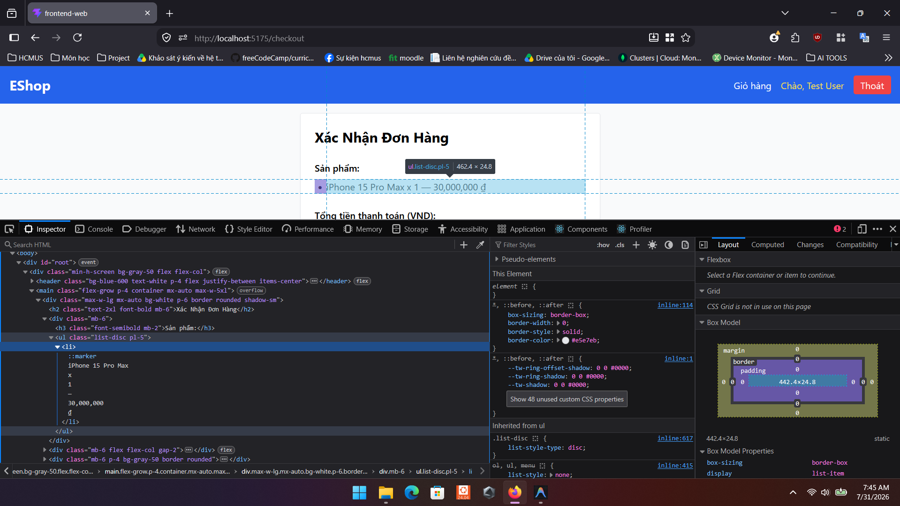

# Bug ID: `GUI-CHK-012`

## Bug description:
Phần tóm tắt danh sách sản phẩm đặt mua trên trang Thanh toán chỉ hiển thị dạng văn bản thuần túy `<ul><li>` mà không có hình ảnh thumbnail của sản phẩm và thuộc tính `alt` kèm theo theo quy định FR-24.

## Test case coverage: 
- `GUI-CHK-012` (Kiểm tra hiển thị hình ảnh sản phẩm và thuộc tính alt trong tóm tắt đơn hàng)

## Preconditions: 
- Người dùng có sản phẩm trong giỏ và mở trang Thanh toán (`/checkout`).

## Test steps: 
1. Truy cập trang Thanh toán (`/checkout`).
2. Quan sát danh sách "Sản phẩm:" trong bảng xác nhận đơn hàng.

## Expected results: 
Mỗi sản phẩm hiển thị kèm hình ảnh thu nhỏ (thumbnail) có thuộc tính `alt` mô tả rõ ràng (ví dụ: ``).

## Actual results: 
Danh sách sản phẩm render bằng text thuần túy: `<li key={index}>{item.name} x {item.quantity} — {(item.price * item.quantity).toLocaleString()} ₫</li>`, hoàn toàn không có thẻ `` và thuộc tính `alt`.

## Severity: 
Minor

## Priority: 
Low

### Bug screenshot: 

