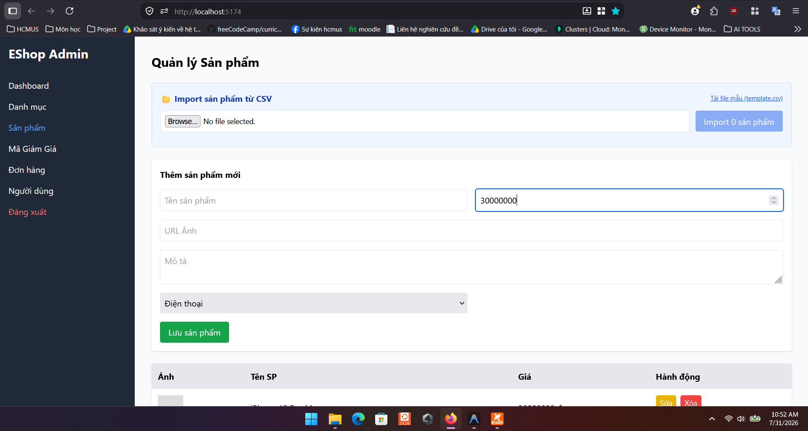

# Bug ID: `UX-02`

## Bug description:
Ô nhập "Giá tiền" trên Form sản phẩm thiếu Label cố định (chỉ dùng placeholder), không tự động phân cách 3 chữ số hàng nghìn (ví dụ: `100.000`) và không tự trim khoảng trắng thừa, dẫn đến 3/7 người dùng (43%) nhập sai nhiều lần.

## Test case coverage: 
- `UX-02` (Kiểm tra nhãn Label và định dạng số tiền tự động tại ô Giá tiền)

## Preconditions: 
- Admin đã đăng nhập vào hệ thống Web Admin (`http://localhost:5174`).

## Test steps: 
1. Truy cập tab "Sản phẩm" trong Web Admin.
2. Quan sát ô nhập "Giá tiền" trong form "Thêm sản phẩm mới".
3. Thử nhập một số tiền lớn (ví dụ: `30000000`) và kiểm tra phản hồi hiển thị.

## Expected results: 
Ô nhập giá tiền phải có Label cố định phía trên, hỗ trợ tự động phân cách hàng nghìn theo thời gian thực (currency mask: `30.000.000 ₫`) và tự động xóa khoảng trắng dư thừa.

## Actual results: 
Ô nhập chỉ dùng `placeholder="Giá tiền"`, không phân cách 3 chữ số khiến người dùng dễ nhìn nhầm số lượng số 0 và nhập sai giá tiền nhiều lần.

## Severity: 
Major

## Priority: 
High

### Bug screenshot: 

