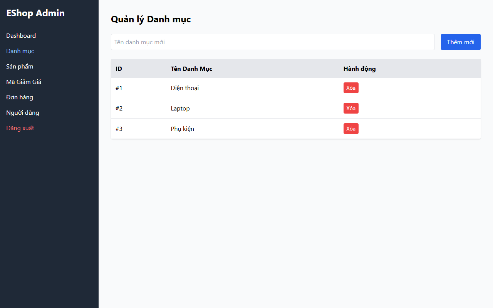

# Bug ID: `UX-03`

## Bug description:
Form Quản lý Danh mục không vô hiệu hóa (disable) nút "Thêm mới" khi ô nhập rỗng, khiến 4/7 người dùng (57%) có thói quen bấm nút "Thêm mới" ngay lập tức mà chưa điền Tên danh mục.

## Test case coverage: 
- `UX-03` (Kiểm tra trạng thái nút Thêm mới và validation rỗng Form Danh mục)

## Preconditions: 
- Admin đã đăng nhập vào hệ thống Web Admin (`http://localhost:5174`).

## Test steps: 
1. Truy cập tab "Danh mục" trong Web Admin.
2. Để trống ô nhập "Tên danh mục mới".
3. Quan sát trạng thái và thử nhấn nút "Thêm mới".

## Expected results: 
Nút "Thêm mới" phải bị vô hiệu hóa (`disabled`) khi chưa điền dữ liệu, hoặc hiển thị cảnh báo validation ngay dưới ô nhập khi người dùng nhấn nút.

## Actual results: 
Nút "Thêm mới" luôn ở trạng thái active xanh lá, khi nhấn tạo danh mục rỗng hoặc gọi API lỗi mà không có cảnh báo trực quan trước.

## Severity: 
Moderate

## Priority: 
Medium

### Bug screenshot: 

