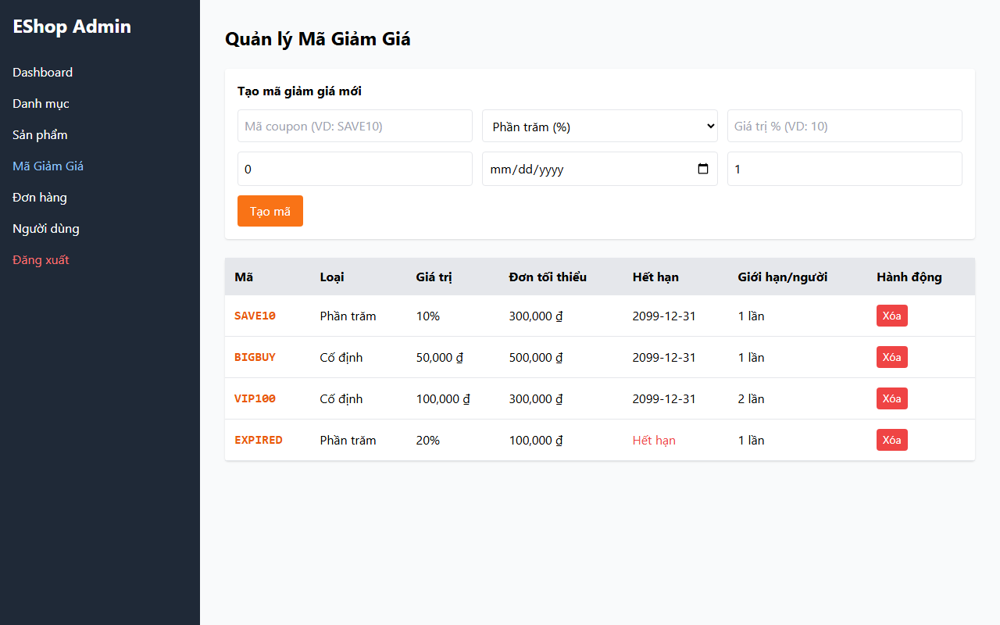

# Bug ID: `UX-04`

## Bug description:
Ô nhập Ngày hết hạn mã giảm giá (Input date) chưa được chuẩn hóa theo định dạng Việt Nam (`dd/mm/yyyy`), gây nhầm lẫn giữa ngày và tháng cho người dùng khi chọn hạn dùng.

## Test case coverage: 
- `UX-04` (Kiểm tra định dạng DatePicker tại ô Ngày hết hạn mã giảm giá)

## Preconditions: 
- Admin đã đăng nhập vào hệ thống Web Admin (`http://localhost:5174`).

## Test steps: 
1. Truy cập tab "Mã Giảm Giá" trong Web Admin.
2. Nhấp vào ô nhập "Ngày hết hạn" trong form "Tạo mã giảm giá mới".
3. Chọn một ngày bất kỳ và quan sát định dạng hiển thị.

## Expected results: 
DatePicker và trường nhập phải hiển thị trực quan theo định dạng Việt Nam `dd/mm/yyyy` (Ngày/Tháng/Năm).

## Actual results: 
Trường nhập phụ thuộc vào cài đặt trình duyệt mặc định (dạng `mm/dd/yyyy`), không được format cứng theo chuẩn `dd/mm/yyyy` làm người dùng phân vân.

## Severity: 
Moderate

## Priority: 
Medium

### Bug screenshot: 

