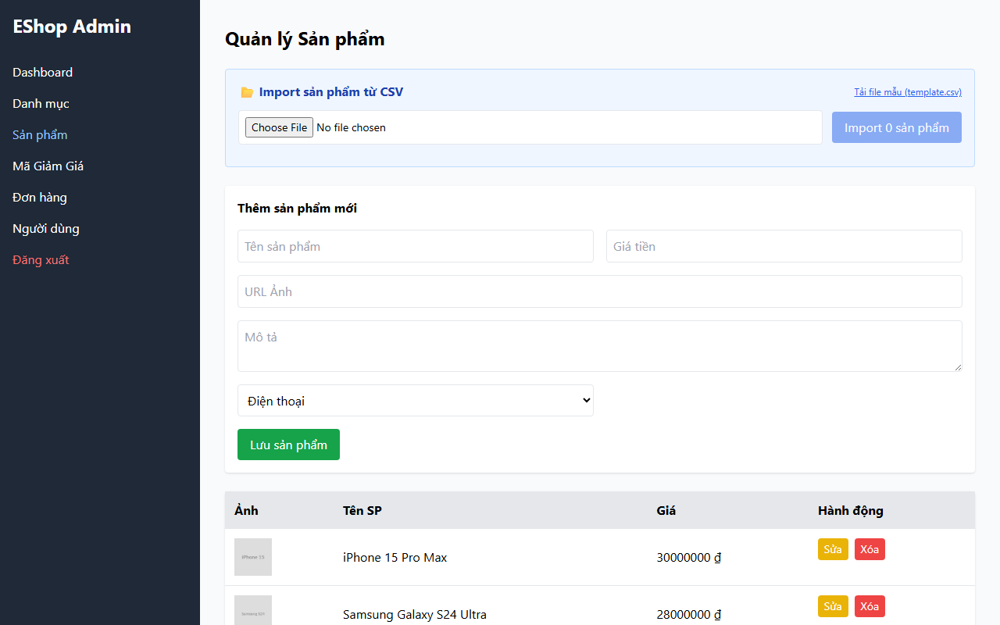

# Bug ID: `UX-05`

## Bug description:
Hệ thống thiếu thông báo phản hồi trạng thái (Toast notification / Popup) ở góc màn hình khi nhấn "Lưu sản phẩm" hoặc "Tạo mã" thành công, khiến 4/7 người dùng (57%) hoài nghi không biết thao tác đã được lưu hay chưa.

## Test case coverage: 
- `UX-05` (Kiểm tra thông báo phản hồi trạng thái Feedback khi thực hiện lưu dữ liệu)

## Preconditions: 
- Admin đã đăng nhập vào hệ thống Web Admin (`http://localhost:5174`).

## Test steps: 
1. Truy cập tab "Sản phẩm" hoặc "Mã Giảm Giá".
2. Điền đầy đủ thông tin và nhấn nút "Lưu sản phẩm" / "Tạo mã".
3. Quan sát phản hồi hiển thị trên màn hình sau khi lưu thành công.

## Expected results: 
Hệ thống phải lập tức xuất hiện Toast notification nổi ở góc màn hình (ví dụ: "✅ Đã lưu sản phẩm thành công!") để người dùng yên tâm.

## Actual results: 
Hệ thống chỉ âm thầm cập nhật vào bảng dữ liệu bên dưới mà không có Toast notification hay Popup phản hồi tức thì, khiến nhiều người dùng bấm lưu nhiều lần hoặc phải F5 kiểm tra lại.

## Severity: 
Moderate

## Priority: 
Medium

### Bug screenshot: 

