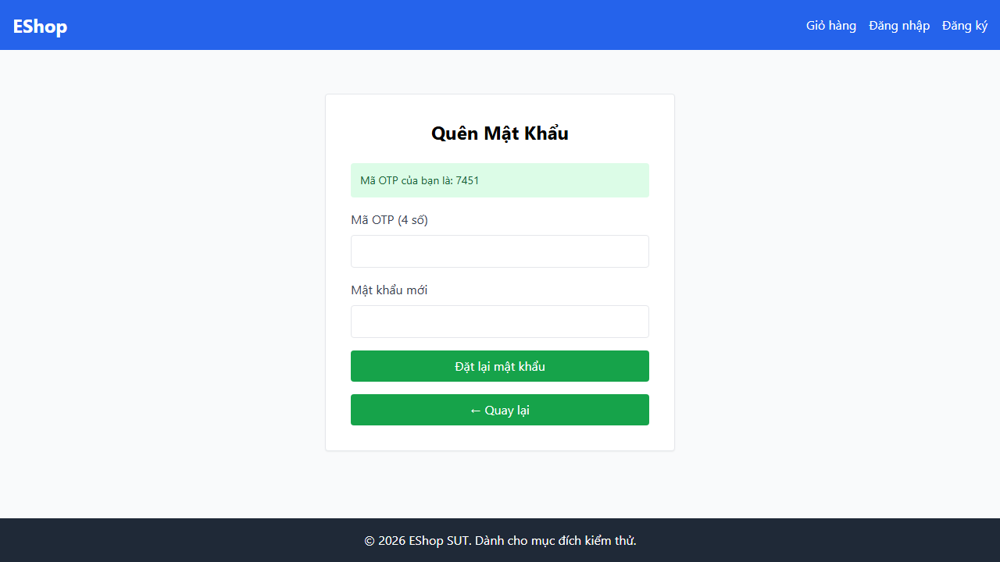
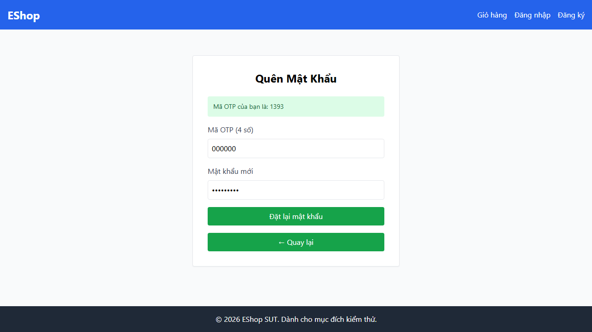

# 🐛 Báo Cáo Lỗi Kiểm Thử (Bug Report) - Feature FR-03: Quên mật khẩu & Đặt lại mật khẩu

**Ngày tạo:** 2026-08-06  
**Người thực hiện:** 23127340  

---

## [BUG-01] SUT sinh mã OTP gồm 4 chữ số thay vì 6 chữ số theo đúng yêu cầu đặc tả SRS

- **Bug ID:** BUG-FR03-01
- **Test Case liên quan:** TC-FR03-01 (EP Email hợp lệ đã đăng ký trong miền E1) & các kịch bản EP Bước 2 (TC-FR03-02, TC-FR03-09 đến TC-FR03-16)
- **Trình duyệt bị lỗi:** Chromium, Firefox, WebKit
- **Severity (Mức độ nghiêm trọng kỹ thuật):** Major
- **Priority (Mức độ ưu tiên xử lý kinh doanh):** P1 (High)
- **Trạng thái:** New

### 1. Các bước tái hiện (Steps to Reproduce)
1. Truy cập trang `/forgot-password`
2. Nhập Email đã đăng ký trong hệ thống: `test@eshop.com`
3. Nhấn nút **"Lấy mã OTP"**

### 2. Kết quả thực tế (Actual Result)
Hệ thống hiển thị thông báo thành công chứa mã OTP gồm 4 chữ số (ví dụ: `7451` hoặc `8967`).

### 3. Kết quả kỳ vọng (Expected Result)
Mã OTP sinh ra phải đúng 6 chữ số theo yêu cầu chuẩn SRS (ví dụ: `123456`) để đảm bảo tính an toàn bảo mật.

### 4. Bằng chứng lỗi (Evidence Screenshot)

---

## [BUG-02] Regex xác thực mật khẩu ở Backend SUT bị lỗi cài đặt (bắt buộc chứa khoảng trắng thay vì ký tự đặc biệt)

- **Bug ID:** BUG-FR03-02
- **Test Case liên quan:** TC-FR03-02, TC-FR03-24, TC-FR03-25, TC-FR03-27, TC-FR03-28, TC-FR03-30, TC-FR03-31, TC-FR03-33, TC-FR03-34, TC-FR03-36, TC-FR03-37
- **Trình duyệt bị lỗi:** Chromium, Firefox, WebKit
- **Severity (Mức độ nghiêm trọng kỹ thuật):** Critical
- **Priority (Mức độ ưu tiên xử lý kinh doanh):** P1 (High)
- **Trạng thái:** New

### 1. Các bước tái hiện (Steps to Reproduce)
1. Truy cập trang `/forgot-password`
2. Nhập Email: `test@eshop.com`, nhấn nút **"Lấy mã OTP"**
3. Nhập mã OTP đã nhận, nhập Mật khẩu mới hợp lệ chứa ký tự đặc biệt (ví dụ: `NewPass!1` hoặc `Abc!1234`)
4. Nhập Xác nhận mật khẩu trùng khớp và nhấn **"Đặt lại mật khẩu"**

### 2. Kết quả thực tế (Actual Result)
Hệ thống bật thông báo Alert: `"Mật khẩu quá yếu! Phải dài tối thiểu 8 ký tự, gồm chữ hoa, chữ thường, số và KÝ TỰ ĐẶC BIỆT."` mặc dù mật khẩu nhập vào hoàn toàn thỏa mãn tiêu chuẩn an toàn. Nguyên nhân do Backend dùng biểu thức Regex lỗi `/(?=.*\s)[A-Za-z\d\s]{8,}$/` (bắt buộc ký tự khoảng trắng `\s` thay vì ký tự đặc biệt).

### 3. Kết quả kỳ vọng (Expected Result)
Hệ thống cho phép đặt lại mật khẩu thành công và thông báo `"Đổi mật khẩu thành công!"`, sau đó chuyển hướng về trang Đăng nhập `/login`.

### 4. Bằng chứng lỗi (Evidence Screenshot)

---

## [BUG-03] SUT không kiểm tra và báo lỗi sai mã OTP mà ưu tiên kiểm tra mật khẩu trước khi xử lý Bước 2

- **Bug ID:** BUG-FR03-03
- **Test Case liên quan:** TC-FR03-06 (EP Mã OTP sai không khớp), TC-FR03-07 (EP Mã OTP của email khác)
- **Trình duyệt bị lỗi:** Chromium, Firefox, WebKit
- **Severity (Mức độ nghiêm trọng kỹ thuật):** Major
- **Priority (Mức độ ưu tiên xử lý kinh doanh):** P2 (Medium)
- **Trạng thái:** New

### 1. Các bước tái hiện (Steps to Reproduce)
1. Truy cập trang `/forgot-password`
2. Nhập Email `test@eshop.com` và lấy mã OTP
3. Nhập mã OTP không đúng (ví dụ: `000000` hoặc `9999`) và nhập mật khẩu mới `NewPass!1`
4. Nhấn **"Đặt lại mật khẩu"**

### 2. Kết quả thực tế (Actual Result)
Hệ thống không đối soát mã OTP để hiển thị thông báo `"Mã OTP không đúng"`, mà lại kiểm tra mật khẩu và trả về thông báo lỗi sai quy cách mật khẩu.

### 3. Kết quả kỳ vọng (Expected Result)
Hệ thống phải ưu tiên kiểm tra mã OTP, nếu mã OTP sai hoặc không khớp thì hiển thị thông báo lỗi `"Mã OTP không đúng"`.

### 4. Bằng chứng lỗi (Evidence Screenshot)

