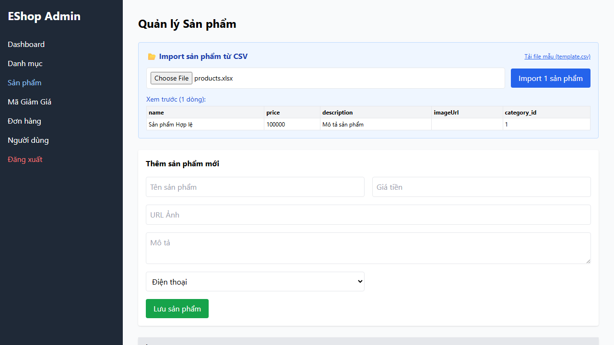
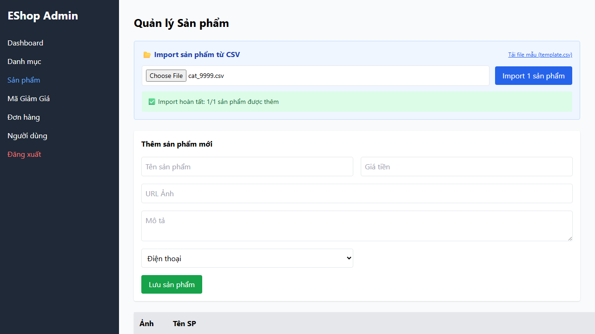
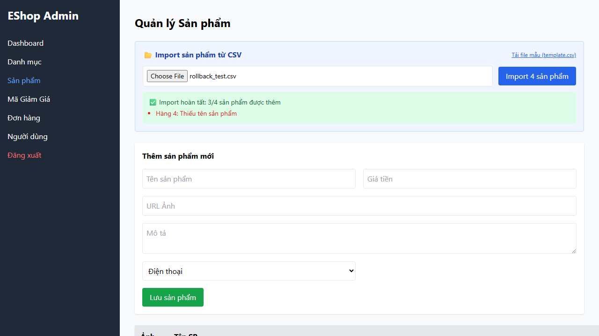
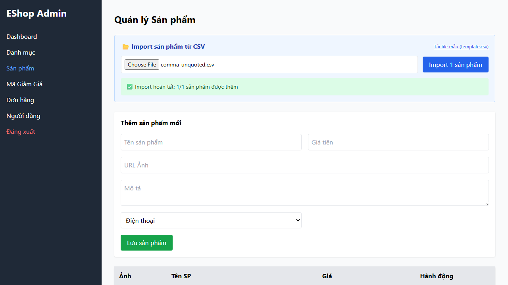

# 🐛 Báo Cáo Lỗi Kiểm Thử (Bug Report) - Feature FR-16 (Import Products from CSV)

**Ngày tạo:** 2026-08-07  
**Người thực hiện:** 23127340  

---

## [BUG-FR16-01] SUT không từ chối các file không đúng định dạng CSV (.xlsx, không có đuôi file) ngay ở tầng xem trước (Preview)

- **Bug ID:** BUG-FR16-01
- **Test Case liên quan:** FR16_EP_IV01, FR16_EP_IV02
- **Trình duyệt bị lỗi:** Chromium, Firefox, WebKit
- **Severity (Mức độ nghiêm trọng kỹ thuật):** Major
- **Priority (Mức độ ưu tiên xử lý kinh doanh):** P2 (Medium)
- **Trạng thái:** New

### 1. Các bước tái hiện (Steps to Reproduce)
1. Đăng nhập trang Admin (`http://localhost:5174`) và chuyển tới tab **Sản phẩm**.
2. Chọn file `products.xlsx` (định dạng Excel) hoặc file `products` (không có phần mở rộng).
3. Quan sát giao diện Admin ở phần xem trước file import.

### 2. Kết quả thực tế (Actual Result)
Giao diện Admin vẫn hiển thị khung xem trước dữ liệu ("Xem trước (1 dòng):") và cho phép kích hoạt thao tác Import.

### 3. Kết quả kỳ vọng (Expected Result)
Hệ thống phải kiểm tra phần mở rộng file, từ chối nạp file không phải `.csv`, không hiển thị khung xem trước và khóa (disable) nút Import kèm thông báo lỗi "Định dạng file không hợp lệ".

### 4. Bằng chứng lỗi (Evidence Screenshot)

---

## [BUG-FR16-02] SUT không kiểm tra validation giá sản phẩm không hợp lệ (price <= 0, giá trị chuỗi hoặc rỗng) khi import CSV

- **Bug ID:** BUG-FR16-02
- **Test Case liên quan:** FR16_EP_IV09, FR16_EP_IV10, FR16_EP_IV11, FR16_EP_IV12, FR16_BVA_07, FR16_BVA_10
- **Trình duyệt bị lỗi:** Chromium, Firefox, WebKit
- **Severity (Mức độ nghiêm trọng kỹ thuật):** Major
- **Priority (Mức độ ưu tiên xử lý kinh doanh):** P1 (High)
- **Trạng thái:** New

### 1. Các bước tái hiện (Steps to Reproduce)
1. Đăng nhập trang Admin (`http://localhost:5174`) và chuyển tới tab **Sản phẩm**.
2. Tải lên file CSV chứa dữ liệu giá không hợp lệ (ví dụ: `price` bằng `0`, `-50000`, `'abc'`, hoặc rỗng).
3. Nhấn nút **Import**.

### 2. Kết quả thực tế (Actual Result)
Hệ thống không báo lỗi validation, cho phép lưu dữ liệu giá không hợp lệ vào CSDL hoặc không hiển thị thông báo hủy giao dịch (`Import hoàn tất: 0/...`).

### 3. Kết quả kỳ vọng (Expected Result)
Hệ thống phải kiểm tra giá sản phẩm `price > 0`, từ chối import dòng dữ liệu lỗi, báo lỗi chi tiết "Giá tiền không hợp lệ" và thực hiện hủy giao dịch (Rollback 0 sản phẩm được thêm).

### 4. Bằng chứng lỗi (Evidence Screenshot)

---

## [BUG-FR16-03] SUT cho phép import tên sản phẩm vượt quá độ dài tối đa 255 ký tự (256 ký tự)

- **Bug ID:** BUG-FR16-03
- **Test Case liên quan:** FR16_EP_IV08, FR16_BVA_06
- **Trình duyệt bị lỗi:** Chromium, Firefox, WebKit
- **Severity (Mức độ nghiêm trọng kỹ thuật):** Major
- **Priority (Mức độ ưu tiên xử lý kinh doanh):** P2 (Medium)
- **Trạng thái:** New

### 1. Các bước tái hiện (Steps to Reproduce)
1. Đăng nhập trang Admin (`http://localhost:5174`) và chuyển tới tab **Sản phẩm**.
2. Tải lên file CSV có cột `name` chứa chuỗi có độ dài 256 ký tự (vượt quá 255 ký tự).
3. Nhấn nút **Import**.

### 2. Kết quả thực tế (Actual Result)
Hệ thống thực hiện import sản phẩm mà không báo lỗi tên sản phẩm quá dài.

### 3. Kết quả kỳ vọng (Expected Result)
Hệ thống phải chặn việc import tên sản phẩm > 255 ký tự, hiển thị thông báo lỗi "Tên sản phẩm quá dài" và trả về `Import hoàn tất: 0/...`.
- **Cơ sở tiêu chuẩn đối soát:** Dựa trên thuộc tính ràng buộc đầu vào chuẩn của **FR-15 (Product CRUD)** quy định *"Tên sản phẩm tối đa 255 ký tự"* và giới hạn độ dài lưu trữ trường `name` trong CSDL SQLite. Việc import sản phẩm hàng loạt từ CSV (FR-16) bắt buộc phải tuân thủ đồng nhất chuẩn ràng buộc dữ liệu này.

### 4. Bằng chứng lỗi (Evidence Screenshot)

---

## [BUG-FR16-04] SUT không kiểm tra validation ID danh mục (category_id không tồn tại, không phải số hoặc để trống)

- **Bug ID:** BUG-FR16-04
- **Test Case liên quan:** FR16_EP_IV13, FR16_EP_IV14, FR16_EP_IV15
- **Trình duyệt bị lỗi:** Chromium, Firefox, WebKit
- **Severity (Mức độ nghiêm trọng kỹ thuật):** Major
- **Priority (Mức độ ưu tiên xử lý kinh doanh):** P2 (Medium)
- **Trạng thái:** New

### 1. Các bước tái hiện (Steps to Reproduce)
1. Đăng nhập trang Admin (`http://localhost:5174`) và chuyển tới tab **Sản phẩm**.
2. Tải lên file CSV có `category_id` bằng `9999` (không tồn tại), `'abc'` hoặc để trống.
3. Nhấn nút **Import**.

### 2. Kết quả thực tế (Actual Result)
Hệ thống không validate `category_id` trước khi import, dẫn đến lỗi chưa được xử lý hoặc cho phép import dữ liệu vi phạm khóa ngoại.

### 3. Kết quả kỳ vọng (Expected Result)
Hệ thống phải kiểm tra `category_id` tồn tại trong hệ thống, từ chối import và hiển thị thông báo lỗi rõ ràng cho người dùng.

### 4. Bằng chứng lỗi (Evidence Screenshot)

---

## [BUG-FR16-05] SUT vi phạm nguyên tắc giao dịch nguyên tử (All-or-Nothing Rollback) khi 1 dòng dữ liệu trong file CSV bị lỗi

- **Bug ID:** BUG-FR16-05
- **Test Case liên quan:** FR16_EP_IV16
- **Trình duyệt bị lỗi:** Chromium, Firefox, WebKit
- **Severity (Mức độ nghiêm trọng kỹ thuật):** Critical
- **Priority (Mức độ ưu tiên xử lý kinh doanh):** P1 (High)
- **Trạng thái:** New

### 1. Các bước tái hiện (Steps to Reproduce)
1. Đăng nhập trang Admin (`http://localhost:5174`) và chuyển tới tab **Sản phẩm**.
2. Tải lên file CSV chứa 4 dòng dữ liệu, trong đó dòng 1, 2, 4 hợp lệ và dòng 3 bị lỗi (rỗng `name`).
3. Nhấn nút **Import**.

### 2. Kết quả thực tế (Actual Result)
Hệ thống vẫn thực hiện lưu 3 dòng hợp lệ vào CSDL thay vì khôi phục trạng thái ban đầu (`0/4` sản phẩm được thêm).

### 3. Kết quả kỳ vọng (Expected Result)
Hệ thống phải đảm bảo nguyên tắc All-or-Nothing Rollback: Nếu có bất kỳ dòng nào trong file CSV bị lỗi, toàn bộ file phải bị từ chối import và không dòng nào được ghi vào CSDL (`Import hoàn tất: 0/4`).

### 4. Bằng chứng lỗi (Evidence Screenshot)

---

## [BUG-FR16-06] SUT parse sai dòng CSV chứa dấu phẩy không được bọc trong dấu nháy kép

- **Bug ID:** BUG-FR16-06
- **Test Case liên quan:** FR16_EP_IV06
- **Trình duyệt bị lỗi:** Chromium, Firefox, WebKit
- **Severity (Mức độ nghiêm trọng kỹ thuật):** Minor
- **Priority (Mức độ ưu tiên xử lý kinh doanh):** P3 (Low)
- **Trạng thái:** New

### 1. Các bước tái hiện (Steps to Reproduce)
1. Đăng nhập trang Admin (`http://localhost:5174`) và chuyển tới tab **Sản phẩm**.
2. Tải lên file CSV chứa dòng dữ liệu có dấu phẩy nằm trong giá trị cột nhưng không có nháy kép: `Bàn phím cơ, Keychron Q1,4000000,Bàn phím,,3`.
3. Nhấn nút **Import**.

### 2. Kết quả thực tế (Actual Result)
SUT phân tách dấu phẩy sai vị trí khiến cột giá nhận giá trị sai và không từ chối import đúng quy cách RFC 4180.

### 3. Kết quả kỳ vọng (Expected Result)
Hệ thống phát hiện lỗi định dạng CSV không bọc nháy kép theo RFC 4180 và từ chối import dòng dữ liệu này.

### 4. Bằng chứng lỗi (Evidence Screenshot)

---
