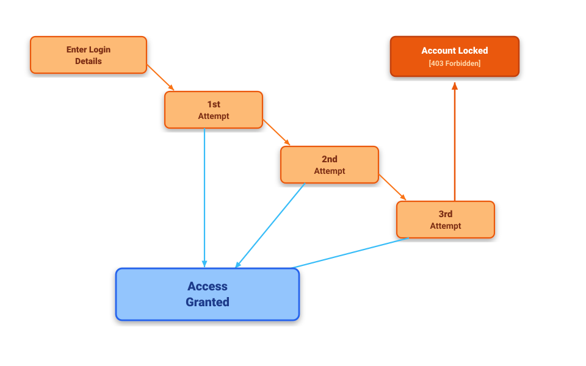

# BÁO CÁO THIẾT KẾ VÀ KIỂM THỬ API 1 (POOL A)

## `POST /api/login` (FR-02: Đăng nhập & Khóa tài khoản)

**Sinh viên thực hiện:** 23127340
**Môn học:** Software Testing (HW06 – API Testing)
**Hệ thống (SUT):** EShop Backend API (`http://localhost:3000`)

---

## 1. THÔNG TIN API & ĐẶC TẢ YÊU CẦU

* **Endpoint:** `POST /api/login`
* **Content-Type:** `application/json`
* **Mô tả chức năng:** Xác thực thông tin người dùng bằng `email` và `password`. Nếu thành công, trả về JWT Token và thông tin `user`. Nếu thất bại liên tiếp $\ge 3$ lần, tài khoản bị tạm khóa trong CSDL (`locked_until`).
* **Cấu trúc Request Body:**
  ```json
  {
    "email": "user@domain.com",
    "password": "Password123!"
  }
  ```
* **Mã phản hồi HTTP theo đặc tả:**
  * **200 OK:** Đăng nhập thành công, trả về JWT Token và thông tin `user` (loại bỏ trường mật khẩu).
  * **400 Bad Request:** Thiếu trường bắt buộc (`email` hoặc `password`), kiểu dữ liệu không hợp lệ.
  * **401 Unauthorized:** Email không tồn tại hoặc sai mật khẩu.
  * **403 Forbidden:** Tài khoản đang trong thời gian bị tạm khóa (`locked_until`).

---

## 2. PHÂN TÍCH TEST DESIGN CHI TIẾT (CHI TIẾT KỸ THUẬT)

### 2.1. Phân vùng Tương đương (Domain / Equivalence Partitioning Classes)

Phân tích miền giá trị đầu vào của 2 tham số `email` và `password` thành các lớp tương đương hợp lệ (**Valid Classes**) và không hợp lệ (**Invalid Classes**):

| Tham số               | Mã Lớp (Class ID) | Tên Phân Vùng Tương Đương                  | Điều kiện / Giá trị đại diện    |            Kỳ vọng            |
| :--------------------- | :-----------------: | :------------------------------------------------- | :-------------------------------------- | :-----------------------------: |
| **`email`**    |  **V_EM_01**  | Email hợp lệ đã tồn tại (User thường)      | `test@eshop.com`                      | Hợp lệ (200 nếu pass đúng) |
|                        |  **V_EM_02**  | Email hợp lệ đã tồn tại (Admin)              | `admin@eshop.com`                     |  Hợp lệ (200, role='admin')  |
|                        | **IV_EM_01** | Email hợp lệ nhưng chưa từng đăng ký       | `notfound@eshop.com`                  |        401 Unauthorized        |
|                        | **IV_EM_02** | Email sai cú pháp (thiếu`@`)                  | `invalidemail.com`                    |         400 Bad Request         |
|                        | **IV_EM_03** | Email sai cú pháp (thiếu domain)                | `user@`                               |         400 Bad Request         |
|                        | **IV_EM_04** | Email chứa khoảng trắng ở giữa                | `user name@eshop.com`                 |         400 Bad Request         |
|                        | **IV_EM_05** | Chuỗi rỗng                                       | `""`                                  |         400 Bad Request         |
|                        | **IV_EM_06** | Không truyền trường`email` / Null            | `null` hoặc không có key           |         400 Bad Request         |
|                        | **IV_EM_07** | Kiểu dữ liệu không phải string (Số/Bool/Obj) | `123456`, `true`, `{"$ne": null}` |         400 Bad Request         |
| **`password`** |  **V_PW_01**  | Mật khẩu chính xác khớp với tài khoản      | `Test1234!` (hoặc `Admin123!`)     |        Hợp lệ (200 OK)        |
|                        | **IV_PW_01** | Mật khẩu sai hoàn toàn                         | `WrongPassword999`                    |        401 Unauthorized        |
|                        | **IV_PW_02** | Chuỗi rỗng                                       | `""`                                  |         400 Bad Request         |
|                        | **IV_PW_03** | Không truyền trường`password` / Null         | `null` hoặc không có key           |         400 Bad Request         |
|                        | **IV_PW_04** | Kiểu dữ liệu không phải string (Bool/Number)  | `true`, `12345678`                  |         400 Bad Request         |

---

### 2.2. Phân tích Giá trị Biên (Boundary Value Analysis - BVA)

#### A. Nguyên tắc áp dụng BVA:

BVA chỉ áp dụng cho các **tham số đầu vào có miền giá trị định lượng có thứ tự (Ordered Input Domains)**. Trong Request Body của `POST /api/login`, tham số duy nhất có miền giá trị có thứ tự là **Độ dài Mật khẩu (`password.length`)** với ràng buộc tối thiểu $\ge 8$ ký tự (ngưỡng biên dưới $\text{Min} = 8$).

#### B. Bảng Giá Trị Biên 3-Point BVA:

Áp dụng phương pháp **3-Point BVA** ($\text{Min}-1, \text{Min}, \text{Min}+1$) tại điểm biên dưới $\text{Min} = 8$:

| Tham số kiểm tra                                   | Ngưỡng theo Spec                                       |      Kỹ thuật      | 3 Điểm biên cụ thể                                                                                                                                                   |             Mã test tương ứng             | Kỳ vọng                                                                                                              |
| :--------------------------------------------------- | :------------------------------------------------------- | :-------------------: | :------------------------------------------------------------------------------------------------------------------------------------------------------------------------ | :-------------------------------------------: | :--------------------------------------------------------------------------------------------------------------------- |
| **Độ dài Mật khẩu** (`password.length`) | $\text{Length} \ge 8$(Biên dưới $\text{Min} = 8$) | **3-point BVA** | $\bullet\ 7$ ký tự ($\text{Min}-1$): `"Pass12!"`$\bullet\ 8$ ký tự ($\text{Min}$): `"Pass123!"`$\bullet\ 9$ ký tự ($\text{Min}+1$): `"Pass1234!"` | `TC_LOG_BVA_01TC_LOG_BVA_02``TC_LOG_BVA_03` | • 7 chars: 401 Unauthorized (Dưới chuẩn)• 8 chars: 200 OK (nếu đúng pass)• 9 chars: 200 OK (nếu đúng pass) |

#### C. Lý do lựa chọn 3-point BVA:

* **Kiểm tra chính xác toán tử so sánh:** Đảm bảo hệ thống kiểm tra chặt chẽ điều kiện $\ge 8$ (bao phủ cả điểm không hợp lệ $7$, điểm biên $8$, và điểm hợp lệ kế cận $9$).
* **Tuân thủ chuẩn quốc tế ISO/IEC/IEEE 29119-4:** Đảm bảo tính đầy đủ của kiểm thử biên cho các trường xác thực quan trọng.

---

### 2.3. Sơ đồ Chuyển trạng thái (State Transition Testing — Vòng đời Khóa Tài khoản)

> *Lưu ý: Cơ chế khóa tài khoản sau các lần đăng nhập sai và tự động mở khóa theo thời gian là thuộc tính trạng thái nội tại của hệ thống (Internal State Lifecycle), được kiểm thử toàn diện qua State Transition Testing.*

#### A. Sơ đồ chuyển trạng thái (State Transition Diagram)

*Sơ đồ chuyển trạng thái dưới đây được thiết kế theo cấu trúc bậc thang và lưu tại đường dẫn `./images/FR02.svg`.*



#### B. Xác định States & Actions

**1. Danh sách các Trạng thái (States):**

| State                   | Tên trạng thái               | Mô tả ý nghĩa / Điều kiện đạt trạng thái                                                    |
| ----------------------- | ------------------------------- | ------------------------------------------------------------------------------------------------------ |
| `Enter_Login_Details` | Nhập thông tin ban đầu      | Trạng thái mặc định trước khi đăng nhập,`login_attempts = 0`, `locked_until = NULL`.     |
| `1st_Attempt`         | Lần thử 1 (Thất bại lần 1) | Người dùng nhập sai mật khẩu lần đầu tiên,`login_attempts = 1`.                            |
| `2nd_Attempt`         | Lần thử 2 (Thất bại lần 2) | Người dùng nhập sai mật khẩu lần thứ 2 liên tiếp,`login_attempts = 2`.                     |
| `3rd_Attempt`         | Lần thử 3 (Thất bại lần 3) | Người dùng nhập sai mật khẩu lần thứ 3 liên tiếp,`login_attempts = 3`.                     |
| `Access_Granted`      | Đăng nhập thành công       | Xác thực thành công (HTTP 200 OK), cấp JWT Token, reset`login_attempts = 0`.                    |
| `Account_Locked`      | Tạm khóa tài khoản          | Tài khoản bị khóa sau 3 lần sai liên tiếp, gán`locked_until = Date.now() + 180s` (HTTP 403). |

**2. Danh sách các Hành động / Sự kiện (Actions / Events):**

| Action / Event                 | Actor | Mô tả                                                                                         |
| ------------------------------ | ----- | ----------------------------------------------------------------------------------------------- |
| `Enter_Correct_Password`     | User  | Gửi`POST /api/login` với email và mật khẩu chính xác (`200 OK`).                     |
| `Enter_Wrong_Password`       | User  | Gửi`POST /api/login` với mật khẩu không chính xác (`401 Unauthorized`).              |
| `Login_While_Locked`         | User  | Gửi request khi tài khoản đang trong thời gian tạm khóa (`403 Forbidden`).             |
| `Login_After_Lockout_Expiry` | User  | Gửi request với mật khẩu đúng sau khi thời gian tạm khóa đã kết thúc (`200 OK`). |

#### C. Ma trận Trạng thái x Hành động (States x Actions Matrix)

| Trạng thái hiện tại           | Action: Enter_Correct_Password               | Action: Enter_Wrong_Password                                                       | Action: Login_While_Locked                           | Action: Login_After_Lockout_Expiry                    |
| --------------------------------- | -------------------------------------------- | ---------------------------------------------------------------------------------- | ---------------------------------------------------- | ----------------------------------------------------- |
| **`Enter_Login_Details`** | `Access_Granted` (200 OK)                  | `1st_Attempt` (401 Unauthorized)                                                 | —                                                   | —                                                    |
| **`1st_Attempt`**         | `Access_Granted` (200 OK - Reset attempts) | `2nd_Attempt` (401) *(⚠️ `BUG-LOG-01` nhảy cóc sang `Account_Locked`)* | —                                                   | —                                                    |
| **`2nd_Attempt`**         | `Access_Granted` (200 OK - Reset attempts) | `3rd_Attempt` $\rightarrow$ `Account_Locked` (401 / Khóa)                   | —                                                   | —                                                    |
| **`3rd_Attempt`**         | `Access_Granted` (200 OK - Reset attempts) | `Account_Locked` (401 / Khóa tài khoản)                                       | —                                                   | —                                                    |
| **`Account_Locked`**      | —                                           | —                                                                                 | `Account_Locked` (403 Forbidden - Chặn truy cập) | `Access_Granted` (200 OK - Mở khóa & Reset về 0) |

---

## 3. DANH SÁCH BỘ TEST CASES CHI TIẾT (>= 35 CASES)

### Nhóm A: Domain & Input Validation Test Cases (16 TCs)

| TC ID             | Miền kiểm thử (Target Class / BVA)                             | Input Request Body                                              |   Expected Status   | Expected Output & Assertion                     |
| :---------------- | :---------------------------------------------------------------- | :-------------------------------------------------------------- | :------------------: | :---------------------------------------------- |
| `TC_LOG_DOM_01` | **`V_EM_01` & `V_PW_01`** (User & Mật khẩu hợp lệ)  | `{"email": "test@eshop.com", "password": "Test1234!"}`        |      `200 OK`      | Cấp token,`user.email == "test@eshop.com"`   |
| `TC_LOG_DOM_02` | **`V_EM_02` & `V_PW_01`** (Admin & Mật khẩu hợp lệ) | `{"email": "admin@eshop.com", "password": "Admin123!"}`       |      `200 OK`      | Cấp token,`user.role == "admin"`             |
| `TC_LOG_DOM_03` | **`IV_EM_01`** (Email chưa từng đăng ký)             | `{"email": "notfound@eshop.com", "password": "Test1234!"}`    | `401 Unauthorized` | Báo lỗi`Invalid email or password`          |
| `TC_LOG_DOM_04` | **`IV_EM_02`** (Email thiếu ký tự `@`)               | `{"email": "invalidemail.com", "password": "Test1234!"}`      | `400 Bad Request` | Báo lỗi email sai định dạng                |
| `TC_LOG_DOM_05` | **`IV_EM_03`** (Email thiếu phần domain)                | `{"email": "user@", "password": "Test1234!"}`                 | `400 Bad Request` | Báo lỗi email sai định dạng                |
| `TC_LOG_DOM_06` | **`IV_EM_04`** (Email chứa khoảng trắng)               | `{"email": "user name@eshop.com", "password": "Test1234!"}`   | `400 Bad Request` | Báo lỗi email sai định dạng                |
| `TC_LOG_DOM_07` | **`IV_EM_05`** (Email là chuỗi rỗng `""`)            | `{"email": "", "password": "Test1234!"}`                      | `400 Bad Request` | Báo lỗi email không được để trống      |
| `TC_LOG_DOM_08` | **`IV_EM_06`** (Không truyền trường `email`)        | `{"password": "Test1234!"}`                                   | `400 Bad Request` | Báo lỗi thiếu trường email bắt buộc      |
| `TC_LOG_DOM_09` | **`IV_EM_07`** (Email sai kiểu - Number)                 | `{"email": 123456, "password": "Test1234!"}`                  | `400 Bad Request` | Báo lỗi kiểu dữ liệu sai                   |
| `TC_LOG_DOM_10` | **`IV_PW_01`** (Mật khẩu sai hoàn toàn)               | `{"email": "test@eshop.com", "password": "WrongPassword999"}` | `401 Unauthorized` | Báo lỗi`Invalid email or password`          |
| `TC_LOG_DOM_11` | **`IV_PW_02`** (Mật khẩu là chuỗi rỗng `""`)       | `{"email": "test@eshop.com", "password": ""}`                 | `400 Bad Request` | Báo lỗi mật khẩu không được để trống |
| `TC_LOG_DOM_12` | **`IV_PW_03`** (Không truyền trường `password`)     | `{"email": "test@eshop.com"}`                                 | `400 Bad Request` | Báo lỗi thiếu trường password bắt buộc   |
| `TC_LOG_DOM_13` | **`IV_PW_04`** (Mật khẩu sai kiểu - Bool)              | `{"email": "test@eshop.com", "password": true}`               | `400 Bad Request` | Báo lỗi kiểu dữ liệu sai                   |
| `TC_LOG_BVA_01` | **3-point BVA: Min - 1 (7 ký tự)**                        | `{"email": "test@eshop.com", "password": "Pass12!"}`          | `401 Unauthorized` | Báo lỗi mật khẩu dưới 8 ký tự           |
| `TC_LOG_BVA_02` | **3-point BVA: Min (8 ký tự)**                            | `{"email": "test@eshop.com", "password": "Pass123!"}`         | `401 Unauthorized` | Kiểm tra mật khẩu đúng ngưỡng 8 ký tự  |
| `TC_LOG_BVA_03` | **3-point BVA: Min + 1 (9 ký tự)**                        | `{"email": "test@eshop.com", "password": "Pass1234!"}`        | `401 Unauthorized` | Kiểm tra mật khẩu trên ngưỡng 8 ký tự   |

### Nhóm B: State Transition Test Cases (8 TCs)

| TC ID            | Ánh xạ Ma trận Chuyển trạng thái (Mục 2.3.C)         | Bước chuyển & Kịch bản kiểm thử                                        |   Expected Status   | Kỳ vọng Database / State                                                  |
| :--------------- | :---------------------------------------------------------- | :---------------------------------------------------------------------------- | :------------------: | :-------------------------------------------------------------------------- |
| `TC_LOG_ST_01` | **Cell (Enter_Details, Enter_Wrong_Password)**        | `Enter_Login_Details` ──(Sai lần 1)──> `1st_Attempt`                 | `401 Unauthorized` | `login_attempts = 1`, `locked_until = NULL`                             |
| `TC_LOG_ST_02` | **Cell (1st_Attempt, Enter_Wrong_Password)**          | `1st_Attempt` ──(Sai lần 2)──> `2nd_Attempt`                         | `401 Unauthorized` | `login_attempts = 2` *(Phát hiện **`BUG-LOG-01`**)*           |
| `TC_LOG_ST_03` | **Cell (2nd_Attempt, Enter_Wrong_Password)**          | `2nd_Attempt` ──(Sai lần 3)──> `Account_Locked`                      | `401 Unauthorized` | `login_attempts = 3`, kích hoạt khóa `locked_until = now + 180s`     |
| `TC_LOG_ST_04` | **Cell (1st_Attempt, Enter_Correct_Password)**        | `1st_Attempt` ──(Nhập đúng)──> `Access_Granted`                    |      `200 OK`      | Đăng nhập thành công, reset`login_attempts = 0`                      |
| `TC_LOG_ST_05` | **Cell (2nd_Attempt, Enter_Correct_Password)**        | `2nd_Attempt` ──(Nhập đúng)──> `Access_Granted`                    |      `200 OK`      | Đăng nhập thành công, reset`login_attempts = 0`                      |
| `TC_LOG_ST_06` | **Cell (Account_Locked, Login_While_Locked)**         | `Account_Locked` ──(Thử khi khóa < 180s)──> `Account_Locked`        |  `403 Forbidden`  | "Tài khoản đã bị khóa. Vui lòng thử lại sau."                      |
| `TC_LOG_ST_07` | **Cell (Account_Locked, Login_After_Lockout_Expiry)** | `Account_Locked` ──(Đợi >= 180s + Nhập đúng)──> `Access_Granted` |      `200 OK`      | Đăng nhập thành công, reset`login_attempts = 0, locked_until = NULL` |
| `TC_LOG_ST_08` | **Cell (Enter_Details, Enter_Correct_Password)**      | `Enter_Login_Details` ──(Đúng lần đầu)──> `Access_Granted`       |      `200 OK`      | Cấp token JWT,`login_attempts = 0`                                       |

### Nhóm C: Security Test Cases (`SEC-01` đến `SEC-07`) — 7 TCs

| TC ID             | Mục tiêu bảo mật              | Payload kiểm thử (Request Body)                                                                   |  Expected Status  | Tiêu chí bảo mật & Assertion                                                                                                   |
| :---------------- | :-------------------------------- | :-------------------------------------------------------------------------------------------------- | :---------------: | :--------------------------------------------------------------------------------------------------------------------------------- |
| `TC_LOG_SEC_01` | SEC-04 (SQLi Bypass)              | `{"email": "' OR 1=1 --", "password": "any"}`                                                     | `401` / `400` | Không bị bypass đăng nhập                                                                                                     |
| `TC_LOG_SEC_02` | SEC-04 (SQLi Time Delay)          | `{"email": "test@eshop.com'; SELECT sqlite3_sleep(5000);--", "password": "1"}`                    | `401` / `400` | Không bị delay truy vấn SQL                                                                                                     |
| `TC_LOG_SEC_03` | SEC-01 (Sensitive Data Leak)      | `{"email": "test@eshop.com", "password": "Test1234!"}`                                            |    `200 OK`    | Response**không lộ** trường `password`/`reset_token`                                                                 |
| `TC_LOG_SEC_04` | SEC-01 (Password Hashing via API) | `{"email": "test@eshop.com", "password": "Test1234!"}`                                            |    `200 OK`    | `user.password` không được trả về dạng plaintext mà phải được băm Bcrypt *(Phát hiện **`BUG-LOG-03`**)* |
| `TC_LOG_SEC_05` | SEC-05 (XSS Payload)              | `{"email": "<script>alert('XSS')</script>@eshop.com", "password": "Test"}`                        | `400` / `401` | Chuỗi script được khử khuẩn an toàn                                                                                         |
| `TC_LOG_SEC_06` | SEC-02 (JWT Validation)           | `{"email": "test@eshop.com", "password": "Test1234!"}`                                            |    `200 OK`    | JWT gồm đúng 3 phần`header.payload.signature` tách bởi dấu chấm                                                          |
| `TC_LOG_SEC_07` | SEC-03 (Brute-force)              | `{"email": "test@eshop.com", "password": "WrongPassword999"}` *(gửi lặp 10 lần liên tiếp)* | `403` / `429` | Hệ thống kích hoạt khóa tài khoản hoặc giới hạn tần suất request                                                       |

### Nhóm D: Schema & Status Code Validation (5 TCs)

| TC ID             | Kịch bản Schema      | Payload kiểm thử (Request Body)                               |   Expected Status   | JSON Schema Assertion                                                     |
| :---------------- | :--------------------- | :-------------------------------------------------------------- | :------------------: | :------------------------------------------------------------------------ |
| `TC_LOG_SCH_01` | Success Response Shape | `{"email": "test@eshop.com", "password": "Test1234!"}`        |      `200 OK`      | Có`message` (str), `token` (str), `user` ({id, name, email, role}) |
| `TC_LOG_SCH_02` | Error 401 Shape        | `{"email": "test@eshop.com", "password": "WrongPassword"}`    | `401 Unauthorized` | Format JSON`{"error": "string"}`                                        |
| `TC_LOG_SCH_03` | Error 403 Shape        | `{"email": "locked_user@eshop.com", "password": "Test1234!"}` |  `403 Forbidden`  | Format JSON`{"error": "string"}`                                        |
| `TC_LOG_SCH_04` | Header Content-Type    | `{"email": "test@eshop.com", "password": "Test1234!"}`        |      `200 OK`      | Header`Content-Type: application/json`                                  |
| `TC_LOG_SCH_05` | Invalid Content-Type   | `"<user><email>test@eshop.com</email></user>"`                |  `400` / `415`  | Xử lý từ chối payload không phải JSON                               |

---

## 4. AUDIT & HUMAN REVIEW

| Test Case ID / Nhóm | Nhãn Đánh Giá | Nhận định của Con Người đối chiếu theo Đặc tả (api_specification.md) | Hành động hiệu chỉnh (Human Correction) |
| :--- | :---: | :--- | :--- |
| `TC_LOG_DOM_01` - `04`<br>`TC_LOG_DOM_05` - `13` | **VALID** | Thiết kế đúng theo đặc tả: Thành công trả `200 OK`, sai credentials trả `401`, dữ liệu rỗng/thiếu/sai type trả `400 Bad Request`. | Giữ nguyên trong bộ test suite chuẩn; khi chạy thực tế backend trả 401 cho body rỗng sẽ phát hiện lỗi backend (**`BUG-LOG-05 / 06`**). |
| `TC_LOG_ST_01` - `08` | **VALID** | Thiết kế chính xác theo đặc tả FR-02: Nhập sai 3 lần liên tiếp mới khóa tài khoản, đăng nhập đúng được mở khóa và reset về 0. | Giữ nguyên test case. Khi chạy phát hiện backend bị lỗi khóa ngay ở lần 2 (**`BUG-LOG-01`**) và khóa 180s (**`BUG-LOG-02`**). |
| *BVA Extreme Length (32/254 chars do AI tự sinh)* | **INVALID** | AI tự suy diễn các giới hạn độ dài 32 ký tự (Password) và 254 ký tự (Email) không hề có trong `api_specification.md` hay `README.md`. | **Loại bỏ hoàn toàn** các ca kiểm thử giả định vô căn cứ này khỏi bộ test design. |
| *BVA Minimum Password Length (Ban đầu)* | **INCOMPLETE** | AI ban đầu chỉ tạo 1 test case sơ sài cho độ dài mật khẩu mà không áp dụng kỹ thuật 3-point BVA {7, 8, 9} theo chuẩn ISO 29119-4. | **Bổ sung đầy đủ 3 ca kiểm thử biên** `TC_LOG_BVA_01`, `02`, `03` tại ngưỡng tối thiểu 8 ký tự. |
| `TC_LOG_SEC_01` - `07` | **VALID** | Bao phủ đầy đủ các tiêu chuẩn bảo mật theo đặc tả môn học (SQLi, XSS, JWT format, không lộ mật khẩu). | Đưa vào bộ kiểm thử bảo mật; phát hiện lỗi backend để lộ mật khẩu plaintext (**`BUG-LOG-03`**). |

---

## 5. MỞ RỘNG TEST CASES (HUMAN EXTENSION — 6 TCs)

| TC ID | Kỹ thuật & Tên Test Case | Mô tả & Dữ liệu Request | Lý do AI bỏ sót (Root Cause Analysis) |
| :--- | :--- | :--- | :--- |
| `TC_LOG_EXT_01` | **Security: Mass Assignment** | Gửi kèm trường nhạy cảm `{"email": "...", "password": "...", "role": "admin"}` | AI chỉ kiểm tra các trường có trong spec, không phòng ngừa hacker inject thêm trường. |
| `TC_LOG_EXT_02` | **Security: Timing Discrepancy** | Đo độ trễ thời gian Delta t giữa user tồn tại sai pass vs user không tồn tại | AI thiếu góc nhìn về side-channel attack và phân tích chênh lệch thời gian xử lý DB. |
| `TC_LOG_EXT_03` | **Domain: Case-Insensitive Email** | Đăng nhập bằng `TEST@ESHOP.COM` với pass đúng | AI mặc định email phân biệt hoa thường theo chuỗi thông thường. |
| `TC_LOG_EXT_04` | **Security: Zero-Width Characters** | Gửi email chứa ký tự vô hình `test\u200B@eshop.com` | AI không kiểm thử các ký tự Unicode Homoglyph Attack. |
| `TC_LOG_EXT_05` | **State: Reset Lockout on Success** | Nhập sai 2 lần -> Đăng nhập đúng -> Nhập sai lại 1 lần (kiểm tra reset) | AI chỉ test luồng tuyến tính 1 chiều. |
| `TC_LOG_EXT_06` | **Security: HTTP Verb Tampering** | Gửi `GET /api/login` hoặc `DELETE /api/login` | AI chỉ tập trung vào verb `POST` trong spec. |

**TỔNG CỘNG TEST CASES API 1:** **42 Test Cases** (AI: 36, Human Extend: 6).
