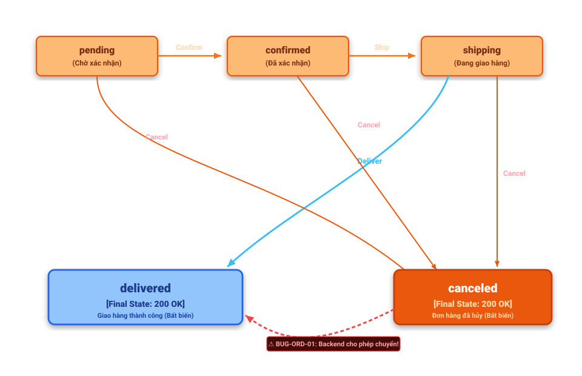

# BÁO CÁO THIẾT KẾ VÀ KIỂM THỬ API 3 (POOL C)

## `PUT /api/admin/orders/:id/status` (FR-10, FR-18: Quản lý Chuyển trạng thái Đơn hàng)

**Sinh viên thực hiện:** 23127340  
**Môn học:** Software Testing (HW06 – API Testing)  
**Hệ thống (SUT):** EShop Backend API (`http://localhost:3000`)

---

## 1. THÔNG TIN API & ĐẶC TẢ YÊU CẦU

* **Endpoint:** `PUT /api/admin/orders/:id/status`
* **Content-Type:** `application/json`
* **Quyền hạn truy cập:** Bắt buộc có quyền Quản trị viên (`role = 'admin'`, Header `Authorization: Bearer <token>`).
* **Path Parameter:**
  * `:id` (Integer): Mã định danh duy nhất của đơn hàng cần cập nhật (phải là số nguyên dương).
* **Cấu trúc Request Body:**
  ```json
  {
    "status": "confirmed"
  }
  ```
  *(Các giá trị hợp lệ trong Enum: `pending`, `confirmed`, `shipping`, `delivered`, `canceled`)*
* **Quy tắc chuyển đổi trạng thái hợp lệ (Order State Machine):**
  * `pending` ──> `confirmed` (Admin duyệt) hoặc `canceled` (Hủy đơn).
  * `confirmed` ──> `shipping` (Giao hàng) hoặc `canceled` (Hủy đơn).
  * `shipping` ──> `delivered` (Giao thành công) hoặc `canceled` (Admin hủy khi đang giao).
  * `delivered` và `canceled` là **Final States (Bất biến)**: Nghiêm cấm chuyển sang bất kỳ trạng thái nào khác.
* **Mã phản hồi HTTP theo đặc tả:**
  * **200 OK:** Cập nhật trạng thái đơn hàng thành công (`{"message": "Order status updated"}`).
  * **400 Bad Request:** Thiếu trường bắt buộc, sai định dạng `:id`, `status` nằm ngoài Enum hoặc vi phạm quy tắc chuyển trạng thái.
  * **401 Unauthorized:** Không truyền JWT Token hoặc Token hết hạn/không hợp lệ.
  * **403 Forbidden:** Người dùng không có quyền Quản trị viên (`role !== 'admin'`).
  * **404 Not Found:** Không tìm thấy đơn hàng với `:id` tương ứng.

---

## 2. PHÂN TÍCH TEST DESIGN CHI TIẾT (CHI TIẾT KỸ THUẬT)

### 2.1. Phân vùng Tương đương (Domain / Equivalence Partitioning Classes)

Phân tích miền giá trị đầu vào của 2 tham số `id` (Path Parameter) và `status` (Request Body Parameter) thành các lớp tương đương hợp lệ (**Valid Classes**) và không hợp lệ (**Invalid Classes**):

| Tham số | Mã Lớp (Class ID) | Tên Phân Vùng Tương Đương | Điều kiện / Giá trị đại diện | Kỳ vọng theo Đặc tả |
| :--- | :---: | :--- | :--- | :---: |
| **Path Param `:id`** | **`V_ID_01`** | ID nguyên dương hợp lệ tồn tại trong DB | `1`, `2` | `200 OK` (nếu status hợp lệ) |
| | **`IV_ID_01`** | ID nguyên dương nhưng không tồn tại trong DB | `999999` | `404 Not Found` |
| | **`IV_ID_02`** | ID là số âm hoặc bằng 0 | `-1`, `0` | `400 Bad Request` *(Phát hiện **`BUG-ORD-04`**)* |
| | **`IV_ID_03`** | ID là chuỗi ký tự không phải số | `"abc"`, `"order_one"` | `400 Bad Request` *(Phát hiện **`BUG-ORD-04`**)* |
| | **`IV_ID_04`** | ID là số thực dấu phẩy động (Float) | `1.5` | `400 Bad Request` |
| **Body Param `status`** | **`V_ST_01`** | Status hợp lệ trong Enum và đúng bước chuyển | `"confirmed"`, `"shipping"` | `200 OK` |
| | **`IV_ST_01`** | Chuỗi rỗng `""` | `""` | `400 Bad Request` |
| | **`IV_ST_02`** | Thiếu trường `status` / Body rỗng `{}` | `{}` | `400 Bad Request` |
| | **`IV_ST_03`** | Status không nằm trong danh sách Enum 5 giá trị | `"INVALID_STATUS_XYZ"`, `"processing"` | `400 Bad Request` *(Phát hiện **`BUG-ORD-05`**)* |
| | **`IV_ST_04`** | Status sai kiểu dữ liệu (Số: `123`, Boolean: `true`) | `123`, `true` | `400 Bad Request` |
| | **`IV_ST_05`** | Status vi phạm quy tắc chuyển trạng thái (Nhảy cóc / Quay lui) | `pending` ──> `delivered` | `400 Bad Request` *(Phát hiện **`BUG-ORD-01`**, **`BUG-ORD-03`**)* |

---

### 2.2. Kiểm thử Chuyển trạng thái (State Transition Testing — Ma trận 5 x 5)

#### A. Sơ đồ Chuyển Trạng Thái (State Transition Diagram)

*Sơ đồ chuyển trạng thái dưới đây được lưu tại đường dẫn `./images/FR10.svg`.*



#### B. Danh sách các Trạng thái (States):

| State | Tên trạng thái | Mô tả ý nghĩa / Ràng buộc chuyển đổi |
| :--- | :--- | :--- |
| `pending` | Chờ xác nhận | Trạng thái khởi tạo mặc định khi đơn hàng vừa được tạo. |
| `confirmed` | Đã xác nhận | Đơn hàng đã được Admin kiểm tra và duyệt thành công. |
| `shipping` | Đang giao hàng | Đơn hàng đã được bàn giao cho đơn vị vận chuyển. |
| `delivered` | Đã giao hàng | Giao hàng thành công (Final State - Bất biến). |
| `canceled` | Đã hủy | Đơn hàng bị hủy (Final State - Bất biến). |

#### C. Ma trận Chuyển Trạng Thái Toàn Diện 5 x 5 = 25 Bước Chuyển

| Trạng thái hiện tại | Target: `pending` | Target: `confirmed` | Target: `shipping` | Target: `delivered` | Target: `canceled` |
| :--- | :---: | :---: | :---: | :---: | :---: |
| **`pending`** | ❌ 400 (Trùng) | ✅ **200 OK** | ❌ 400 (Nhảy cóc) | ❌ 400 (Nhảy cóc) | ✅ **200 OK** |
| **`confirmed`** | ❌ 400 (Quay lui) | ❌ 400 (Trùng) | ✅ **200 OK** | ❌ 400 (Nhảy cóc) | ✅ **200 OK** |
| **`shipping`** | ❌ 400 (Quay lui) | ❌ 400 (Quay lui) | ❌ 400 (Trùng) | ✅ **200 OK** | ✅ **200 OK** *(Admin - `BUG-ORD-03`)* |
| **`delivered`** *(Final)* | ❌ 400 | ❌ 400 | ❌ 400 | ❌ 400 | ❌ 400 |
| **`canceled`** *(Final)* | ❌ 400 | ❌ 400 | ❌ 400 | ❌ **400** *(Bị dính `BUG-ORD-01` trả 200)* | ❌ 400 |

---

## 3. DANH SÁCH BỘ TEST CASES CHI TIẾT (48 TEST CASES)

### Nhóm A: Domain & Input Validation Test Cases (9 TCs)

| TC ID | Miền kiểm thử (Target Class) | Input Request (Path & Body) | Expected Status | Expected Output & Assertion |
| :--- | :--- | :--- | :---: | :--- |
| `TC_ORD_DOM_01` | **`V_ID_01` & `V_ST_01`** (ID & Status hợp lệ) | `PUT /api/admin/orders/1/status`<br>`{"status": "confirmed"}` | `200 OK` | `message == "Order status updated"` |
| `TC_ORD_DOM_02` | **`IV_ID_01`** (ID không tồn tại trong DB) | `PUT /api/admin/orders/999999/status`<br>`{"status": "confirmed"}` | `404 Not Found` | Báo lỗi đơn hàng không tồn tại |
| `TC_ORD_DOM_03` | **`IV_ID_02`** (ID là số âm) | `PUT /api/admin/orders/-1/status`<br>`{"status": "confirmed"}` | `400 Bad Request` | Báo lỗi định dạng ID không hợp lệ *(Phát hiện **`BUG-ORD-04`** khi server trả `404`)* |
| `TC_ORD_DOM_04` | **`IV_ID_03`** (ID là chuỗi ký tự) | `PUT /api/admin/orders/abc/status`<br>`{"status": "confirmed"}` | `400 Bad Request` | Báo lỗi ID phải là số *(Phát hiện **`BUG-ORD-04`**)* |
| `TC_ORD_DOM_05` | **`IV_ID_04`** (ID là số thực Float) | `PUT /api/admin/orders/1.5/status`<br>`{"status": "confirmed"}` | `400 Bad Request` | Báo lỗi ID phải là số nguyên |
| `TC_ORD_DOM_06` | **`IV_ST_02`** (Thiếu trường `status` / Body rỗng) | `PUT /api/admin/orders/1/status`<br>`{}` | `400 Bad Request` | Báo lỗi thiếu trường status bắt buộc |
| `TC_ORD_DOM_07` | **`IV_ST_01`** (Trường `status` là chuỗi rỗng `""`) | `PUT /api/admin/orders/1/status`<br>`{"status": ""}` | `400 Bad Request` | Báo lỗi status không được để trống |
| `TC_ORD_DOM_08` | **`IV_ST_03`** (Trường `status` không nằm trong Enum) | `PUT /api/admin/orders/1/status`<br>`{"status": "INVALID_STATUS_XYZ"}` | `400 Bad Request` | Báo lỗi giá trị status không hợp lệ *(Phát hiện **`BUG-ORD-05`**)* |
| `TC_ORD_DOM_09` | **`IV_ST_04`** (Trường `status` sai kiểu dữ liệu - Number) | `PUT /api/admin/orders/1/status`<br>`{"status": 123}` | `400 Bad Request` | Báo lỗi kiểu dữ liệu status phải là string |

---

### Nhóm B: State Transition Test Cases (25 TCs — Bao phủ 100% Ma trận 5x5)

| TC ID | Ánh xạ Ma trận (Từ -> Tới) | Bước chuyển trạng thái | Tính hợp lệ theo Đặc tả | Expected Status | Chi tiết hành vi & Kỳ vọng |
| :--- | :--- | :--- | :---: | :---: | :--- |
| **Từ trạng thái `pending`:** | | | | | |
| `TC_ORD_ST_01` | **Cell (pending -> pending)** | `pending` ──(Set pending)──> `pending` | Không hợp lệ | `400 Bad Request` | Chặn cập nhật trạng thái trùng lặp |
| `TC_ORD_ST_02` | **Cell (pending -> confirmed)** | `pending` ──(Confirm)──> `confirmed` | **Hợp lệ** | `200 OK` | Duyệt đơn hàng thành công |
| `TC_ORD_ST_03` | **Cell (pending -> shipping)** | `pending` ──(Ship)──> `shipping` | Không hợp lệ | `400 Bad Request` | Chặn nhảy cóc khi chưa xác nhận |
| `TC_ORD_ST_04` | **Cell (pending -> delivered)** | `pending` ──(Deliver)──> `delivered` | Không hợp lệ | `400 Bad Request` | Chặn nhảy cóc khi chưa giao hàng |
| `TC_ORD_ST_05` | **Cell (pending -> canceled)** | `pending` ──(Cancel)──> `canceled` | **Hợp lệ** | `200 OK` | Hủy đơn hàng ở trạng thái chờ |
| **Từ trạng thái `confirmed`:** | | | | | |
| `TC_ORD_ST_06` | **Cell (confirmed -> pending)** | `confirmed` ──(Set pending)──> `pending` | Không hợp lệ | `400 Bad Request` | Chặn quay lui trạng thái |
| `TC_ORD_ST_07` | **Cell (confirmed -> confirmed)** | `confirmed` ──(Set confirmed)──> `confirmed` | Không hợp lệ | `400 Bad Request` | Chặn cập nhật trạng thái trùng lặp |
| `TC_ORD_ST_08` | **Cell (confirmed -> shipping)** | `confirmed` ──(Ship)──> `shipping` | **Hợp lệ** | `200 OK` | Bàn giao bên vận chuyển |
| `TC_ORD_ST_09` | **Cell (confirmed -> delivered)** | `confirmed` ──(Deliver)──> `delivered` | Không hợp lệ | `400 Bad Request` | Chặn nhảy cóc qua bước giao hàng |
| `TC_ORD_ST_10` | **Cell (confirmed -> canceled)** | `confirmed` ──(Cancel)──> `canceled` | **Hợp lệ** | `200 OK` | Hủy đơn hàng sau khi duyệt |
| **Từ trạng thái `shipping`:** | | | | | |
| `TC_ORD_ST_11` | **Cell (shipping -> pending)** | `shipping` ──(Set pending)──> `pending` | Không hợp lệ | `400 Bad Request` | Chặn quay lui trạng thái |
| `TC_ORD_ST_12` | **Cell (shipping -> confirmed)** | `shipping` ──(Set confirmed)──> `confirmed` | Không hợp lệ | `400 Bad Request` | Chặn quay lui trạng thái |
| `TC_ORD_ST_13` | **Cell (shipping -> shipping)** | `shipping` ──(Set shipping)──> `shipping` | Không hợp lệ | `400 Bad Request` | Chặn cập nhật trạng thái trùng lặp |
| `TC_ORD_ST_14` | **Cell (shipping -> delivered)** | `shipping` ──(Deliver)──> `delivered` | **Hợp lệ** | `200 OK` | Giao hàng thành công (Final State) |
| `TC_ORD_ST_15` | **Cell (shipping -> canceled)** | `shipping` ──(Cancel)──> `canceled` | **Hợp lệ (Admin)** | `200 OK` | Admin có quyền hủy khi đang giao *(Phát hiện **`BUG-ORD-03`** khi server trả `400`)* |
| **Từ trạng thái `delivered` (Final State - Bất biến):** | | | | | |
| `TC_ORD_ST_16` | **Cell (delivered -> pending)** | `delivered` ──(Set pending)──> `pending` | Không hợp lệ | `400 Bad Request` | Final State - Bất biến, không thể sửa đổi |
| `TC_ORD_ST_17` | **Cell (delivered -> confirmed)** | `delivered` ──(Set confirmed)──> `confirmed` | Không hợp lệ | `400 Bad Request` | Final State - Bất biến, không thể sửa đổi |
| `TC_ORD_ST_18` | **Cell (delivered -> shipping)** | `delivered` ──(Set shipping)──> `shipping` | Không hợp lệ | `400 Bad Request` | Final State - Bất biến, không thể sửa đổi |
| `TC_ORD_ST_19` | **Cell (delivered -> delivered)** | `delivered` ──(Set delivered)──> `delivered` | Không hợp lệ | `400 Bad Request` | Final State - Chặn cập nhật trùng lặp |
| `TC_ORD_ST_20` | **Cell (delivered -> canceled)** | `delivered` ──(Set canceled)──> `canceled` | Không hợp lệ | `400 Bad Request` | Final State - Không thể hủy đơn đã giao |
| **Từ trạng thái `canceled` (Final State - Bất biến):** | | | | | |
| `TC_ORD_ST_21` | **Cell (canceled -> pending)** | `canceled` ──(Set pending)──> `pending` | Không hợp lệ | `400 Bad Request` | Final State - Không thể mở lại đơn |
| `TC_ORD_ST_22` | **Cell (canceled -> confirmed)** | `canceled` ──(Set confirmed)──> `confirmed` | Không hợp lệ | `400 Bad Request` | Final State - Không thể duyệt đơn đã hủy |
| `TC_ORD_ST_23` | **Cell (canceled -> shipping)** | `canceled` ──(Set shipping)──> `shipping` | Không hợp lệ | `400 Bad Request` | Final State - Không thể giao đơn đã hủy |
| `TC_ORD_ST_24` | **Cell (canceled -> delivered)** | `canceled` ──(Set delivered)──> `delivered` | **Nghiêm cấm** | `400 Bad Request` | Không được giao đơn đã hủy *(Phát hiện **`BUG-ORD-01`** khi server trả `200`)* |
| `TC_ORD_ST_25` | **Cell (canceled -> canceled)** | `canceled` ──(Set canceled)──> `canceled` | Không hợp lệ | `400 Bad Request` | Final State - Chặn cập nhật trùng lặp |

---

### Nhóm C: Security Test Cases (`SEC-01` đến `SEC-07`) — 5 TCs

| TC ID | Mục tiêu bảo mật | Kịch bản kiểm thử (Request Payload & Header) | Expected Status | Tiêu chí bảo mật & Assertion |
| :--- | :--- | :--- | :---: | :--- |
| `TC_ORD_SEC_01` | **SEC-03 (BFLA / Privilege Escalation)** | Token của User thường (`role = 'user'`) gọi `PUT /api/admin/orders/1/status` | `403 Forbidden` | Chặn user thường cập nhật trạng thái *(Phát hiện **`BUG-ORD-02`** khi server trả `200`)* |
| `TC_ORD_SEC_02` | **SEC-02 (Missing Auth Token)** | Gọi API không kèm Header `Authorization` | `401 Unauthorized` | Chặn truy cập ẩn danh |
| `TC_ORD_SEC_03` | **SEC-01 (Invalid Token)** | Gửi Token giả mạo hoặc hết hạn (`Bearer invalid_jwt`) | `401` / `403` | Từ chối token không hợp lệ |
| `TC_ORD_SEC_04` | **SEC-04 (SQLi in Path Param)** | `PUT /api/admin/orders/1' OR '1'='1/status` với body `{"status": "confirmed"}` | `400` / `404` | Tham số hóa, không dính SQLi |
| `TC_ORD_SEC_05` | **SEC-05 (XSS in status field)** | `PUT /api/admin/orders/1/status` với body `{"status": "<script>alert(1)</script>"}` | `400 Bad Request` | Khử khuẩn an toàn chuỗi XSS |

---

### Nhóm D: Schema & Status Code Validation (4 TCs)

| TC ID | Kịch bản Schema | Input Payload | Expected Status | JSON Schema Assertion |
| :--- | :--- | :--- | :---: | :--- |
| `TC_ORD_SCH_01` | Success Response Shape | `{"status": "confirmed"}` | `200 OK` | Schema có `{"message": "Order status updated"}` |
| `TC_ORD_SCH_02` | Error 400 Response Shape | `{"status": "delivered"}` (nhảy cóc từ pending) | `400 Bad Request` | Schema dạng `{"error": "string"}` |
| `TC_ORD_SCH_03` | Error 404 Response Shape | `PUT /api/admin/orders/999999/status` | `404 Not Found` | Schema dạng `{"error": "string"}` |
| `TC_ORD_SCH_04` | Header Content-Type | `{"status": "confirmed"}` | `200 OK` | Header `Content-Type: application/json` |

---

## 4. AUDIT & HUMAN REVIEW

| Test Case ID / Nhóm | Nhãn Đánh Giá | Nhận định của Con Người đối chiếu theo Đặc tả (api_specification.md & README.md) | Hành động hiệu chỉnh của Con Người (Human Correction) |
| :--- | :---: | :--- | :--- |
| **`TC_ORD_DOM_01` - `09`** *(Phân vùng tương đương - EP)* | **INCOMPLETE** | AI ban đầu chỉ tập trung vào chuyển trạng thái mà bỏ qua kỹ thuật Phân vùng tương đương (EP) cho 2 tham số `:id` và `status`, dẫn đến bỏ lọt các lỗi validation đầu vào của hệ thống. | **Bổ sung trọn bộ 9 test cases EP** kiểm thử toàn diện: ID âm, String ID, Float ID, thiếu status, status rỗng, status ngoài Enum để bắt trọn **`BUG-ORD-04`** (không validate Path Param `:id`) và **`BUG-ORD-05`** (thiếu schema enum validation). |
| **`TC_ORD_ST_01` - `25`** *(Chuyển trạng thái 5x5)* | **VALID** | Thiết kế chính xác theo toàn bộ 25 ô của Ma trận Chuyển trạng thái 5x5: Đúng quy trình trả `200 OK`, chuyển sai, trùng lặp hoặc nhảy cóc trả `400 Bad Request`. | Giữ nguyên bộ 25 test cases trong Test Suite. Khi chạy kiểm thử thực tế sẽ phát hiện 2 bug nghiêm trọng: cho phép `canceled -> delivered` (**`BUG-ORD-01`**) và chặn nhầm Admin hủy đơn khi đang giao (**`BUG-ORD-03`**). |
| **`TC_ORD_SEC_01`** *(Phân quyền Admin - BFLA)* | **VALID** | Thiết kế chuẩn theo yêu cầu phân quyền quản trị (FR-12 & SEC-03): Tài khoản người dùng thường (`role = 'user'`) tuyệt đối không được gọi API cập nhật trạng thái đơn của Admin. | Giữ nguyên test case. Khi chạy phát hiện backend bị hổng bảo mật BFLA nghiêm trọng do thiếu kiểm tra `role === 'admin'` (**`BUG-ORD-02`**). |
| **`TC_ORD_SEC_02` - `05`** *(Bảo mật OWASP)* | **VALID** | Thiết kế chuẩn bảo mật OWASP API Security: Bắt buộc Auth Token (`SEC-02`), Token hợp lệ (`SEC-01`), chống SQLi trong Path Param (`SEC-04`) và XSS trong field status (`SEC-05`). | Đưa vào kịch bản kiểm thử tự động, đảm bảo an toàn API. |
| **`TC_ORD_SCH_01` - `04`** *(JSON Schema & Format)* | **VALID** | Thiết kế đúng chuẩn JSON Schema của REST API, kiểm tra cấu trúc `message` khi thành công và `error` khi thất bại. | Đưa vào kịch bản kiểm thử tự động. |
| **BVA Extreme ID Boundary *(2^31 - 1 do AI tự sinh)*** | **INVALID** | AI tự suy diễn giới hạn trần cực trị 2,147,483,647 không hề có trong tài liệu đặc tả `api_specification.md` hay `README.md`. | **Loại bỏ hoàn toàn** các test case giả định vô căn cứ này khỏi bộ test design. |
| **5 bước chuyển trạng thái sang chính nó *(Cell trùng lặp)*** | **INCOMPLETE** | AI ban đầu chỉ tạo 20 test case chuyển đổi giữa các trạng thái khác nhau và bỏ sót 5 bước cập nhật trùng lặp (`pending -> pending`, `confirmed -> confirmed`, v.v.). | **Bổ sung đầy đủ 5 test cases** để hoàn thiện trọn vẹn 25 test cases bao phủ 100% Ma trận 5x5. |

---

## 5. MỞ RỘNG TEST CASES (HUMAN EXTENSION — 5 TCs)

| TC ID | Kỹ thuật & Tên Test Case | Mô tả & Dữ liệu Request | Expected Status | Lý do AI bỏ sót (Root Cause Analysis) |
| :--- | :--- | :--- | :---: | :--- |
| `TC_ORD_EXT_01` | **Security: Mass Assignment Tampering** | Gửi body cố tình chèn thêm trường tổng tiền: `{"status": "confirmed", "total_amount": 0}` | `200 OK` | AI chỉ gửi đúng schema tối thiểu trong đặc tả, không kiểm tra phòng thủ tấn công Mass Assignment khi hacker cố tình tiêm thêm các trường dữ liệu tài chính khác (đơn hàng đổi status thành công nhưng không bị đổi `total_amount`). |
| `TC_ORD_EXT_02` | **Business Logic: Stock Reversion upon Cancel** | Kiểm tra khi đơn chuyển sang `canceled`, số lượng tồn kho sản phẩm có được hoàn lại không | `200 OK` | AI chỉ nhìn cục bộ bảng `orders`, không kiểm tra tác động liên bảng `products`. |
| `TC_ORD_EXT_03` | **Security: Admin Conflict of Interest** | Admin tự đổi trạng thái đơn hàng do chính Admin đặt mua | `200 OK` / `400` | AI không xét đến các ràng buộc kiểm soát gian lận nội bộ. |
| `TC_ORD_EXT_04` | **Audit Trail Verification** | Kiểm tra sau khi đổi trạng thái, trường `updated_at` hoặc log có ghi nhận đúng thời gian/admin | `200 OK` | AI chỉ quan tâm HTTP code mà bỏ qua kiểm tra vết kiểm toán (Audit Trail). |
| `TC_ORD_EXT_05` | **Security: Nested Object Injection** | Gửi body dạng nested object `{"status": {"$ne": "delivered"}}` | `400 Bad Request` | AI mặc định body là flat JSON, không kiểm thử tấn công cấu trúc đối tượng phức tạp. |

---

**TỔNG CỘNG TEST CASES API 3:** **48 Test Cases** (AI sinh + Bổ sung EP: 43, Human Extend: 5).
