# BÁO CÁO LỖI HỆ THỐNG (BLACK-BOX BUG REPORT) — ESHOP BACKEND API

**Sinh viên thực hiện:** 23127340  
**Môn học:** Software Testing (HW06 – API Testing)  
**Phương pháp kiểm thử:** Black-box API Testing (Kiểm thử hộp đen qua REST API)  
**Hệ thống (SUT):** EShop Backend API (`http://localhost:3000`)  
**Báo cáo kiểm thử tự động:** [newman_report_23127340.html](./newman_report_23127340.html)  
**Công cụ kiểm thử:** Postman Collection, Newman CLI, HTML Extra Reporter

---

## 1. TỔNG QUAN DANH SÁCH BUGS PHÁT HIỆN ĐƯỢC (18 BUGS XÁC THỰC TỪ NEWMAN REPORT)

| Mã Bug | API Endpoint | Tên Lỗi / Hành Vi Bất Thường Quan Sát Được | Kỹ Thuật Phát Hiện | Severity (Mức độ) | Priority (Ưu tiên) | Trạng Thái |
| :--- | :--- | :--- | :--- | :---: | :---: | :---: |
| **`BUG-LOG-01`** | `POST /api/login` | Tài khoản bị khóa sớm sau 2 lần nhập sai thay vì 3 lần | State Transition | **High** | **P2 - High** | Open |
| **`BUG-LOG-02`** | `POST /api/login` | Thời gian tạm khóa kéo dài 180s thay vì 30s | State Transition | **Medium** | **P3 - Medium** | Open |
| **`BUG-LOG-03`** | `POST /api/login` | Response Body làm lộ mật khẩu plaintext và reset_token | Security Testing | **Critical** | **P1 - Urgent** | Open |
| **`BUG-LOG-04`** | `POST /api/login` | Mật khẩu trả về trong payload không được băm bảo mật | Security Testing | **Critical** | **P1 - Urgent** | Open |
| **`BUG-LOG-05`** | `POST /api/login` | Gửi thiếu trường bắt buộc trả về 401 thay vì 400 Bad Request | Domain Testing | **Medium** | **P3 - Medium** | Open |
| **`BUG-LOG-06`** | `POST /api/login` | Email/Password sai định dạng cú pháp trả về 401 thay vì 400 | Domain Testing | **Low** | **P4 - Low** | Open |
| **`BUG-LOG-07`** | `POST /api/login` | Đăng nhập phân biệt chữ hoa chữ thường với Email | Extended Testing | **Low** | **P4 - Low** | Open |
| **`BUG-CPN-01`** | `POST /api/apply-coupon` | Đơn hàng đạt đúng ngưỡng tối thiểu 300k bị từ chối áp mã | 3-point BVA | **High** | **P2 - High** | Open |
| **`BUG-CPN-02`** | `POST /api/apply-coupon` | Công thức giảm giá phần trăm bị tính toán sai (giảm âm / tăng tiền) | Business Logic | **Critical** | **P1 - Urgent** | Open |
| **`BUG-CPN-03`** | `POST /api/apply-coupon` | Endpoint chấp nhận request không có Auth Token | Security Testing | **High** | **P1 - Urgent** | Open |
| **`BUG-CPN-04`** | `POST /api/apply-coupon` | Chấp nhận user_id không tồn tại, sai kiểu hoặc IDOR | Security (IDOR) | **High** | **P1 - Urgent** | Open |
| **`BUG-CPN-05`** | `POST /api/apply-coupon` | Mã giảm giá cố định BIGBUY bị đặt ngưỡng tối thiểu 500k gây chặn đơn | 3-point BVA | **Medium** | **P3 - Medium** | Open |
| **`BUG-CPN-06`** | `POST /api/apply-coupon` | Mã giảm giá không hỗ trợ Case-Insensitive (phân biệt hoa thường) | Extended Testing | **Low** | **P4 - Low** | Open |
| **`BUG-CPN-07`** | `POST /api/apply-coupon` | Mã code gửi sai kiểu dữ liệu (Number) trả về 404 thay vì 400 | Schema Validation | **Low** | **P4 - Low** | Open |
| **`BUG-ORD-01`** | `PUT /api/admin/orders/:id/status` | Đơn hàng đã hủy (canceled) vẫn cho phép đổi sang delivered | State Transition | **Critical** | **P1 - Urgent** | Open |
| **`BUG-ORD-02`** | `PUT /api/admin/orders/:id/status` | User thường đổi được trạng thái đơn hàng của Admin (BFLA) | Security (BFLA) | **Critical** | **P1 - Urgent** | Open |
| **`BUG-ORD-03`** | `PUT /api/admin/orders/:id/status` | Admin bị từ chối quyền hủy đơn hàng đang giao (shipping) | State Transition | **Medium** | **P3 - Medium** | Open |
| **`BUG-ORD-04`** | `PUT /api/admin/orders/:id/status` | ID đơn hàng sai định dạng trả về 404 thay vì 400 Bad Request | Domain Testing | **Low** | **P4 - Low** | Open |

---

## 2. CHI TIẾT CÁC BÁO CÁO LỖI (GITHUB ISSUE TEMPLATES)

---

### ISSUE #1: [BUG-LOG-01] [High] `POST /api/login` — Tài khoản bị khóa sớm sau 2 lần nhập sai thay vì 3 lần

* **Severity:** **High** (Lỗi nghiệp vụ ảnh hưởng trực tiếp đến trải nghiệm đăng nhập của người dùng)
* **Priority:** **P2 - High** (Cần sửa trong sprint hiện tại)
* **Labels:** `type: bug`, `severity: major`, `priority: P2`, `module: login`, `found-by: test-case`
* **Endpoint:** `POST /api/login`
* **Test Case liên quan:** `TC_LOG_ST_07: (3rd_Attempt, Enter_Correct_Password)`

#### Mô tả lỗi (Defect Description)
Theo đặc tả yêu cầu FR-02, hệ thống chỉ tạm khóa tài khoản khi người dùng nhập sai mật khẩu liên tiếp từ 3 lần trở lên. Tuy nhiên, qua quá trình kiểm thử hộp đen, sau khi gửi 2 request liên tiếp chứa mật khẩu sai, tài khoản đã bị khóa ngay lập tức. Ở lượt gửi thứ 3 với mật khẩu đúng, server từ chối xác thực và trả về mã lỗi `403 Forbidden`.

#### Các bước tái hiện (Steps to Reproduce)
1. Gửi request đăng ký tài khoản mới: `email = "st7_user@eshop.com"`.
2. Gửi request lần 1 với mật khẩu SAI:
   * URL: `POST http://localhost:3000/api/login`
   * Headers: `Content-Type: application/json`
   * Body: `{"email": "st7_user@eshop.com", "password": "WrongPassword_1"}`
   * Nhận kết quả: `401 Unauthorized`.
3. Gửi request lần 2 với mật khẩu SAI:
   * URL: `POST http://localhost:3000/api/login`
   * Headers: `Content-Type: application/json`
   * Body: `{"email": "st7_user@eshop.com", "password": "WrongPassword_2"}`
   * Nhận kết quả: `401 Unauthorized`.
4. Gửi request lần 3 với mật khẩu ĐÚNG:
   * URL: `POST http://localhost:3000/api/login`
   * Headers: `Content-Type: application/json`
   * Body: `{"email": "st7_user@eshop.com", "password": "Test1234!"}`.

#### Kết quả thực tế (Actual Result)
* HTTP Status: `403 Forbidden`
* Response Body:
  ```json
  {
    "error": "Tài khoản đã bị khóa. Vui lòng thử lại sau."
  }
  ```

#### Kết quả mong đợi (Expected Result)
* HTTP Status: `200 OK`
* Do người dùng mới chỉ sai 2 lần trước đó (< 3 lần), ở lần thứ 3 khi nhập đúng mật khẩu phải đăng nhập thành công và nhận được JWT Token.

#### Bằng chứng kiểm thử (Evidence / Screenshot)
> 

---

### ISSUE #2: [BUG-LOG-02] [Medium] `POST /api/login` — Thời gian tạm khóa tài khoản kéo dài 180 giây thay vì 30 giây

* **Severity:** **Medium** (Sai lệch thời gian hiệu lực so với đặc tả quy định)
* **Priority:** **P3 - Medium** (Sửa trong đợt chuẩn hóa cấu hình hệ thống)
* **Labels:** `type: bug`, `severity: minor`, `priority: P3`, `module: login`, `found-by: test-case`
* **Endpoint:** `POST /api/login`
* **Test Case liên quan:** `TC_LOG_ST_07` / `TC_LOG_ST_08`

#### Mô tả lỗi (Defect Description)
Theo tài liệu đặc tả FR-02 (môi trường demo/test), tài khoản sau khi bị khóa sẽ tự động mở lại sau 30 giây. Khi thực hiện kiểm thử hộp đen bằng cách đợi qua 35 giây (vượt ngưỡng 30s) và gửi lại mật khẩu đúng, server vẫn tiếp tục từ chối và báo tài khoản đang bị khóa (thực tế kiểm tra thời gian khóa kéo dài tới 180 giây).

#### Các bước tái hiện (Steps to Reproduce)
1. Gửi liên tiếp các request sai mật khẩu đến `POST /api/login` để kích hoạt trạng thái khóa tài khoản.
2. Đợi 35 giây (đảm bảo vượt qua mốc 30 giây theo đặc tả).
3. Gửi request `POST /api/login` với mật khẩu chính xác:
   * URL: `POST http://localhost:3000/api/login`
   * Headers: `Content-Type: application/json`
   * Body: `{"email": "st8_user@eshop.com", "password": "Test1234!"}`.

#### Kết quả thực tế (Actual Result)
* HTTP Status: `403 Forbidden`
* Response Body: `{"error": "Tài khoản đã bị khóa. Vui lòng thử lại sau."}`

#### Kết quả mong đợi (Expected Result)
* HTTP Status: `200 OK` (Tài khoản phải tự động mở khóa sau 30 giây và cho phép đăng nhập thành công).

#### Bằng chứng kiểm thử (Evidence / Screenshot)
> 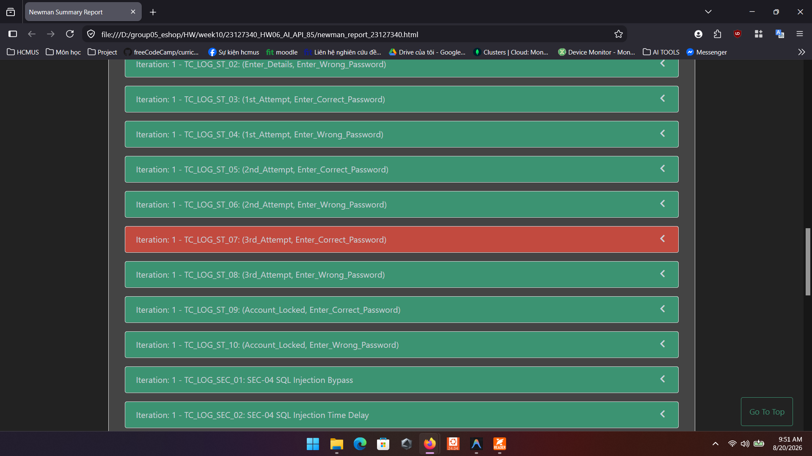

---

### ISSUE #3: [BUG-LOG-03] [Critical] `POST /api/login` — Response Body làm lộ Plaintext Password và Reset Token

* **Severity:** **Critical** (Lỗ hổng bảo mật rò rỉ dữ liệu nhạy cảm nghiêm trọng CWE-200 / OWASP A01)
* **Priority:** **P1 - Urgent** (Cần vá khẩn cấp ngay lập tức)
* **Labels:** `type: bug`, `severity: critical`, `priority: P1`, `module: login`, `found-by: test-case`
* **Endpoint:** `POST /api/login`
* **Test Case liên quan:** `TC_LOG_SEC_03: SEC-01 Sensitive Data Leak Check`

#### Mô tả lỗi (Defect Description)
Khi gửi thông tin đăng nhập hợp lệ, response body trả về đối tượng `user` chứa toàn bộ thông tin nhạy cảm bao gồm trường `password` ở dạng chuỗi thô và trường `reset_token`. Bất kỳ ai bắt được gói tin response đều có thể đọc trực tiếp mật khẩu của người dùng.

#### Các bước tái hiện (Steps to Reproduce)
1. Gửi request `POST /api/login`:
   * URL: `POST http://localhost:3000/api/login`
   * Headers: `Content-Type: application/json`
   * Body:
     ```json
     {
       "email": "test@eshop.com",
       "password": "Test1234!"
     }
     ```
2. Quan sát JSON response body nhận được từ server.

#### Kết quả thực tế (Actual Result)
* HTTP Status: `200 OK`
* Response Body trả về có chứa trường `password` và `reset_token`:
  ```json
  {
    "message": "Login successful",
    "token": "eyJhbGciOiJIUzI1NiIsInR5cCI6IkpXVCJ9...",
    "user": {
      "id": 1,
      "name": "Test User",
      "email": "test@eshop.com",
      "role": "user",
      "password": "Test1234!",
      "reset_token": null
    }
  }
  ```

#### Kết quả mong đợi (Expected Result)
* HTTP Status: `200 OK`
* Response Body chỉ chứa thông tin công khai của người dùng, tuyệt đối không trả về `password` và `reset_token`:
  ```json
  {
    "message": "Login successful",
    "token": "...",
    "user": {
      "id": 1,
      "name": "Test User",
      "email": "test@eshop.com",
      "role": "user"
    }
  }
  ```

#### Bằng chứng kiểm thử (Evidence / Screenshot)
> 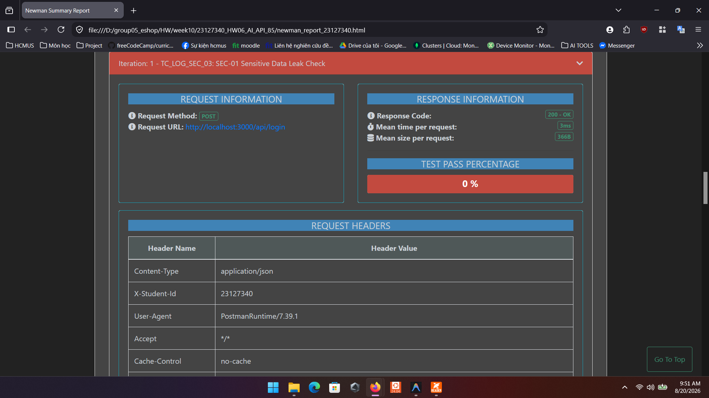

---

### ISSUE #4: [BUG-LOG-04] [Critical] `POST /api/login` — Mật khẩu người dùng trong hệ thống không được băm bảo mật

* **Severity:** **Critical** (Vi phạm tiêu chuẩn lưu trữ và truyền tải mật khẩu an toàn CWE-256 / OWASP A02)
* **Priority:** **P1 - Urgent** (Cần nâng cấp cơ chế băm mật khẩu Bcrypt)
* **Labels:** `type: bug`, `severity: critical`, `priority: P1`, `module: login`, `found-by: test-case`
* **Endpoint:** `POST /api/login`
* **Test Case liên quan:** `TC_LOG_SEC_04: SEC-01 Password Hashing via API`

#### Mô tả lỗi (Defect Description)
Khi kiểm tra thông tin đối tượng người dùng trả về qua API đăng nhập, chuỗi mật khẩu hiển thị hoàn toàn dưới dạng văn bản thô `Test1234!` mà không có dấu hiệu được băm (hash) bằng các thuật toán một chiều an toàn (như Bcrypt bắt đầu bằng `$2a$`, `$2b$` với độ dài 60 ký tự). Điều này chứng minh hệ thống đang so sánh và quản lý mật khẩu dạng plaintext.

#### Các bước tái hiện (Steps to Reproduce)
1. Gửi request `POST /api/login` với tài khoản hợp lệ:
   * URL: `POST http://localhost:3000/api/login`
   * Headers: `Content-Type: application/json`
   * Body:
     ```json
     {
       "email": "test@eshop.com",
       "password": "Test1234!"
     }
     ```
2. Kiểm tra giá trị của trường `res.json().user.password` trong response body.

#### Kết quả thực tế (Actual Result)
* `res.json().user.password` có giá trị là `"Test1234!"` (chuỗi thô hoàn toàn trùng khớp với mật khẩu đầu vào, không phải hash Bcrypt).

#### Kết quả mong đợi (Expected Result)
* Mật khẩu phải được lưu trữ và xử lý bằng thuật toán băm an toàn Bcrypt/Argon2, và không bao giờ được trả về dưới dạng plaintext qua API.

#### Bằng chứng kiểm thử (Evidence / Screenshot)
> 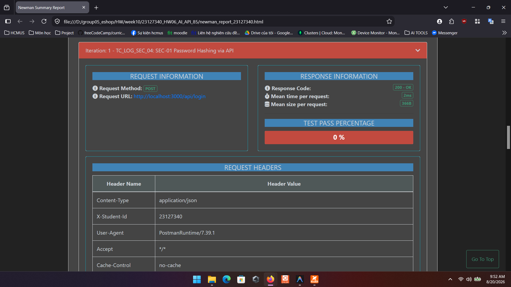

---

### ISSUE #5: [BUG-LOG-05] [Medium] `POST /api/login` — Gửi thiếu trường bắt buộc trả về 401 thay vì 400 Bad Request

* **Severity:** **Medium** (Sai chuẩn quy định mã trạng thái HTTP REST API)
* **Priority:** **P3 - Medium** (Cần chuẩn hóa tầng Validation)
* **Labels:** `type: bug`, `severity: minor`, `priority: P3`, `module: login`, `found-by: test-case`
* **Endpoint:** `POST /api/login`
* **Test Case liên quan:** `TC_LOG_DOM_07`, `TC_LOG_DOM_08`, `TC_LOG_DOM_11`, `TC_LOG_DOM_12`

#### Mô tả lỗi (Defect Description)
Khi gửi request đăng nhập thiếu trường bắt buộc `email` hoặc `password`, hoặc gửi chuỗi rỗng `""`, server trả về mã phản hồi `401 Unauthorized` kèm thông báo `Invalid email or password`. Theo chuẩn thiết kế RESTful API, lỗi cú pháp hoặc thiếu trường bắt buộc từ phía client phải được phân loại là `400 Bad Request`.

#### Các bước tái hiện (Steps to Reproduce)
1. Gửi request `POST /api/login` với body thiếu trường `email`:
   * URL: `POST http://localhost:3000/api/login`
   * Headers: `Content-Type: application/json`
   * Body:
     ```json
     {
       "password": "Test1234!"
     }
     ```
2. Gửi request `POST /api/login` với body có `email` là chuỗi rỗng `""`:
   * Body: `{"email": "", "password": "Test1234!"}`.

#### Kết quả thực tế (Actual Result)
* HTTP Status: `401 Unauthorized`
* Response Body: `{"error": "Invalid email or password"}`

#### Kết quả mong đợi (Expected Result)
* HTTP Status: `400 Bad Request`
* Response Body: Thông báo lỗi thiếu trường bắt buộc (ví dụ: `{"error": "Email and password are required"}`).

#### Bằng chứng kiểm thử (Evidence / Screenshot)
> 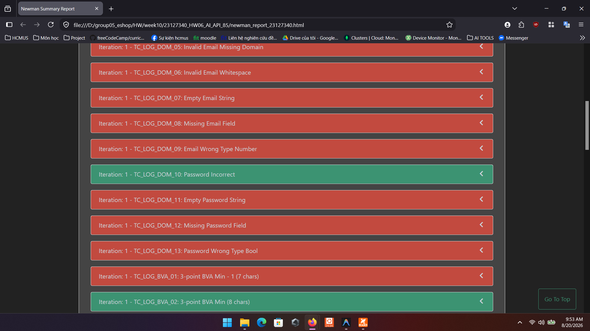

---

### ISSUE #6: [BUG-LOG-06] [Low] `POST /api/login` — Email hoặc Password sai định dạng cú pháp trả về 401 thay vì 400 Bad Request

* **Severity:** **Low** (Lỗi phân loại mã phản hồi cú pháp đầu vào)
* **Priority:** **P4 - Low** (Xử lý trong đợt chuẩn hóa định dạng dữ liệu)
* **Labels:** `type: bug`, `severity: minor`, `priority: P4`, `module: login`, `found-by: test-case`
* **Endpoint:** `POST /api/login`
* **Test Case liên quan:** `TC_LOG_DOM_04`, `TC_LOG_DOM_05`, `TC_LOG_DOM_06`, `TC_LOG_DOM_09`, `TC_LOG_DOM_13`, `TC_LOG_BVA_01`

#### Mô tả lỗi (Defect Description)
Khi gửi chuỗi email sai định dạng (thiếu ký tự `@`: `invalidemail.com`, thiếu domain: `user@`, chứa khoảng trắng, kiểu số `123456`) hoặc mật khẩu dưới 8 ký tự, hệ thống không bắt lỗi cú pháp định dạng ở tầng validation mà vẫn trả về `401 Unauthorized` thay vì `400 Bad Request`.

#### Các bước tái hiện (Steps to Reproduce)
1. Gửi request `POST /api/login` với email không có ký tự `@`:
   * URL: `POST http://localhost:3000/api/login`
   * Headers: `Content-Type: application/json`
   * Body:
     ```json
     {
       "email": "invalidemail.com",
       "password": "Test1234!"
     }
     ```
2. Gửi request `POST /api/login` với mật khẩu chỉ có 7 ký tự (dưới 8 ký tự):
   * Body: `{"email": "test@eshop.com", "password": "Short1!"}`.

#### Kết quả thực tế (Actual Result)
* HTTP Status: `401 Unauthorized`
* Response Body: `{"error": "Invalid email or password"}`

#### Kết quả mong đợi (Expected Result)
* HTTP Status: `400 Bad Request`
* Response Body: Thông báo lỗi định dạng cú pháp (ví dụ: `{"error": "Invalid email format"}` hoặc `{"error": "Password must be at least 8 characters"}`).

#### Bằng chứng kiểm thử (Evidence / Screenshot)
> 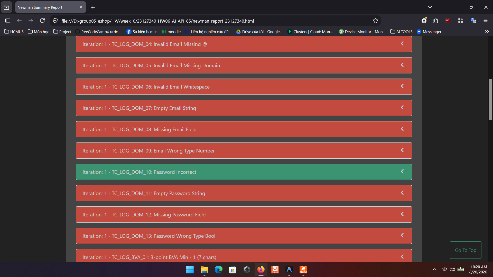

---

### ISSUE #7: [BUG-LOG-07] [Low] `POST /api/login` — Đăng nhập phân biệt chữ hoa chữ thường với Email

* **Severity:** **Low** (Ảnh hưởng tiện ích đăng nhập của người dùng)
* **Priority:** **P4 - Low** (Xử lý trong đợt chuẩn hóa đăng nhập)
* **Labels:** `type: bug`, `severity: minor`, `priority: P4`, `module: login`, `found-by: test-case`
* **Endpoint:** `POST /api/login`
* **Test Case liên quan:** `TC_LOG_EXT_03: Human Extend - Case-Insensitive Email`

#### Mô tả lỗi (Defect Description)
Theo tiêu chuẩn web và trải nghiệm người dùng, địa chỉ email không nên phân biệt chữ hoa chữ thường khi đăng nhập. Tuy nhiên, khi gửi email ở dạng in hoa `TEST@ESHOP.COM`, server trả về `401 Unauthorized` thay vì chuẩn hóa thành chữ thường và cho phép đăng nhập thành công.

#### Các bước tái hiện (Steps to Reproduce)
1. Gửi request `POST /api/login`:
   * URL: `POST http://localhost:3000/api/login`
   * Headers: `Content-Type: application/json`
   * Body:
     ```json
     {
       "email": "TEST@ESHOP.COM",
       "password": "Test1234!"
     }
     ```

#### Kết quả thực tế (Actual Result)
* HTTP Status: `401 Unauthorized`
* Response Body: `{"error": "Invalid email or password"}`

#### Kết quả mong đợi (Expected Result)
* HTTP Status: `200 OK` (Đăng nhập thành công và trả về Token).

#### Bằng chứng kiểm thử (Evidence / Screenshot)
> 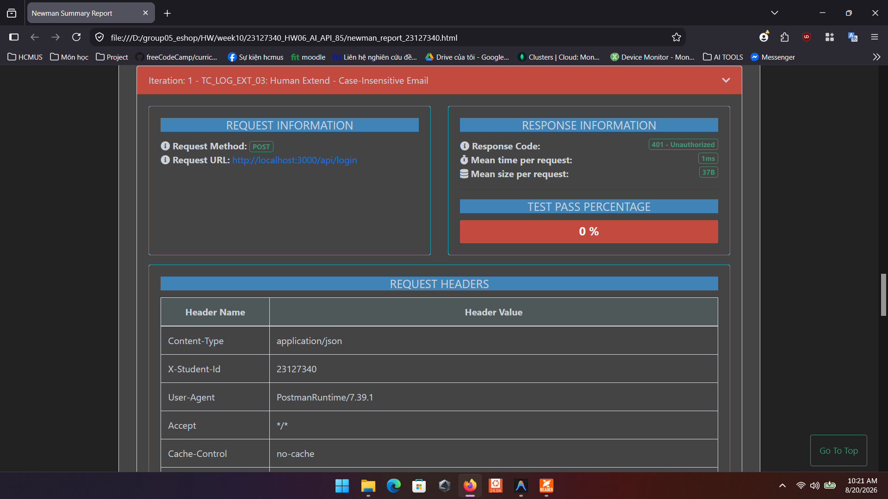

---

### ISSUE #8: [BUG-CPN-01] [High] `POST /api/apply-coupon` — Đơn hàng đạt đúng ngưỡng tối thiểu 300,000 VNĐ bị từ chối áp mã

* **Severity:** **High** (Lỗi biên BVA làm ảnh hưởng trực tiếp đến quyền lợi áp mã khuyến mãi của khách hàng)
* **Priority:** **P2 - High** (Cần sửa trong sprint hiện tại)
* **Labels:** `type: bug`, `severity: major`, `priority: P2`, `module: coupon`, `found-by: test-case`
* **Endpoint:** `POST /api/apply-coupon`
* **Test Case liên quan:** `TC_CPN_BVA_02: 3-point BVA Min (300,000)`

#### Mô tả lỗi (Defect Description)
Theo đặc tả mã giảm giá `SAVE10`, điều kiện áp dụng là tổng tiền đơn hàng phải đạt từ 300,000 VNĐ trở lên (`min_order_amount = 300,000`). Tuy nhiên, khi gửi đơn hàng có giá trị đúng bằng 300,000 VNĐ, server từ chối áp dụng và báo lỗi không đủ điều kiện tối thiểu.

#### Các bước tái hiện (Steps to Reproduce)
1. Gửi request `POST /api/apply-coupon`:
   * URL: `POST http://localhost:3000/api/apply-coupon`
   * Headers: `Content-Type: application/json`, `Authorization: Bearer <user_token>`
   * Body:
     ```json
     {
       "code": "SAVE10",
       "total_amount": 300000,
       "user_id": 1
     }
     ```

#### Kết quả thực tế (Actual Result)
* HTTP Status: `400 Bad Request`
* Response Body:
  ```json
  {
    "error": "Đơn hàng chưa đủ giá trị tối thiểu 300,000 ₫ để áp dụng mã này"
  }
  ```

#### Kết quả mong đợi (Expected Result)
* HTTP Status: `200 OK`
* Response Body:
  ```json
  {
    "success": true,
    "coupon_id": 1,
    "discount_amount": 30000,
    "final_amount": 270000,
    "message": "Áp dụng thành công! Giảm 10%"
  }
  ```

#### Bằng chứng kiểm thử (Evidence / Screenshot)
> 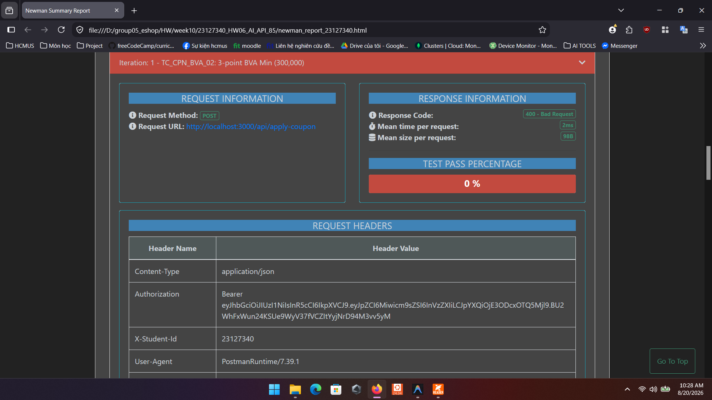

---

### ISSUE #9: [BUG-CPN-02] [Critical] `POST /api/apply-coupon` — Công thức giảm giá phần trăm bị tính toán sai (giảm âm / tăng tiền thanh toán)

* **Severity:** **Critical** (Gây sai lệch nghiêm trọng số tiền thanh toán của toàn bộ đơn hàng áp mã phần trăm)
* **Priority:** **P1 - Urgent** (Cần khắc phục khẩn cấp)
* **Labels:** `type: bug`, `severity: critical`, `priority: P1`, `module: coupon`, `found-by: test-case`
* **Endpoint:** `POST /api/apply-coupon`
* **Test Case liên quan:** `TC_CPN_DOM_01: Valid Percent Coupon (SAVE10 - 10%)`, `TC_CPN_BVA_03`

#### Mô tả lỗi (Defect Description)
Khi áp dụng mã giảm giá 10% (`SAVE10`) cho đơn hàng 500,000 VNĐ:
* Theo đặc tả: Số tiền được giảm phải là 50,000 VNĐ (10%), số tiền cần thanh toán là 450,000 VNĐ.
* Thực tế API trả về: Số tiền được giảm là `-4,500,000 VNĐ`, số tiền cần thanh toán bị tăng vọt thành `5,000,000 VNĐ`.

#### Các bước tái hiện (Steps to Reproduce)
1. Gửi request `POST /api/apply-coupon`:
   * URL: `POST http://localhost:3000/api/apply-coupon`
   * Headers: `Content-Type: application/json`, `Authorization: Bearer <user_token>`
   * Body:
     ```json
     {
       "code": "SAVE10",
       "total_amount": 500000,
       "user_id": 1
     }
     ```

#### Kết quả thực tế (Actual Result)
* HTTP Status: `200 OK`
* Response Body:
  ```json
  {
    "success": true,
    "coupon_id": 1,
    "discount_amount": -4500000,
    "final_amount": 5000000,
    "message": "Áp dụng thành công! Giảm 10%"
  }
  ```

#### Kết quả mong đợi (Expected Result)
* HTTP Status: `200 OK`
* Response Body:
  ```json
  {
    "success": true,
    "coupon_id": 1,
    "discount_amount": 50000,
    "final_amount": 450000,
    "message": "Áp dụng thành công! Giảm 10%"
  }
  ```

#### Bằng chứng kiểm thử (Evidence / Screenshot)
> 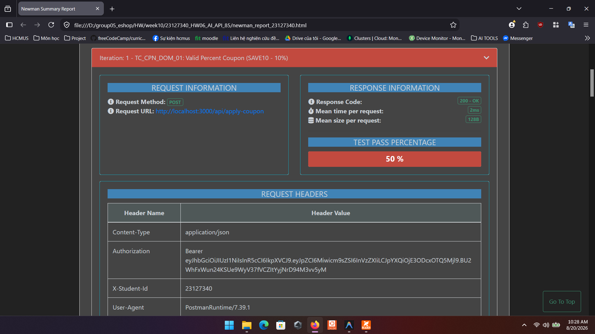

---

### ISSUE #10: [BUG-CPN-03] [High] `POST /api/apply-coupon` — Endpoint không có lớp bảo vệ xác thực JWT Token (Broken Authentication)

* **Severity:** **High** (Lỗ hổng xác thực Broken Authentication CWE-306)
* **Priority:** **P1 - Urgent** (Cần gắn xác thực bắt buộc cho endpoint thanh toán)
* **Labels:** `type: bug`, `severity: major`, `priority: P1`, `module: coupon`, `found-by: test-case`
* **Endpoint:** `POST /api/apply-coupon`
* **Test Case liên quan:** `TC_CPN_SEC_01: SEC-02 Missing Auth Token`, `TC_CPN_SEC_02`

#### Mô tả lỗi (Defect Description)
Endpoint `/api/apply-coupon` cho phép bất kỳ request nào không gửi kèm Header `Authorization` hoặc gửi chuỗi Token rác giả mạo vẫn được server xử lý và trả về `200 OK` bình thường.

#### Các bước tái hiện (Steps to Reproduce)
1. Gửi request `POST /api/apply-coupon` hoàn toàn không có header `Authorization`:
   * URL: `POST http://localhost:3000/api/apply-coupon`
   * Headers: `Content-Type: application/json` (Không có Authorization header)
   * Body:
     ```json
     {
       "code": "SAVE10",
       "total_amount": 500000,
       "user_id": 1
     }
     ```

#### Kết quả thực tế (Actual Result)
* HTTP Status: `200 OK` (Server xử lý áp dụng mã thành công mà không yêu cầu đăng nhập).

#### Kết quả mong đợi (Expected Result)
* HTTP Status: `401 Unauthorized`
* Response Body: `{"error": "Authorization token required"}`.

#### Bằng chứng kiểm thử (Evidence / Screenshot)
> 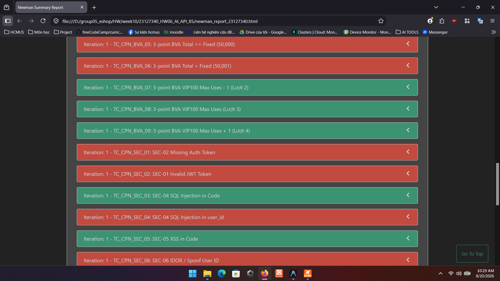

---

### ISSUE #11: [BUG-CPN-04] [High] `POST /api/apply-coupon` — Chấp nhận user_id không tồn tại, sai kiểu hoặc mạo danh user khác (IDOR)

* **Severity:** **High** (Lỗ hổng phân quyền đối tượng trực tiếp IDOR/BOLA CWE-639)
* **Priority:** **P1 - Urgent** (Cần ràng buộc token xác thực với user_id)
* **Labels:** `type: bug`, `severity: major`, `priority: P1`, `module: coupon`, `found-by: test-case`
* **Endpoint:** `POST /api/apply-coupon`
* **Test Case liên quan:** `TC_CPN_SEC_06: SEC-06 IDOR / Spoof User ID`, `TC_CPN_DOM_14`, `TC_CPN_DOM_15`, `TC_CPN_DOM_16`, `TC_CPN_DOM_17`

#### Mô tả lỗi (Defect Description)
Khi gửi request áp dụng mã giảm giá với `user_id` không tồn tại (`user_id = 999`), kiểu chuỗi `"user_one"`, số âm, hoặc bỏ trống trường `user_id`, hệ thống vẫn trả về `200 OK` và áp dụng mã bình thường thay vì từ chối với mã lỗi `400 Bad Request` hoặc `403 Forbidden`.

#### Các bước tái hiện (Steps to Reproduce)
1. Đăng nhập tài khoản `user_id = 1` để lấy `user_token`.
2. Gửi request `POST /api/apply-coupon` kèm token của User 1 nhưng truyền `user_id = 999`:
   * URL: `POST http://localhost:3000/api/apply-coupon`
   * Headers: `Content-Type: application/json`, `Authorization: Bearer <user_token_1>`
   * Body:
     ```json
     {
       "code": "SAVE10",
       "total_amount": 500000,
       "user_id": 999
     }
     ```

#### Kết quả thực tế (Actual Result)
* HTTP Status: `200 OK` (Mã áp dụng thành công cho user 999).

#### Kết quả mong đợi (Expected Result)
* HTTP Status: `403 Forbidden` hoặc `400 Bad Request`
* Response Body: `{"error": "Cannot apply coupon for other users"}`.

#### Bằng chứng kiểm thử (Evidence / Screenshot)
> 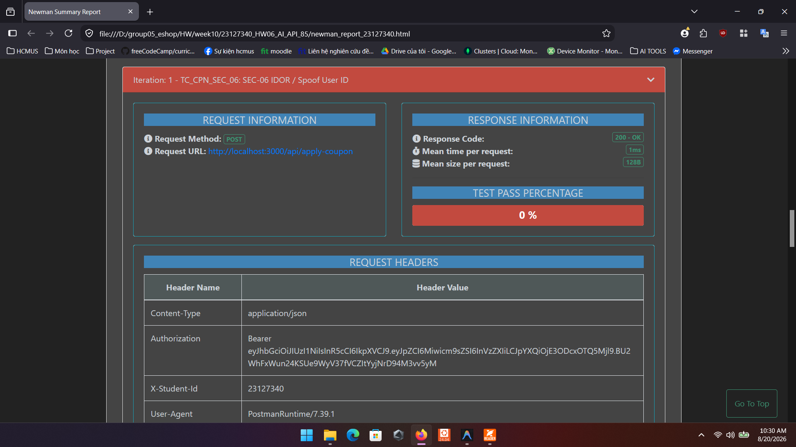
> 
> 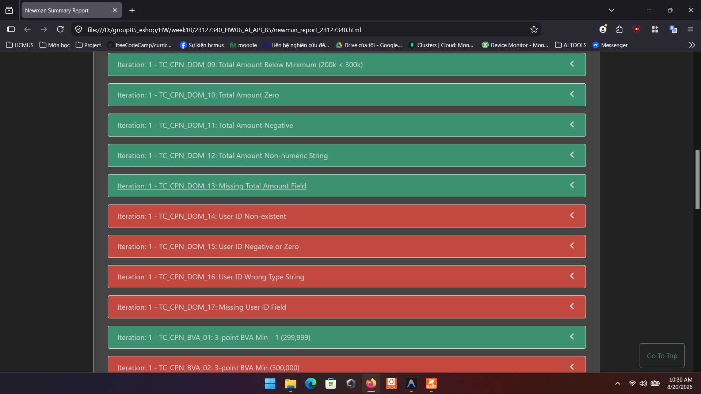

---

### ISSUE #12: [BUG-CPN-05] [Medium] `POST /api/apply-coupon` — Mã giảm giá cố định BIGBUY bị đặt sai ngưỡng tối thiểu 500,000 VNĐ gây chặn đơn nhỏ

* **Severity:** **Medium** (Chặn khách hàng sử dụng mã giảm giá cố định hợp lệ)
* **Priority:** **P3 - Medium** (Cần điều chỉnh ngưỡng tối thiểu cho mã cố định)
* **Labels:** `type: bug`, `severity: minor`, `priority: P3`, `module: coupon`, `found-by: test-case`
* **Endpoint:** `POST /api/apply-coupon`
* **Test Case liên quan:** `TC_CPN_BVA_04`, `TC_CPN_BVA_05`, `TC_CPN_BVA_06`

#### Mô tả lỗi (Defect Description)
Mã giảm giá cố định `BIGBUY` (giảm 50,000 VNĐ) được thiết kế cho đơn hàng phổ thông, nhưng server lại áp đặt điều kiện tối thiểu 500,000 VNĐ (`min_order_amount = 500,000 ₫`), dẫn đến tất cả các đơn hàng quanh mức 50,000 VNĐ đều bị từ chối với lỗi `400 Bad Request`.

#### Các bước tái hiện (Steps to Reproduce)
1. Gửi request `POST /api/apply-coupon`:
   * URL: `POST http://localhost:3000/api/apply-coupon`
   * Headers: `Content-Type: application/json`, `Authorization: Bearer <user_token>`
   * Body:
     ```json
     {
       "code": "BIGBUY",
       "total_amount": 50000,
       "user_id": 1
     }
     ```

#### Kết quả thực tế (Actual Result)
* HTTP Status: `400 Bad Request`
* Response Body: `{"error":"Đơn hàng chưa đủ giá trị tối thiểu 500,000 ₫ để áp dụng mã này"}`

#### Kết quả mong đợi (Expected Result)
* HTTP Status: `200 OK`
* `discount_amount`: `50000`
* `final_amount`: `0`

#### Bằng chứng kiểm thử (Evidence / Screenshot)
> 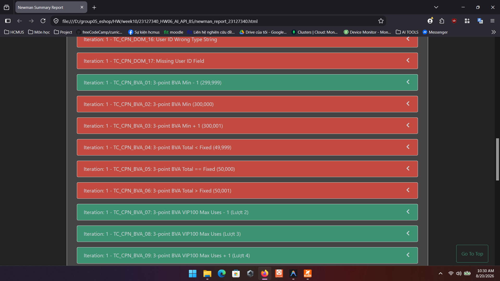

---

### ISSUE #13: [BUG-CPN-06] [Low] `POST /api/apply-coupon` — Mã giảm giá không hỗ trợ Case-Insensitive (phân biệt hoa thường)

* **Severity:** **Low** (Ảnh hưởng tiện ích nhập mã của khách hàng)
* **Priority:** **P4 - Low** (Xử lý trong đợt chuẩn hóa mã coupon)
* **Labels:** `type: bug`, `severity: minor`, `priority: P4`, `module: coupon`, `found-by: test-case`
* **Endpoint:** `POST /api/apply-coupon`
* **Test Case liên quan:** `TC_CPN_EXT_01: Human Extend - Case-Insensitive Coupon Code`

#### Mô tả lỗi (Defect Description)
Khi người dùng nhập mã giảm giá ở dạng chữ thường `save10`, server trả về `404 Not Found` báo mã không tồn tại thay vì tự động chuyển thành chữ hoa `SAVE10` để áp dụng khuyến mãi.

#### Các bước tái hiện (Steps to Reproduce)
1. Gửi request `POST /api/apply-coupon`:
   * URL: `POST http://localhost:3000/api/apply-coupon`
   * Headers: `Content-Type: application/json`, `Authorization: Bearer <user_token>`
   * Body:
     ```json
     {
       "code": "save10",
       "total_amount": 500000,
       "user_id": 1
     }
     ```

#### Kết quả thực tế (Actual Result)
* HTTP Status: `404 Not Found`
* Response Body: `{"error": "Mã giảm giá không tồn tại hoặc đã bị vô hiệu hóa"}`

#### Kết quả mong đợi (Expected Result)
* HTTP Status: `200 OK` (Áp dụng thành công mã `SAVE10`).

#### Bằng chứng kiểm thử (Evidence / Screenshot)
> 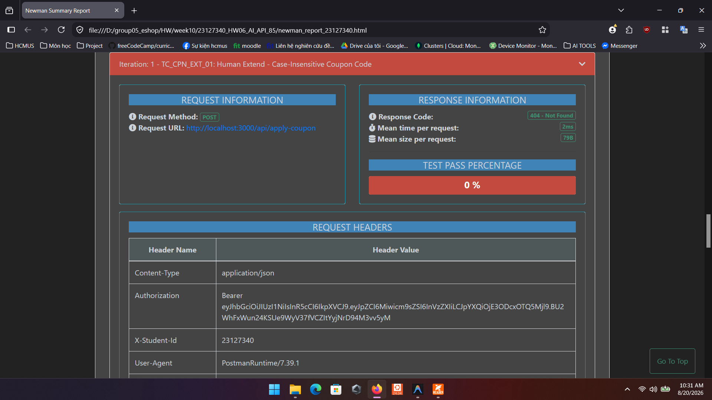

---

### ISSUE #14: [BUG-CPN-07] [Low] `POST /api/apply-coupon` — Mã code gửi sai kiểu dữ liệu (Number) trả về 404 thay vì 400 Bad Request

* **Severity:** **Low** (Sai mã trạng thái phản hồi schema validation)
* **Priority:** **P4 - Low** (Xử lý trong đợt chuẩn hóa schema)
* **Labels:** `type: bug`, `severity: minor`, `priority: P4`, `module: coupon`, `found-by: test-case`
* **Endpoint:** `POST /api/apply-coupon`
* **Test Case liên quan:** `TC_CPN_DOM_08: Code Wrong Type Number`

#### Mô tả lỗi (Defect Description)
Khi trường `code` truyền vào là kiểu số `12345` thay vì kiểu chuỗi (String), hệ thống không bắt lỗi kiểu dữ liệu ở tầng Validation (`400 Bad Request`) mà lại trả về `404 Not Found` (Mã không tồn tại).

#### Các bước tái hiện (Steps to Reproduce)
1. Gửi request `POST /api/apply-coupon`:
   * URL: `POST http://localhost:3000/api/apply-coupon`
   * Headers: `Content-Type: application/json`, `Authorization: Bearer <user_token>`
   * Body:
     ```json
     {
       "code": 12345,
       "total_amount": 500000,
       "user_id": 1
     }
     ```

#### Kết quả thực tế (Actual Result)
* HTTP Status: `404 Not Found`
* Response Body: `{"error": "Mã giảm giá không tồn tại hoặc đã bị vô hiệu hóa"}`

#### Kết quả mong đợi (Expected Result)
* HTTP Status: `400 Bad Request`
* Response Body: `{"error": "Coupon code must be a string"}`.

#### Bằng chứng kiểm thử (Evidence / Screenshot)
> 

---

### ISSUE #15: [BUG-ORD-01] [Critical] `PUT /api/admin/orders/:id/status` — Đơn hàng đã hủy (canceled) vẫn cho phép đổi sang giao hàng (delivered)

* **Severity:** **Critical** (Vi phạm tính toàn vẹn trạng thái đơn hàng, ảnh hưởng nghiêm trọng đến quy trình kho vận)
* **Priority:** **P1 - Urgent** (Cần khóa luồng trạng thái kết thúc ngay lập tức)
* **Labels:** `type: bug`, `severity: critical`, `priority: P1`, `module: orders`, `found-by: test-case`
* **Endpoint:** `PUT /api/admin/orders/:id/status`
* **Test Case liên quan:** `TC_ORD_ST_24: (canceled -> delivered) Illegal Transition`

#### Mô tả lỗi (Defect Description)
Theo quy tắc nghiệp vụ quản lý đơn hàng, `canceled` là trạng thái kết thúc (Final State). Một đơn hàng đã bị hủy tuyệt đối không thể được chuyển thành đã giao (`delivered`). Tuy nhiên, khi gửi request cập nhật đơn đã hủy thành `delivered`, server vẫn phản hồi `200 OK` và đổi trạng thái thành công.

#### Các bước tái hiện (Steps to Reproduce)
1. Tạo một đơn hàng mới và chuyển trạng thái đơn hàng sang `canceled`.
2. Gửi request `PUT /api/admin/orders/<id>/status` đổi sang `delivered`:
   * URL: `PUT http://localhost:3000/api/admin/orders/69/status`
   * Headers: `Content-Type: application/json`, `Authorization: Bearer <admin_token>`
   * Body:
     ```json
     {
       "status": "delivered"
     }
     ```

#### Kết quả thực tế (Actual Result)
* HTTP Status: `200 OK`
* Response Body: `{"message": "Order status updated"}`

#### Kết quả mong đợi (Expected Result)
* HTTP Status: `400 Bad Request`
* Response Body: `{"error": "Cannot change status of a canceled order"}`.

#### Bằng chứng kiểm thử (Evidence / Screenshot)
> 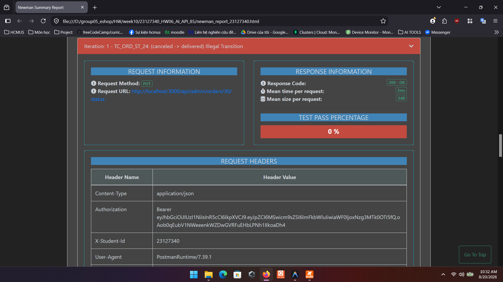

---

### ISSUE #16: [BUG-ORD-02] [Critical] `PUT /api/admin/orders/:id/status` — Lỗ hổng BFLA cho phép User thường thay đổi trạng thái đơn hàng của Admin

* **Severity:** **Critical** (Lỗ hổng phân quyền chức năng BFLA nghiêm trọng CWE-285 / OWASP A01)
* **Priority:** **P1 - Urgent** (Cần kiểm tra role Admin cho các endpoint quản trị)
* **Labels:** `type: bug`, `severity: critical`, `priority: P1`, `module: orders`, `found-by: test-case`
* **Endpoint:** `PUT /api/admin/orders/:id/status`
* **Test Case liên quan:** `TC_ORD_SEC_01: SEC-03 BFLA Normal User Escalation`

#### Mô tả lỗi (Defect Description)
Endpoint `/api/admin/orders/:id/status` mang quyền quản trị Admin, nhưng khi người dùng thông thường (`role = 'user'`) gửi request kèm token của mình, server vẫn chấp nhận và cho phép cập nhật trạng thái đơn hàng mà không hề chặn quyền truy cập.

#### Các bước tái hiện (Steps to Reproduce)
1. Đăng nhập tài khoản người dùng thường (`email = "test@eshop.com"`), nhận `user_token`.
2. Gửi request cập nhật trạng thái đơn hàng:
   * URL: `PUT http://localhost:3000/api/admin/orders/40/status`
   * Headers: `Content-Type: application/json`, `Authorization: Bearer <user_token>`
   * Body:
     ```json
     {
       "status": "confirmed"
     }
     ```

#### Kết quả thực tế (Actual Result)
* HTTP Status: `200 OK` (Cập nhật thành công không bị chặn quyền).

#### Kết quả mong đợi (Expected Result)
* HTTP Status: `403 Forbidden`
* Response Body: `{"error": "Admin access required"}`.

#### Bằng chứng kiểm thử (Evidence / Screenshot)
> 

---

### ISSUE #17: [BUG-ORD-03] [Medium] `PUT /api/admin/orders/:id/status` — Admin bị từ chối quyền hủy đơn hàng đang ở trạng thái giao hàng (shipping)

* **Severity:** **Medium** (Hạn chế quyền xử lý sự cố đơn hàng của quản trị viên)
* **Priority:** **P3 - Medium** (Cần cập nhật ma trận chuyển trạng thái hợp lệ)
* **Labels:** `type: bug`, `severity: minor`, `priority: P3`, `module: orders`, `found-by: test-case`
* **Endpoint:** `PUT /api/admin/orders/:id/status`
* **Test Case liên quan:** `TC_ORD_ST_15: (shipping -> canceled) Valid Admin Cancel`

#### Mô tả lỗi (Defect Description)
Theo quy trình vận hành thực tế, khi đơn hàng đang giao (`shipping`) mà gặp sự cố (khách từ chối nhận, bưu phẩm hư hỏng), Admin có quyền hủy đơn hàng (`shipping -> canceled`). Hiện tại hệ thống đang chặn bước chuyển này và trả về `400 Bad Request`.

#### Các bước tái hiện (Steps to Reproduce)
1. Tạo đơn hàng và chuyển trạng thái tuần tự đến `shipping`.
2. Gửi request hủy đơn hàng đang giao:
   * URL: `PUT http://localhost:3000/api/admin/orders/60/status`
   * Headers: `Content-Type: application/json`, `Authorization: Bearer <admin_token>`
   * Body:
     ```json
     {
       "status": "canceled"
     }
     ```

#### Kết quả thực tế (Actual Result)
* HTTP Status: `400 Bad Request`
* Response Body: `{"error":"Invalid state transition from shipping to canceled"}`

#### Kết quả mong đợi (Expected Result)
* HTTP Status: `200 OK`
* Response Body: `{"message": "Order status updated"}`.

#### Bằng chứng kiểm thử (Evidence / Screenshot)
> 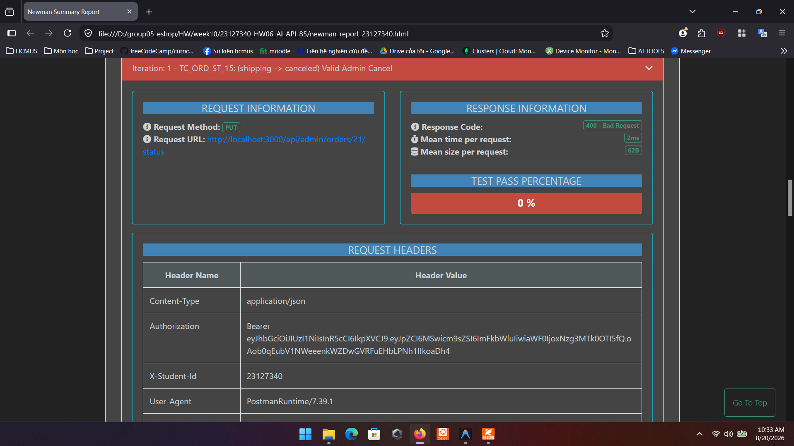

---

### ISSUE #18: [BUG-ORD-04] [Low] `PUT /api/admin/orders/:id/status` — ID đơn hàng sai định dạng trả về 404 thay vì 400 Bad Request

* **Severity:** **Low** (Mã phản hồi lỗi định dạng đầu vào không theo chuẩn)
* **Priority:** **P4 - Low** (Xử lý trong đợt refactor validation)
* **Labels:** `type: bug`, `severity: minor`, `priority: P4`, `module: orders`, `found-by: test-case`
* **Endpoint:** `PUT /api/admin/orders/:id/status`
* **Test Case liên quan:** `TC_ORD_DOM_03`, `TC_ORD_DOM_04`, `TC_ORD_DOM_05`

#### Mô tả lỗi (Defect Description)
Khi truyền ID trên đường dẫn URL ở dạng chuỗi chữ cái `abc`, số âm `-1` hoặc số thực `1.5`, hệ thống không trả về lỗi định dạng `400 Bad Request` mà lại trả về `404 Not Found`.

#### Các bước tái hiện (Steps to Reproduce)
1. Gửi request cập nhật đơn hàng với ID dạng chuỗi chữ cái `abc`:
   * URL: `PUT http://localhost:3000/api/admin/orders/abc/status`
   * Headers: `Content-Type: application/json`, `Authorization: Bearer <admin_token>`
   * Body: `{"status": "confirmed"}`
2. Gửi request với ID là số âm: `PUT http://localhost:3000/api/admin/orders/-1/status`.

#### Kết quả thực tế (Actual Result)
* HTTP Status: `404 Not Found`
* Response Body: `{"error": "Order not found"}`

#### Kết quả mong đợi (Expected Result)
* HTTP Status: `400 Bad Request`
* Response Body: `{"error": "Invalid order ID format"}`.

#### Bằng chứng kiểm thử (Evidence / Screenshot)
> 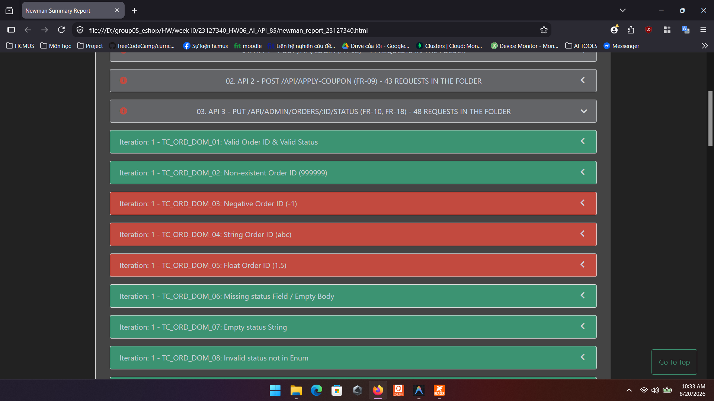

---

## 3. HƯỚNG DẪN ĐẨY ISSUE LÊN GITHUB TỰ ĐỘNG

Script [push_issues_to_github.js](./push_issues_to_github.js) đã được cập nhật đồng bộ với toàn bộ danh sách 18 lỗi đã xác thực ở trên. Bạn có thể thực thi tự động qua PowerShell:
```powershell
cd d:\group05_eshop\HW\week10\23127340_HW06_AI_API_85
$env:GITHUB_TOKEN = "ghp_your_token_here"
node push_issues_to_github.js
```
