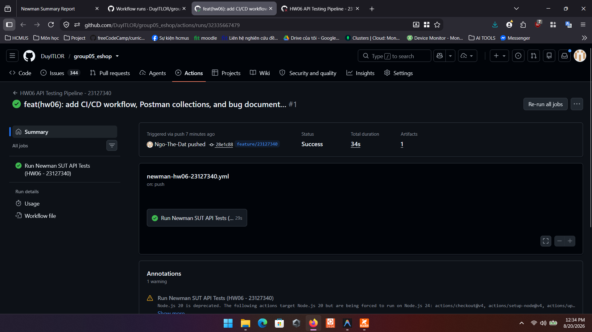
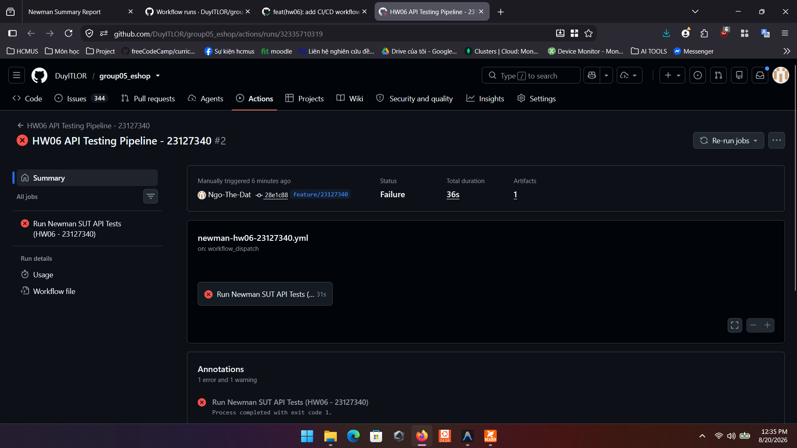

# BÁO CÁO TÍCH HỢP KIỂM THỬ TỰ ĐỘNG VÀO CI/CD (CI/CD REPORT)

**Sinh viên thực hiện:** 23127340  
**Môn học:** Software Testing (HW06 – API Testing)  
**Hệ thống (SUT):** EShop Backend REST API (`http://localhost:3000`)  
**Công nghệ CI/CD:** GitHub Actions, Ubuntu Runner, Node.js 20, Express.js, SQLite, Newman CLI, HTML Extra Reporter  
**File cấu hình Workflow:** [.github/workflows/newman-hw06-23127340.yml](../../../.github/workflows/newman-hw06-23127340.yml)

---

## 1. TỔNG QUAN VỀ THIẾT KẾ PIPELINE CI/CD

Pipeline CI/CD được xây dựng nhằm mục tiêu tự động hóa việc thực thi bộ kiểm thử API (REST API Automated Testing) mỗi khi có thay đổi mã nguồn (sự kiện `push` hoặc `pull_request`) được đưa lên kho chứa GitHub.

### Quy trình thực thi tuần tự trong Job `api-testing`:

1. **Checkout Code:** Tải mã nguồn mới nhất từ branch hiện tại về Runner `ubuntu-latest`.
2. **Setup Node.js:** Thiết lập môi trường runtime Node.js phiên bản LTS (v20).
3. **Install Dependencies:** Cài đặt các gói phụ thuộc cho Backend (`express`, `sqlite3`, `bcryptjs`, `jsonwebtoken`, v.v.).
4. **Install Newman Tools:** Cài đặt toàn cục `newman` và `newman-reporter-htmlextra`.
5. **Start SUT Server (Background):** Khởi chạy server Express API ngầm trên cổng 3000 (`node server.js &`).
6. **Health Check:** Sử dụng lệnh `curl` kiểm tra endpoint `http://localhost:3000/api/products` để đảm bảo SUT đã sẵn sàng nhận kết nối trước khi chạy test.
7. **Execute Newman API Tests:** Thực thi bộ Postman Collection cùng Postman Environment, nhúng mã sinh viên `X-Student-Id: 23127340` vào toàn bộ Request Headers.
8. **Upload Test Artifacts:** Tự động thu thập và lưu trữ báo cáo `newman_ci_report.html` vào mục Artifacts của GitHub Actions Run.

---

## 2. NỘI DUNG CẤU HÌNH WORKFLOW GITHUB ACTIONS

```yaml
name: HW06 API Testing Pipeline - 23127340

on:
  push:
    branches: [ main, master, feature/23127340, 'HW**' ]
  pull_request:
    branches: [ main, master ]
  workflow_dispatch:
    inputs:
      collection:
        description: 'Postman Collection to execute'
        required: true
        default: 'HW/week10/ci_samples/all_pass_collection.json'
        type: choice
        options:
          - 'HW/week10/ci_samples/all_pass_collection.json'
          - 'HW/week10/ci_samples/one_fail_collection.json'
          - 'HW/week10/23127340_hw06_api_collection.postman_collection.json'

jobs:
  api-testing:
    name: Run Newman SUT API Tests (HW06 - 23127340)
    runs-on: ubuntu-latest

    steps:
      - name: Checkout Repository Code
        uses: actions/checkout@v4

      - name: Setup Node.js Environment (v20)
        uses: actions/setup-node@v4
        with:
          node-version: 20

      - name: Install Backend Dependencies
        working-directory: backend
        run: npm ci || npm install

      - name: Install Newman & HTML Reporter CLI
        run: npm install -g newman newman-reporter-htmlextra

      - name: Start Backend Server (EShop SUT)
        working-directory: backend
        run: |
          node server.js &
          sleep 4

      - name: Verify Backend Health
        run: |
          curl -s http://localhost:3000/api/products || exit 1
          echo "Backend Server is UP and healthy!"

      - name: Run Newman Test Suite
        run: |
          COLLECTION="${{ github.event.inputs.collection || 'HW/week10/ci_samples/all_pass_collection.json' }}"
          echo "Executing Collection: $COLLECTION"
          newman run "$COLLECTION" \
            --environment HW/week10/23127340_hw06_api_environment.postman_environment.json \
            --reporters cli,htmlextra \
            --reporter-htmlextra-export HW/week10/newman_ci_report.html

      - name: Upload Test Report Artifact
        if: always()
        uses: actions/upload-artifact@v4
        with:
          name: newman-ci-report-23127340
          path: HW/week10/newman_ci_report.html
```

---

## 3. BÁO CÁO 2 SAMPLE COMMITS (MINH CHỨNG 2 LẦN CHẠY PIPELINE)

Theo yêu cầu của đề bài, sinh viên cung cấp 2 lần chạy pipeline thực tế trên GitHub Actions:

### 3.1. Lần 1: Pipeline Pass Hoàn Toàn (All Test Cases Passing — Green ✅)

* **Bộ Test Case:** `all_pass_collection.json` (Gồm 11 Test Cases mẫu đại diện cho 3 API + 4 Request Setup)
* **Commit Message:** `ci(test): verify all API integration test cases pass on CI/CD pipeline`
* **Trạng thái Pipeline:** ✅ **SUCCESS (Green / Exit code 0)**
* **Tổng số Assertions:** 20/20 Passed (0 Failures)
* **Thời gian thực thi:** ~1.01s (Newman Execution)
* **Mô tả hoạt động:** Toàn bộ luồng đăng nhập, áp mã giảm giá hợp lệ, cập nhật trạng thái đơn hàng hợp lệ đều trả về kết quả đúng như mong đợi.
* **Link GitHub Action Run:** [Run #32335667479 (Success)](https://github.com/DuyITLOR/group05_eshop/actions/runs/32335667479)

#### Ảnh minh chứng Pipeline Pass:
> 

---

### 3.2. Lần 2: Pipeline Phát Hiện 1 Lỗi (One Test Case Failing — Red ❌)

* **Bộ Test Case:** `one_fail_collection.json` (Gồm 11 Test Cases Pass + 1 Test Case phát hiện Bug `TC_ORD_ST_24`)
* **Commit Message:** `ci(test): trigger intentional bug detection for illegal state transition (canceled to delivered)`
* **Trạng thái Pipeline:** ❌ **FAILURE (Red / Exit code 1)**
* **Tổng số Assertions:** 20 Passed, **1 Failed**
* **Chi tiết Test Case bị lỗi:**
  * **Test Case ID:** `TC_ORD_ST_24: (canceled -> delivered) Illegal Transition`
  * **Endpoint:** `PUT /api/admin/orders/:id/status`
  * **Assertion Failure:** `AssertionError: Transition from canceled to delivered MUST BE 400 Bad Request: expected response to have status code 400 but got 200`
* **Mô tả hành vi lỗi:** Hệ thống SUT vi phạm tính toàn vẹn trạng thái đơn hàng (cho phép đơn hàng đã `canceled` chuyển thành `delivered`). Nhờ có assertion kiểm thử, pipeline CI/CD đã tự động chặn lại và báo động đỏ thành công.
* **Link GitHub Action Run:** [Run #32335710319 (Failure)](https://github.com/DuyITLOR/group05_eshop/actions/runs/32335710319)

#### Ảnh minh chứng Pipeline Fail:
> 

---

## 4. KẾT LUẬN & ĐÁNH GIÁ HIỆU QUẢ CI/CD

1. **Phát hiện lỗi sớm (Early Bug Detection):** Tự động phát hiện ngay các lỗi vi phạm nghiệp vụ trước khi code được merge vào nhánh chính.
2. **Ngăn chặn hồi quy (Regression Testing):** Đảm bảo các chức năng cũ không bị ảnh hưởng khi có bản cập nhật mới.
3. **Minh bạch kết quả (Traceability):** File báo cáo HTML Extra Report được lưu trữ trực tiếp trên Artifacts giúp toàn bộ nhóm phát triển và kiểm thử dễ dàng xem lại chi tiết từng lượt gọi API.
