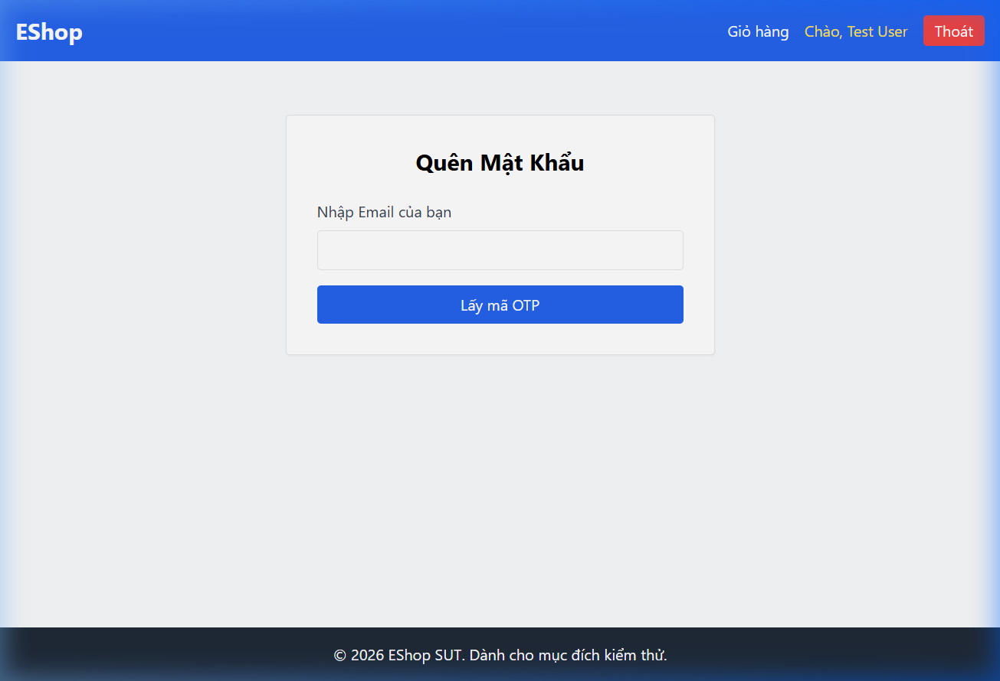

# Bug ID: `FR03-bug-01`

## Bug description:
Màn hình Quên mật khẩu (Bước 1/2) thiếu chỉ báo bước (Step Indicator) "Bước 1 / 2" và thiếu nút/liên kết "Quay lại đăng nhập" như đặc tả yêu cầu.

## Test case coverage: 
- `TC-FR03-01` (Yêu cầu OTP thành công với email đã đăng ký)
- `TC-FR03-18` (Kiểm thử BVA độ dài Email = Min)
- `TC-FR03-19` (Kiểm thử BVA độ dài Email = Min + 1)
- `TC-FR03-20` (Kiểm thử BVA độ dài Email = Max - 1)
- `TC-FR03-21` (Kiểm thử BVA độ dài Email = Max)

## Preconditions: 
- Người dùng đang ở màn hình Quên mật khẩu (`http://localhost:5173/forgot-password`).

## Test steps: 
1. Truy cập vào URL `http://localhost:5173/forgot-password`.
2. Quan sát giao diện Step 1.

## Expected results: 
- Giao diện phải hiển thị chỉ báo bước (Step Indicator) rõ ràng: "Bước 1 / 2".
- Giao diện phải có nút hoặc liên kết "Quay lại đăng nhập" để quay lại trang đăng nhập.

## Actual results: 
- Không có bất kỳ chỉ báo bước (Step Indicator) nào trên giao diện (chỉ hiển thị tiêu đề "Quên Mật Khẩu").
- Không có nút "Quay lại đăng nhập" để người dùng quay về trang đăng nhập.

### Bug screenshot: 

- Chụp màn hình bug và lưu tại: `./bugs/FR03/images/FR03-bug-01.png`
- Nhúng screenshot bug tại đây: 
