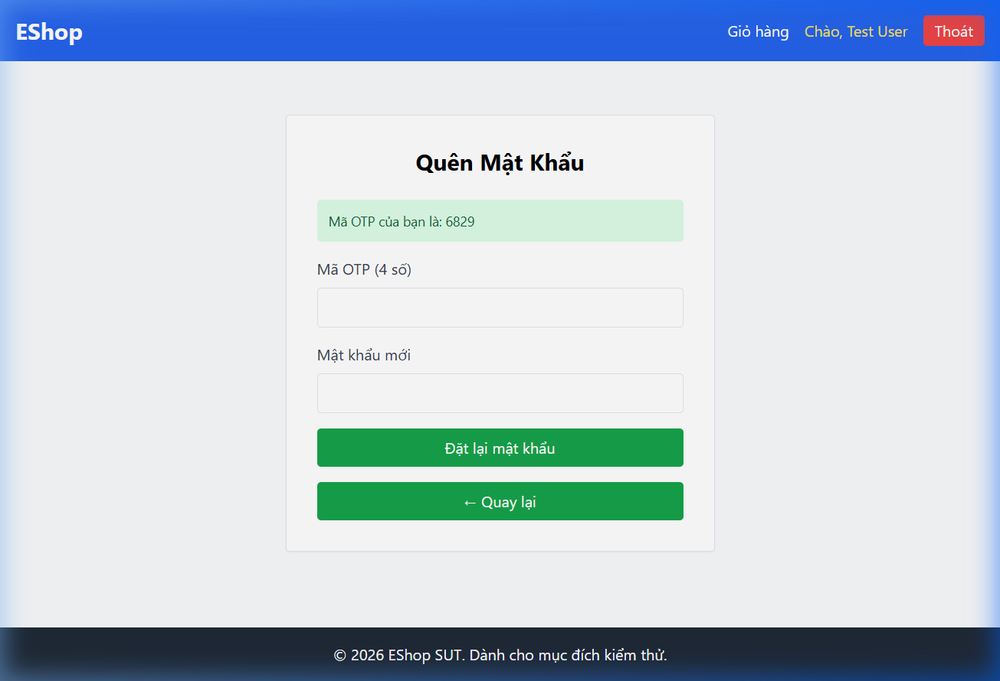

# Bug ID: `FR03-bug-02`

## Bug description:
1. Giao diện Đặt lại mật khẩu (Bước 2/2) không có trường "Xác nhận mật khẩu mới" (Confirm New Password), không thể kiểm tra hai trường mật khẩu khớp nhau như đặc tả yêu cầu.
2. Mã OTP được hệ thống tạo ra chỉ có **4 chữ số** thay vì **6 chữ số** như yêu cầu trong đặc tả FR-03.

## Test case coverage: 
- `TC-FR03-02` (Đặt lại mật khẩu thành công với thông tin hợp lệ)
- `TC-FR03-15` (Đặt lại mật khẩu thất bại do Xác nhận mật khẩu mới rỗng)
- `TC-FR03-16` (Đặt lại mật khẩu thất bại do Xác nhận mật khẩu mới không khớp)
- `TC-FR03-23`, `TC-FR03-24`, `TC-FR03-25` (Kiểm thử BVA độ dài OTP)

## Preconditions: 
- Người dùng đã nhập email đăng ký ở Bước 1 và nhấn nút "Lấy mã OTP".
- Giao diện chuyển sang Bước 2/2.

## Test steps: 
1. Nhập email `test@eshop.com` ở Bước 1.
2. Nhấn "Lấy mã OTP".
3. Quan sát mã OTP hiển thị trong hộp thông báo màu xanh.
4. Quan sát các trường nhập liệu trong Form ở Bước 2.

## Expected results: 
- Hệ thống sinh mã OTP có đúng **6 chữ số** ngẫu nhiên.
- Form ở Bước 2 phải hiển thị đầy đủ 3 trường: "Mã OTP", "Mật khẩu mới", và "Xác nhận mật khẩu mới".

## Actual results: 
- Hệ thống chỉ sinh mã OTP gồm **4 chữ số** (ví dụ: `6829`, `8738`).
- Form Bước 2 chỉ có 2 trường nhập liệu là "Mã OTP (4 số)" và "Mật khẩu mới", hoàn toàn không có trường "Xác nhận mật khẩu mới".

### Bug screenshot: 

- Chụp màn hình bug và lưu tại: `./bugs/FR03/images/FR03-bug-02.png`
- Nhúng screenshot bug tại đây: 
