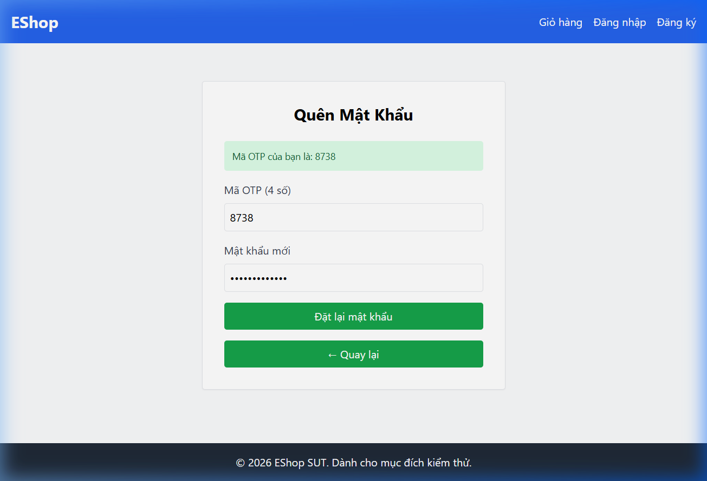

# Bug ID: `FR03-bug-03`

## Bug description:
Màn hình Đặt lại mật khẩu (Bước 2/2) sử dụng biểu thức chính quy (Regex) kiểm tra mật khẩu mạnh bị sai logic (tương tự như màn hình Đăng ký FR-01). Lỗi này bắt buộc mật khẩu mới phải chứa khoảng trắng (space) và chặn toàn bộ các ký tự đặc biệt hợp lệ (ví dụ: `!`, `@`, `#`, `$`, `%`, `*`...). Do đó, người dùng nhập mật khẩu mạnh chuẩn sẽ bị báo lỗi "Mật khẩu quá yếu!", trong khi nhập mật khẩu chứa dấu cách lại được chấp nhận.

## Test case coverage: 
- `TC-FR03-02` (Đặt lại mật khẩu thành công với thông tin hợp lệ)
- `TC-FR03-10` đến `TC-FR03-14` (Đặt lại mật khẩu thất bại do mật khẩu không đúng chuẩn EP)
- Các test case BVA liên quan đến mật khẩu mới hợp lệ: `TC-FR03-27`, `TC-FR03-28`, `TC-FR03-29`, `TC-FR03-30`, `TC-FR03-33`, `TC-FR03-34`, `TC-FR03-36`, `TC-FR03-37`, `TC-FR03-39`, `TC-FR03-40`, `TC-FR03-42`, `TC-FR03-43`.

## Preconditions: 
- Người dùng đã lấy được mã OTP thành công ở Bước 1 và đang ở màn hình Đặt lại mật khẩu (Bước 2).

## Test steps: 
1. Nhập mã OTP hợp lệ nhận được từ Bước 1.
2. Nhập Mật khẩu mới là `Password123!` (mật khẩu rất mạnh và hợp lệ).
3. Nhấp nút "Đặt lại mật khẩu".

## Expected results: 
- Đặt lại mật khẩu thành công (mật khẩu `Password123!` thỏa mãn hoàn toàn chính sách bảo mật).

## Actual results: 
- Hệ thống chặn lại và hiển thị cảnh báo: *"Mật khẩu quá yếu! Phải dài tối thiểu 8 ký tự, gồm chữ hoa, chữ thường, số và KÝ TỰ ĐẶC BIỆT."*
- **Nguyên nhân:** Regex được định nghĩa lỗi trong file `ForgotPassword.jsx`:
  `const flawedStrongPasswordRegex = /^(?=.*[a-z])(?=.*[A-Z])(?=.*\d)(?=.*\s)[A-Za-z\d\s]{8,}$/;`
  Regex này kiểm tra sự tồn tại của khoảng trắng (`(?=.*\s)`) thay vì ký tự đặc biệt, đồng thời lớp ký tự `[A-Za-z\d\s]` chặn hoàn toàn các ký tự đặc biệt thực sự như `!`, `@`, `#`...

### Bug screenshot: 

- Chụp màn hình bug và lưu tại: `./bugs/FR03/images/FR03-bug-03.png`
- Nhúng screenshot bug tại đây: 
