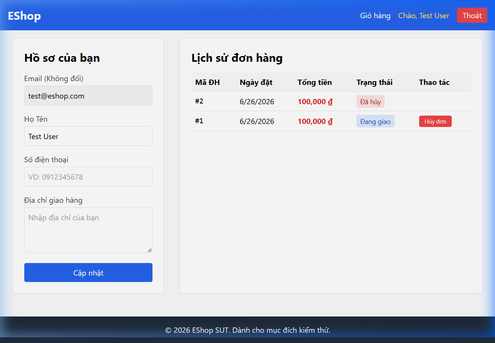
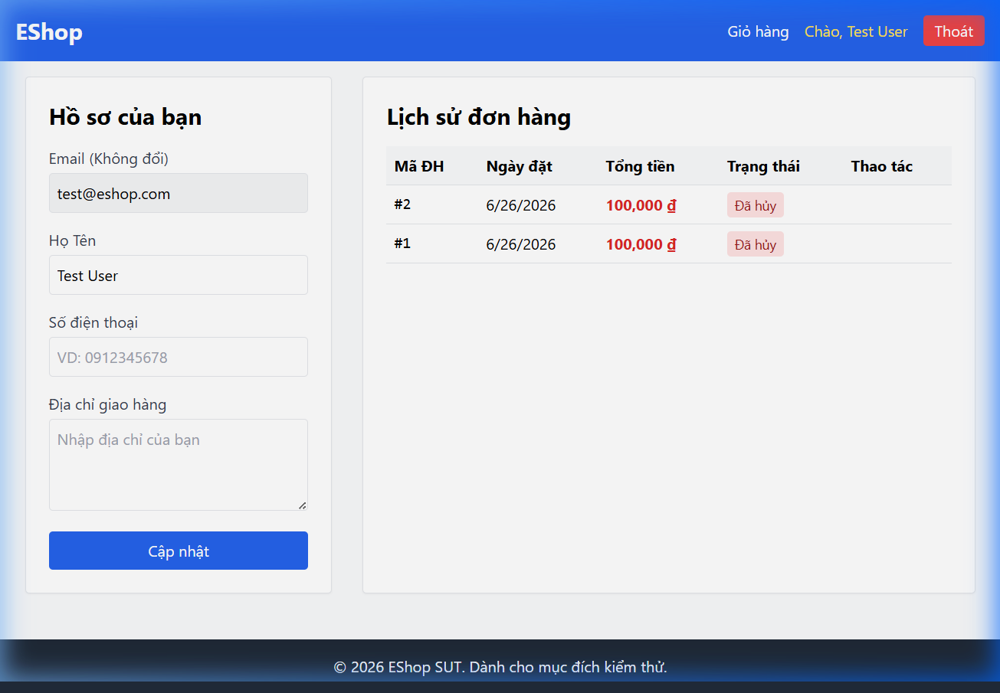

# Bug ID: `FR10-bug-02`

## Bug description:
Người dùng có thể tự hủy đơn hàng khi đơn hàng đang ở trạng thái "Đang giao" (`shipping`) hoặc các trạng thái không hợp lệ khác (như `draft`). Theo đặc tả FR-10: "Khi đơn hàng đã ở trạng thái shipping, User không được phép tự hủy — chỉ Admin mới có thể thao tác".
Giao diện người dùng cũng hiển thị sai nút "Hủy đơn" đối với đơn hàng ở trạng thái "Đang giao".

## Test case coverage: 
- [TC-FR10-19](file:///d:/group05_eshop/tests/test-cases/FR10/TC-FR10-19.md)

## Preconditions: 
1. Đăng nhập hệ thống với tài khoản User thường (`test@eshop.com` / `Test1234!`).
2. User có một đơn hàng đang ở trạng thái `shipping` (Đang giao) trong hệ thống (Ví dụ: ID đơn hàng = 1).

## Test steps: 
1. Người dùng truy cập trang cá nhân tại địa chỉ `http://localhost:5173/profile`.
2. Tìm đơn hàng có mã `#1` trong bảng lịch sử đơn hàng.
3. Kiểm tra xem nút "Hủy đơn" có hiển thị hay không (chụp ảnh màn hình 1).
4. Bấm nút "Hủy đơn", xác nhận trên hộp thoại alert của trình duyệt.
5. Kiểm tra thông báo và trạng thái đơn hàng sau khi hủy (chụp ảnh màn hình 2).

## Expected results: 
1. Nút "Hủy đơn" KHÔNG được hiển thị đối với đơn hàng đang ở trạng thái "Đang giao" (`shipping`).
2. Nếu gửi request trực tiếp qua API `PUT /api/orders/1/cancel`, hệ thống phải trả về mã lỗi `HTTP 400 Bad Request` và trạng thái đơn hàng giữ nguyên `shipping`.

## Actual results: 
1. Nút "Hủy đơn" vẫn hiển thị bình thường bên cạnh đơn hàng có trạng thái "Đang giao".
2. Khi bấm nút, hệ thống báo "Hủy đơn thành công!" và API trả về `HTTP 200 OK`.
3. Trạng thái đơn hàng trong CSDL bị cập nhật thành `canceled` (Đã hủy).

### Bug screenshot: 

- Màn hình hiển thị nút "Hủy đơn" ở trạng thái Đang giao:

- Màn hình hiển thị hủy đơn thành công:

