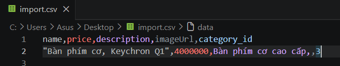
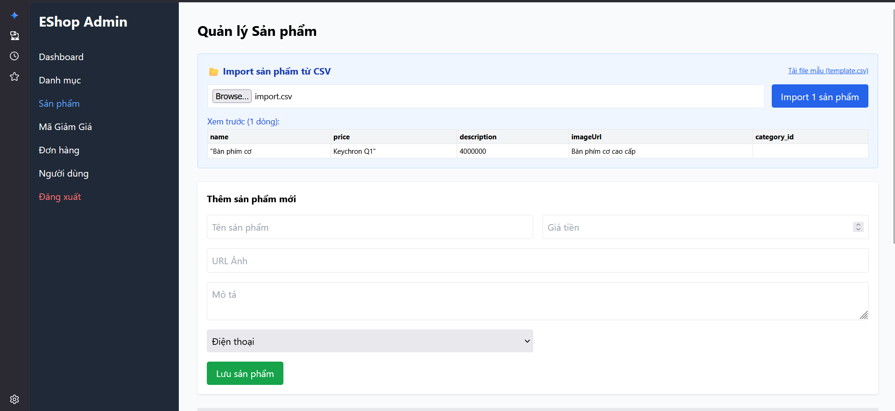

# Bug ID: `FR16-bug-01`

## Bug description:
Giao diện không xử lý đúng chuẩn RFC 4180 khi phân tích cú pháp file CSV có chứa dấu phẩy được bọc trong dấu nháy kép. Hệ thống sử dụng phương thức `split(",")` đơn giản trên client để chia các trường, dẫn đến việc các trường chứa dấu phẩy bị phân tách thành nhiều cột khác nhau, gây lệch cột (column shifting) dữ liệu nghiêm trọng khi gửi lên API.

## Test case coverage: 
- `TC-FR16-01` (Import file CSV hợp lệ hoàn toàn với các dòng dữ liệu đúng chuẩn)
- `TC-FR16-07` (Dòng dữ liệu chứa dấu phẩy nhưng không được bọc trong dấu nháy kép)

## Preconditions: 
1. Người dùng đăng nhập hệ thống với tài khoản Admin (`role = 'admin'`).
2. Người dùng đang ở màn hình Import sản phẩm từ file CSV (`http://localhost:5174/`).

## Test steps: 
1. Tải lên file CSV chứa sản phẩm có thuộc tính chứa dấu phẩy và được bọc trong dấu nháy kép (Ví dụ: `"Bàn phím cơ, Keychron Q1",4000000,Bàn phím cơ cao cấp,,3`).
2. Nhấp nút "Import" hoặc nút xác nhận tải lên.
3. Kiểm tra thông tin sản phẩm được hiển thị trên UI Xem trước và kiểm tra trong cơ sở dữ liệu.

## Expected results: 
1. Hệ thống phân tích cú pháp (parse) đúng chuẩn RFC 4180, gán tên sản phẩm là `"Bàn phím cơ, Keychron Q1"` và giá sản phẩm là `4000000`.
2. Sản phẩm được lưu đúng các thông tin và thuộc tính vào cơ sở dữ liệu.
3. Giao diện hiển thị thông báo import hoàn tất thành công.

## Actual results: 
1. Giao diện xem trước và dữ liệu gửi lên API bị lệch cột hoàn toàn: Tên sản phẩm bị cắt thành `"Bàn phím cơ`, giá tiền bị nhận giá trị là chuỗi `Keychron Q1"`.
2. Cơ sở dữ liệu lưu sai lệch thông tin sản phẩm do lệch cột.
3. Hệ thống vẫn báo import thành công mà không phát hiện ra lỗi định dạng/cú pháp.

### Bug screenshot: 

- Chụp màn hình bug và lưu tại: `./bugs/FR16/images/FR16-bug-01-01.png` và `./bugs/FR16/images/FR16-bug-01-02.png`
- Nhúng các screenshot bug tại đây:
  
  
