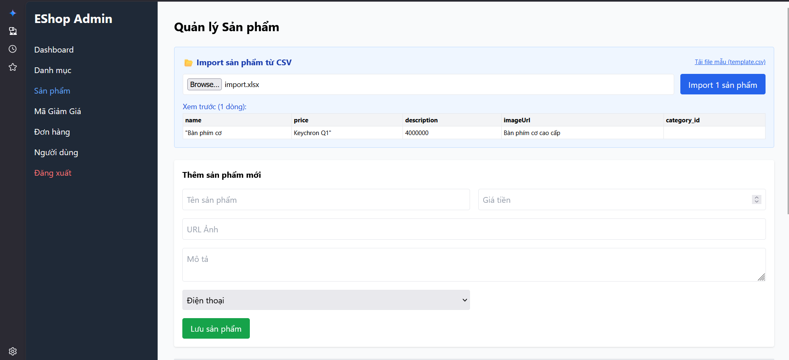

# Bug ID: `FR16-bug-02`

## Bug description:
Giao diện không thực hiện kiểm tra định dạng và phần mở rộng (đuôi file) của file tải lên. Hệ thống cho phép người dùng chọn và tiến hành import các file không phải CSV (ví dụ: file bảng tính `.xlsx`, file văn bản hoặc file không có phần mở rộng). Khi tải lên file sai định dạng, `FileReader` trên frontend vẫn cố đọc nội dung file dưới dạng text và gửi dữ liệu lỗi lên API.

## Test case coverage: 
- `TC-FR16-02` (Tải lên file sai đuôi mở rộng (định dạng `.xlsx`))
- `TC-FR16-03` (Tải lên file không có phần mở rộng (đuôi file))

## Preconditions: 
1. Người dùng đăng nhập hệ thống với tài khoản Admin (`role = 'admin'`).
2. Người dùng đang ở màn hình Import sản phẩm từ file CSV.

## Test steps: 
1. Chọn file sai đuôi mở rộng (như `products.xlsx`) hoặc file không có phần mở rộng (như `products`) để tải lên.
2. Nhấp nút "Import" hoặc nút xác nhận tải lên.
3. Quan sát phản hồi trên giao diện và kiểm tra cơ sở dữ liệu.

## Expected results: 
1. Hệ thống từ chối import và hiển thị thông báo lỗi định dạng file không hợp lệ (yêu cầu file `.csv`).
2. Không thực hiện gửi dữ liệu lên backend API và không có sản phẩm nào được lưu vào cơ sở dữ liệu.

## Actual results: 
1. Hệ thống không kiểm tra đuôi file, vẫn thực hiện đọc file và gửi request lên API.
2. Với file `.xlsx` (binary), FileReader đọc thành chuỗi ký tự lỗi, giao diện hiển thị thông báo hoàn tất với các lỗi dòng dữ liệu thay vì từ chối định dạng file ngay từ đầu.
3. Với file không đuôi chứa nội dung CSV hợp lệ, hệ thống vẫn xử lý bình thường và thêm thành công sản phẩm vào cơ sở dữ liệu mà không từ chối.

### Bug screenshot: 

- Chụp màn hình bug và lưu tại: `./bugs/FR16/images/FR16-bug-02.png`
- Nhúng screenshot bug tại đây:
  
