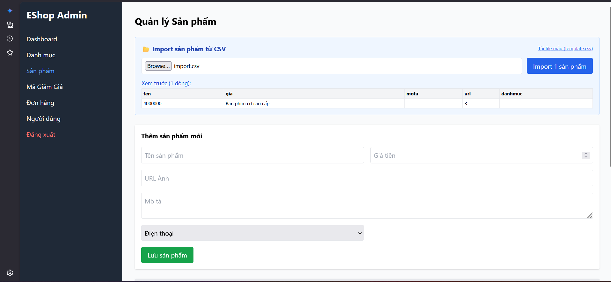
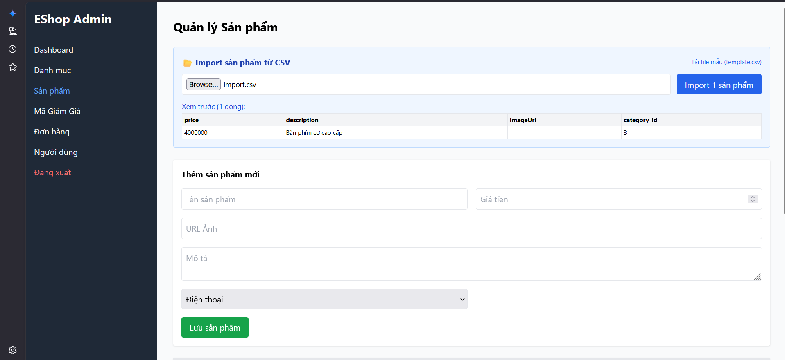

# Bug ID: `FR16-bug-03`

## Bug description:
Giao diện không kiểm tra cấu trúc dòng header đầu tiên của file CSV. Khi file CSV có dòng header sai tên cột hoặc thiếu các cột bắt buộc (`name`, `price`), hệ thống không từ chối file hay hiển thị lỗi cấu trúc file không hợp lệ. Thay vào đó, hệ thống vẫn tiếp tục xử lý, tự động ánh xạ (map) các trường không chuẩn hoặc gửi lên API dẫn đến báo lỗi không đúng bản chất của cấu trúc file.

## Test case coverage: 
- `TC-FR16-04` (File CSV có dòng header sai tên cột)
- `TC-FR16-05` (File CSV thiếu cột bắt buộc (`name`) trong header)

## Preconditions: 
1. Người dùng đăng nhập hệ thống với tài khoản Admin (`role = 'admin'`).
2. Người dùng đang ở màn hình Import sản phẩm từ file CSV.

## Test steps: 
1. Tải lên file CSV có dòng header sai tên cột (Ví dụ: `ten,gia,mota,url,danhmuc`) hoặc thiếu cột bắt buộc (Ví dụ: chỉ có `price,description,imageUrl,category_id`).
2. Nhấp nút "Import".
3. Quan sát thông báo lỗi trên UI và kiểm tra cơ sở dữ liệu.

## Expected results: 
1. Hệ thống từ chối import và hiển thị rõ thông báo lỗi cấu trúc file không hợp lệ (Ví dụ: sai tên cột header hoặc thiếu cột bắt buộc).
2. Không có sản phẩm nào được import và lưu vào cơ sở dữ liệu.

## Actual results: 
1. Đối với file có header sai tên cột: Hệ thống tự động ánh xạ với các thuộc tính thay thế (ten -> name, gia -> price) và tiến hành import thành công mà không cảnh báo lỗi cấu trúc.
2. Đối với file thiếu cột bắt buộc: Hệ thống không báo lỗi cấu trúc header từ đầu mà gửi request lên API, API cố import từng dòng dữ liệu trống và báo lỗi chi tiết hàng loạt "Hàng x: Thiếu tên sản phẩm" thay vì báo lỗi cấu trúc file header.

### Bug screenshot: 

- Chụp màn hình bug và lưu tại: `./bugs/FR16/images/FR16-bug-03-01.png` và `./bugs/FR16/images/FR16-bug-03-02.png`
- Nhúng các screenshot bug tại đây:
  
  
