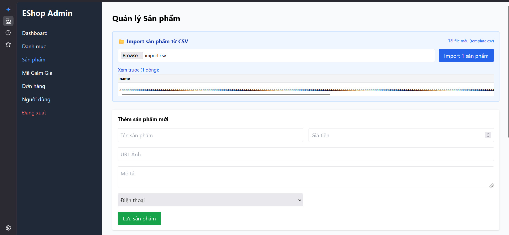

# Bug ID: `FR16-bug-04`

## Bug description:
Hệ thống không kiểm tra giới hạn độ dài của tên sản phẩm (tối đa 255 ký tự theo ràng buộc FR-15) khi thực hiện import sản phẩm từ file CSV. Khi người dùng tải lên sản phẩm có tên dài vượt quá 255 ký tự (Ví dụ: 256 ký tự), hệ thống vẫn chấp nhận và lưu thành công sản phẩm đó vào cơ sở dữ liệu.

## Test case coverage: 
- `TC-FR16-09` (Dòng dữ liệu có tên sản phẩm vượt quá 255 ký tự)
- `TC-FR16-23` (Độ dài `name` = Max + 1 (256 ký tự))

## Preconditions: 
1. Người dùng đăng nhập hệ thống với tài khoản Admin (`role = 'admin'`).
2. Người dùng đang ở màn hình Import sản phẩm từ file CSV.

## Test steps: 
1. Tải lên file CSV chứa sản phẩm có thuộc tính `name` dài 256 ký tự (các trường khác hợp lệ).
2. Nhấp nút "Import".
3. Kiểm tra thông báo trên giao diện và kiểm tra cơ sở dữ liệu.

## Expected results: 
1. Hệ thống từ chối import dòng dữ liệu không hợp lệ này.
2. Hiển thị thông báo lỗi cụ thể: "Hàng 2: Tên sản phẩm quá dài (tối đa 255 ký tự)".
3. Sản phẩm có tên dài 256 ký tự không được thêm vào cơ sở dữ liệu.

## Actual results: 
1. Hệ thống không kiểm tra độ dài tối đa của tên sản phẩm và cho phép import thành công.
2. Sản phẩm dài 256 ký tự được thêm thành công vào cơ sở dữ liệu.
3. Giao diện báo import thành công 1/1 sản phẩm mà không hiển thị bất kỳ lỗi nào.

### Bug screenshot: 

- Chụp màn hình bug và lưu tại: `./bugs/FR16/images/FR16-bug-04.png`
- Nhúng screenshot bug tại đây:
  
