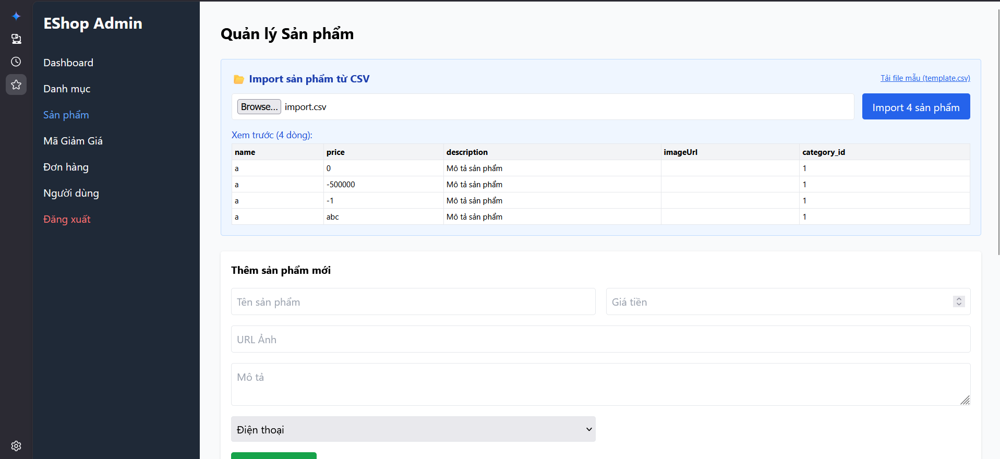

# Bug ID: `FR16-bug-05`

## Bug description:
Hệ thống hoàn toàn thiếu validation cho thuộc tính giá sản phẩm (`price`) khi import từ CSV (yêu cầu là số dương > 0). Hệ thống cho phép import thành công các sản phẩm có giá bằng 0, giá trị âm (Ví dụ: `-50000`, `-1`), giá trị không phải là số (Ví dụ: `abc`), hoặc tự động chuyển đổi thành 0 khi để trống giá tiền và import thành công.

## Test case coverage: 
- `TC-FR16-10` (Dòng dữ liệu có giá sản phẩm bằng 0)
- `TC-FR16-11` (Dòng dữ liệu có giá sản phẩm là số âm)
- `TC-FR16-12` (Dòng dữ liệu có giá sản phẩm không phải là số)
- `TC-FR16-13` (Dòng dữ liệu để trống giá sản phẩm)
- `TC-FR16-24` (Giá trị `price` = Min - 1 (Giá trị 0))
- `TC-FR16-27` (Giá trị `price` < 0 (Số âm, biên ngoài))

## Preconditions: 
1. Người dùng đăng nhập hệ thống với tài khoản Admin (`role = 'admin'`).
2. Người dùng đang ở màn hình Import sản phẩm từ file CSV.

## Test steps: 
1. Tải lên file CSV chứa sản phẩm có thuộc tính `price` không hợp lệ (bằng 0, số âm, chữ `abc`, hoặc để trống giá).
2. Nhấp nút "Import".
3. Kiểm tra thông báo trên giao diện và dữ liệu trong cơ sở dữ liệu.

## Expected results: 
1. Hệ thống từ chối import và hiển thị thông báo lỗi cụ thể cho dòng dữ liệu đó (Ví dụ: "Hàng 2: Giá tiền không hợp lệ (phải là số dương)" hoặc "Hàng 2: Thiếu giá tiền sản phẩm").
2. Không có sản phẩm nào có giá không hợp lệ được lưu vào cơ sở dữ liệu.

## Actual results: 
1. Hệ thống không kiểm tra giá trị của trường `price` và lưu thành công sản phẩm có giá bằng `0`, `-50000`, `-1`, `"abc"` vào cơ sở dữ liệu.
2. Khi để trống trường giá, giao diện tự động map thành giá trị `0` và gửi lên API, import thành công sản phẩm với giá bằng 0 mà không báo lỗi thiếu giá tiền.
3. UI hiển thị thông báo import hoàn tất thành công mà không hiển thị cảnh báo lỗi về giá tiền.

### Bug screenshot: 

- Chụp màn hình bug và lưu tại: `./bugs/FR16/images/FR16-bug-05.png`
- Nhúng screenshot bug tại đây:
  
