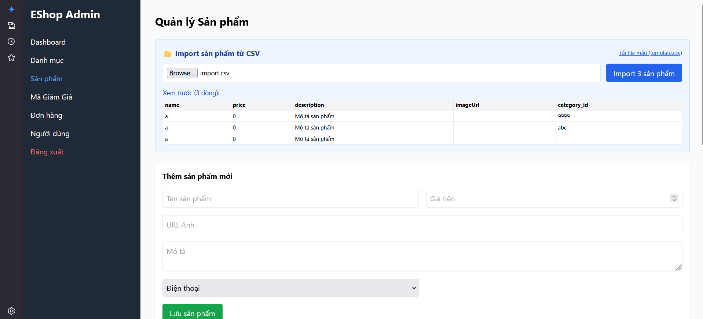

# Bug ID: `FR16-bug-06`

## Bug description:
Hệ thống không kiểm tra tính hợp lệ và sự tồn tại của danh mục sản phẩm (`category_id`) khi thực hiện import từ CSV. Hệ thống chấp nhận và lưu thành công các sản phẩm có ID danh mục không tồn tại trong hệ thống (Ví dụ: `9999`), ID danh mục không phải số nguyên (Ví dụ: `abc`), hoặc tự động gán danh mục mặc định = `1` khi người dùng để trống ID danh mục và tiến hành import thành công.

## Test case coverage: 
- `TC-FR16-14` (Dòng dữ liệu có ID danh mục không tồn tại trong hệ thống)
- `TC-FR16-15` (Dòng dữ liệu có ID danh mục không phải số nguyên)
- `TC-FR16-16` (Dòng dữ liệu để trống ID danh mục)

## Preconditions: 
1. Người dùng đăng nhập hệ thống với tài khoản Admin (`role = 'admin'`).
2. Người dùng đang ở màn hình Import sản phẩm từ file CSV.

## Test steps: 
1. Tải lên file CSV chứa sản phẩm có thuộc tính `category_id` không hợp lệ (ID không tồn tại `9999`, chữ `abc`, hoặc để trống).
2. Nhấp nút "Import".
3. Kiểm tra thông báo lỗi trên UI và kiểm tra trong cơ sở dữ liệu.

## Expected results: 
1. Hệ thống từ chối import và hiển thị thông báo lỗi cụ thể (Ví dụ: "Hàng 2: Danh mục không tồn tại" hoặc "Hàng 2: Thiếu danh mục sản phẩm").
2. Sản phẩm có ID danh mục không hợp lệ không được thêm vào cơ sở dữ liệu.

## Actual results: 
1. Sản phẩm có `category_id` bằng `9999` hoặc `"abc"` được lưu thành công vào cơ sở dữ liệu.
2. Khi để trống ID danh mục, giao diện tự động gán giá trị mặc định là `1` (Điện thoại) và gửi lên API, import thành công sản phẩm vào DB mà không có lỗi.
3. Giao diện hiển thị import thành công mà không báo bất kỳ lỗi nào.

### Bug screenshot: 

- Chụp màn hình bug và lưu tại: `./bugs/FR16/images/FR16-bug-06.png`
- Nhúng screenshot bug tại đây:
  
