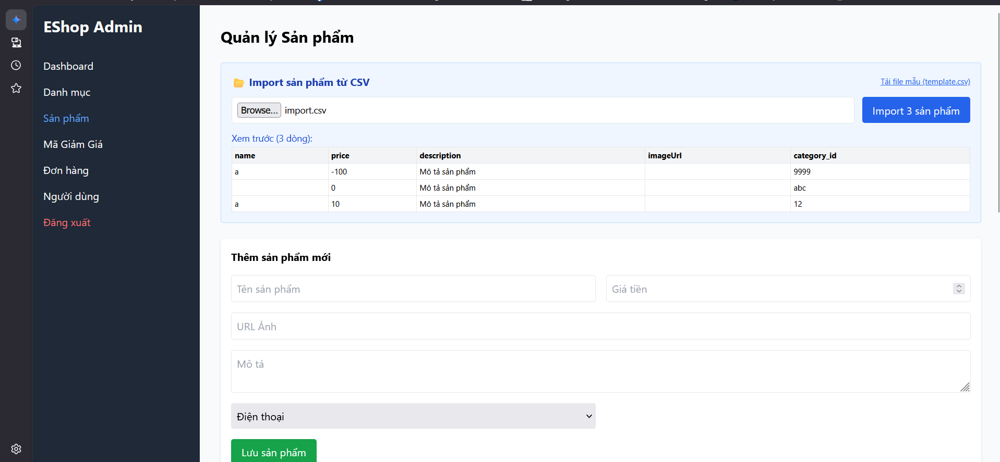
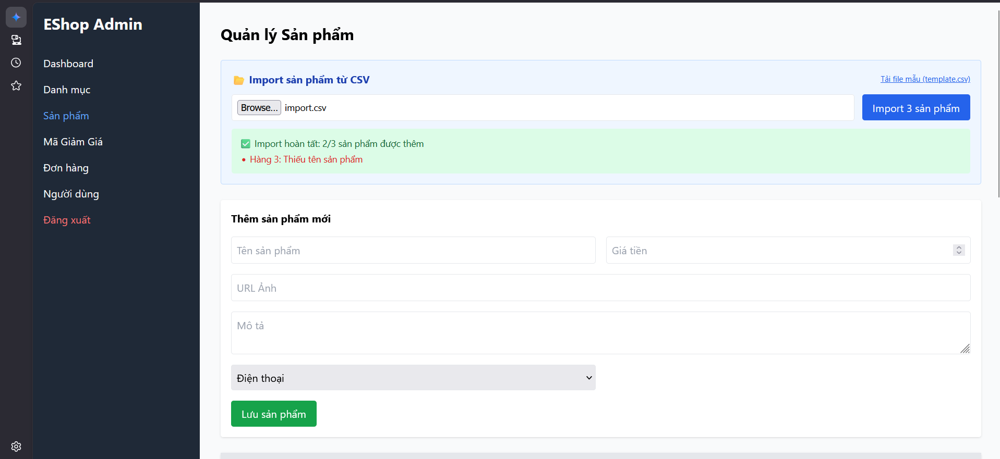

# Bug ID: `FR16-bug-07`

## Bug description:
Hệ thống không thực hiện cơ chế Transaction (giao dịch nguyên tử — All-or-Nothing Rollback). Theo đặc tả FR-16: "Nếu có lỗi ở bất kỳ dòng nào, toàn bộ import phải được rollback". Tuy nhiên, backend API thực hiện chèn dữ liệu từng dòng độc lập mà không sử dụng giao dịch (Transaction) trong SQLite. Do đó, khi trong file CSV chứa cả hàng hợp lệ và hàng lỗi, hệ thống vẫn lưu các dòng hợp lệ vào cơ sở dữ liệu thay vì rollback toàn bộ.

## Test case coverage: 
- `TC-FR16-17` (Giao dịch nguyên tử (All-or-Nothing Rollback) khi có ít nhất một dòng dữ liệu bị lỗi trong số nhiều dòng dữ liệu đúng)

## Preconditions: 
1. Người dùng đăng nhập hệ thống với tài khoản Admin (`role = 'admin'`).
2. Người dùng đang ở màn hình Import sản phẩm từ file CSV.

## Test steps: 
1. Tải lên file CSV chứa 4 dòng dữ liệu sản phẩm, trong đó dòng số 4 có thuộc tính không hợp lệ (Ví dụ: giá trị âm và giả sử backend chặn hoặc dòng đó bị lỗi cơ sở dữ liệu), các dòng còn lại hợp lệ.
2. Nhấp nút "Import".
3. Kiểm tra cơ sở dữ liệu xem các sản phẩm ở các dòng hợp lệ có bị lưu vào hay không.

## Expected results: 
1. Hệ thống thực hiện rollback toàn bộ giao dịch, không có sản phẩm nào (kể cả ở dòng hợp lệ) được thêm vào cơ sở dữ liệu.
2. Giao diện hiển thị thông báo lỗi chi tiết của dòng bị lỗi, số dòng import thành công hiển thị là 0.

## Actual results: 
1. Hệ thống không thực hiện rollback. Tất cả các hàng hợp lệ vẫn được thêm thành công vào cơ sở dữ liệu.
2. Hơn nữa, vì hệ thống thiếu validation trên backend (như giá âm ở hàng 4 vẫn được lưu), nên tất cả 4/4 sản phẩm đều được thêm vào DB thành công.
3. Giao diện báo cáo import thành công toàn bộ sản phẩm thay vì rollback và hiển thị lỗi.

### Bug screenshot: 

- Chụp màn hình bug và lưu tại: `./bugs/FR16/images/FR16-bug-07-01.png` và `./bugs/FR16/images/FR16-bug-07-02.png`
- Nhúng các screenshot bug tại đây:
  
  
