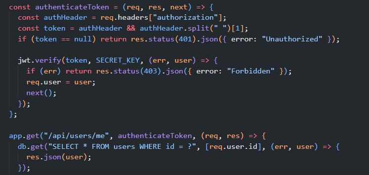
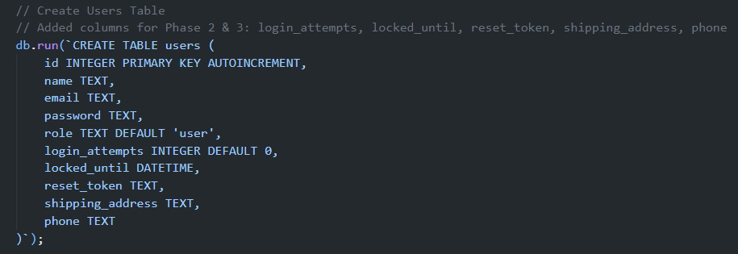

# [HW5][Performance][BUG][Users API] GET /api/users/me trả về trực tiếp user row có password và reset_token

## Found by Test Case

- `AUTH_HEAVY / SPIKE` — `GET /api/users/me`.
- Discovered during HW05 source verification and response-contract preparation for the authenticated SPIKE scenario.
- Confirmation method: `SOURCE_VERIFICATION`; no new runtime request was executed while creating this report.

## Requirement liên quan

- `api_specification.md:59-64`: `GET /api/users/me` là API lấy thông tin cá nhân và yêu cầu Bearer token.
- `README.md:62-67` (`FR-04`): chức năng hồ sơ chỉ nêu thông tin cá nhân cơ bản.
- `README.md:278-280` (`SEC-01` đến `SEC-03`): password và API bảo mật cần được xử lý an toàn.

`api_specification.md` không có response schema chi tiết riêng cho endpoint này. Tuy vậy, `backend/database.js:50-61` xác nhận row `users` thực sự có `password`, `reset_token`, `login_attempts`, `locked_until`, `phone` và `shipping_address`; implementation hiện trả nguyên row đó thay vì projection fields cho profile.

## Severity / Priority

- **Severity:** Major
- **Priority:** P1
- **Classification:** `SECURITY` / `DATA_MINIMIZATION` / `CORRECTNESS`
- **Evidence Quality:** `CONFIRMED`

## Environment

- **Tool:** Source Inspection; HW05 JMeter context
- **OS:** Windows 11
- **Backend:** Node.js / Express.js
- **Database:** SQLite
- **Scenario:** `AUTH_HEAVY / SPIKE`
- **Endpoint:** `GET /api/users/me`

## Steps to reproduce

1. Chuẩn bị tài khoản hợp lệ trong disposable runtime.
2. Gửi `GET http://localhost:3000/api/users/me` với `Authorization: Bearer <valid_token>`.
3. Quan sát các key của response; không ghi hoặc chia sẻ giá trị nhạy cảm.
4. Đối chiếu với implementation hiện tại, vốn lấy toàn bộ user row rồi serialize trực tiếp.

## Expected result

Response chỉ chứa profile fields cần thiết theo contract, ví dụ `id`, `name`, `email` và các field profile được phép. Response không được trả `password`, `reset_token` hoặc field nội bộ không cần thiết.

## Actual result

`backend/server.js:112-115` dùng `SELECT *` và trả nguyên đối tượng `user`:

```js
db.get("SELECT * FROM users WHERE id = ?", [req.user.id], (err, user) => {
  res.json(user);
});
```

`backend/database.js:50-61` định nghĩa các cột `password`, `reset_token`, `login_attempts`, `locked_until`, `phone` và `shipping_address` trong `users`. Vì vậy response path hiện không có projection hoặc filter cho các field nhạy cảm/nội bộ này. Đây là source-backed exposure path; không cần suy luận từ metric performance hoặc runtime response chưa được chạy lại.

## Evidence

### Source Evidence

- `backend/server.js:100-115`: middleware xác thực tồn tại, nhưng handler `GET /api/users/me` truy vấn `SELECT *` và gọi `res.json(user)`.
- `backend/database.js:50-61`: schema hiện hành xác nhận `password` và `reset_token` là cột thực tế của `users`.





### HW05 Test Evidence

- Scenario: `AUTH_HEAVY / SPIKE`.
- Raw JTL facts: `2123` samples, `2123` successful, `0` failed, p95 `4 ms`, p99 `6 ms`.
- Các số liệu này chỉ là context của performance workflow. `0%` error không chứng minh response an toàn hoặc xác nhận correctness/security.

### Requirement Evidence

- `api_specification.md:59-64` và `README.md:62-67`, `213-216`, `274-280` như mô tả ở trên.

## Impact

Authenticated caller nhận response có các field `password` và `reset_token` cùng dữ liệu nội bộ không cần thiết cho profile. Endpoint vẫn yêu cầu JWT, nên impact được xếp `Major/P1` thay vì `Critical/P0`; tuy nhiên việc trả raw credential/reset data vẫn vi phạm data-minimization boundary và mở rộng attack surface.

## Suggested fix

Chỉ select/serialize explicit public profile fields và xử lý trường hợp database error/user absent theo contract an toàn.

```js
db.get(
  "SELECT id, name, email, phone, shipping_address FROM users WHERE id = ?",
  [req.user.id],
  // return only the approved profile DTO
);
```

Field set cuối cùng cần được Student/owner review để phù hợp API contract. Performance benefit từ payload projection: `UNPROVEN` cho đến khi có benchmark comparable sau khi plan/assertion được review.

## Performance note

`NOT_A_CONFIRMED_PERFORMANCE_ISSUE`

Issue được phát hiện trong HW05 performance workflow nhưng evidence hiện có không chứng minh payload projection sẽ cải thiện latency, p95, p99 hay throughput. Không có confirmed performance regression được tạo từ issue này.

## Kết quả Human Review

- **Status:** `CONFIRMED`
- **Evidence Quality:** `CURRENT_SOURCE` + `CURRENT_SCHEMA` + `SUPPORTING_REQUIREMENT`
- **Requirement Support:** Profile endpoint có scope thông tin cá nhân; không có response schema chi tiết, nhưng `SEC-01` hỗ trợ boundary không trả credential/reset data.
- **Severity / Priority quyết định:** `Major` / `P1`.
- **Classification quyết định:** `SECURITY` / `DATA_MINIMIZATION` / `CORRECTNESS`.
- **Recommended Labels:** `bug`, `hw05-perf-testing`, `security`.
- **GitHub Readiness:** `READY_FOR_GITHUB`.
- **Traceability correction:** Priority được điều chỉnh từ generated `P0` thành `P1`; source schema `backend/database.js` thay cho tham chiếu gián tiếp đến tài liệu Task 2.

## GitHub Issue

- **Issue URL:** [#291](https://github.com/DuyITLOR/group05_eshop/issues/291)

## Related Existing Issue

- **Issue:** [#64](https://github.com/DuyITLOR/group05_eshop/issues/64)
