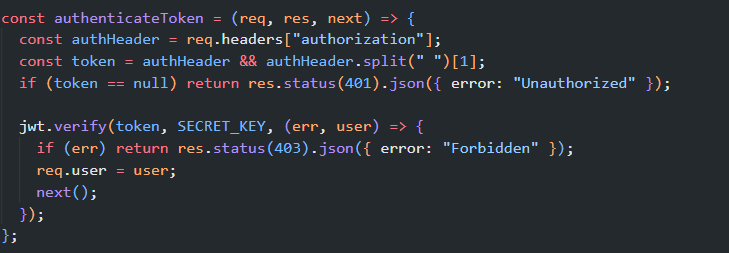
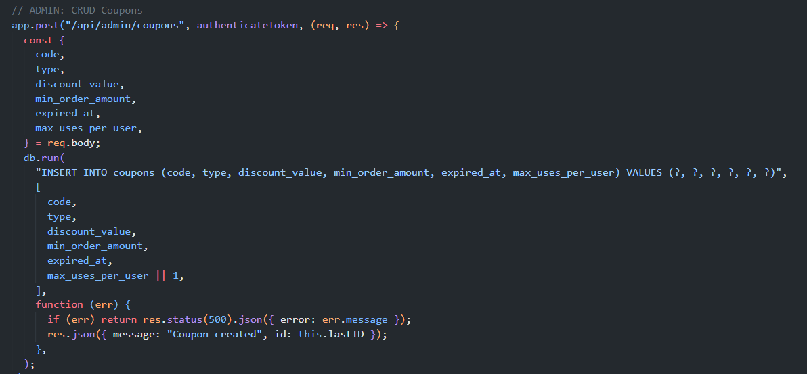

# [HW5][Performance][BUG][Coupons API] POST /api/admin/coupons không kiểm tra quyền Admin ở phía server

## Found by Test Case

- `TRANSACTIONAL / STRESS` — `POST /api/admin/coupons`.
- Discovered during source verification and plan review for the production STRESS scenario.
- Confirmation method: `SOURCE_VERIFICATION`; no mutating request was executed while creating this report.

## Requirement liên quan

- `README.md:174-180` (`FR-12`): mọi API `/api/admin/*` phải yêu cầu JWT hợp lệ và `role = 'admin'` trong token.
- `README.md:213-216` (`FR-17`): Coupon CRUD là chức năng Admin.
- `README.md:278-280` (`SEC-02`, `SEC-03`): API bảo mật cần JWT hợp lệ và API Admin phải kiểm tra role, không chỉ token existence.
- `api_specification.md:202-214`: `POST /api/admin/coupons` thuộc quản lý coupon Admin.

## Severity / Priority

- **Severity:** Major
- **Priority:** P0
- **Classification:** `SECURITY` / `AUTHORIZATION` / `CORRECTNESS`
- **Evidence Quality:** `CONFIRMED`

## Environment

- **Tool:** Source Inspection; HW05 JMeter context
- **OS:** Windows 11
- **Backend:** Node.js / Express.js
- **Database:** SQLite
- **Scenario:** `TRANSACTIONAL / STRESS`
- **Endpoint:** `POST /api/admin/coupons`

## Steps to reproduce

1. Trong disposable runtime, lấy token của một user có `role` khác `admin` và lưu dưới placeholder `<non_admin_token>`.
2. Gửi `POST http://localhost:3000/api/admin/coupons` với `Authorization: Bearer <non_admin_token>`.
3. Dùng body coupon hợp lệ với `code` duy nhất; không dùng source database hoặc production data.
4. Quan sát source/current behavior: handler chỉ dùng `authenticateToken`, sau đó thực hiện `INSERT` mà không kiểm tra `req.user.role`.

## Expected result

Server phải từ chối token không có `role = 'admin'`, ví dụ HTTP `403`, và không được ghi coupon mới. Chỉ Admin được phép thực hiện Coupon CRUD.

## Actual result

`backend/server.js:457-480` bảo vệ route bằng `authenticateToken` nhưng không có nhánh kiểm tra role trước khi chạy `INSERT INTO coupons`:

```js
app.post("/api/admin/coupons", authenticateToken, (req, res) => {
  const { code, type, discount_value, min_order_amount, expired_at, max_uses_per_user } = req.body;
  db.run("INSERT INTO coupons (...) VALUES (?, ?, ?, ?, ?, ?)", [/* request fields */], ...);
});
```

`authenticateToken` tại `backend/server.js:100-109` chỉ verify JWT và gán `req.user`; handler không đọc `req.user.role`.

## Evidence

### Source Evidence

- `backend/server.js:100-109`: JWT verification populates `req.user`.
- `backend/server.js:457-480`: coupon create route has no server-side role guard before write.
- `docs/performance-design/stress-admin-coupons-design.md:33-35`: implementation classified `NOT_IMPLEMENTED` for admin role enforcement.





### HW05 Test Evidence

- Scenario: `TRANSACTIONAL / STRESS`.
- Raw JTL facts: `1687` samples, `1687` successful, `0` failed, p95 `8 ms`, p99 `16 ms`.
- The approved STRESS run used authorized setup and does not test non-admin authorization. These facts do not prove that role enforcement works.

### Requirement Evidence

- `README.md:174-180`, `213-216`, `278-280` and `api_specification.md:202-214` require Admin-only coupon management as cited above.

## Impact

Any authenticated non-admin account can reach an Admin coupon write path if it supplies an otherwise acceptable request. This can create unauthorized coupon records and violate both authorization and data-integrity expectations. Đây là write authorization bypass có thể khai thác bởi user đã xác thực, nhưng evidence hiện không chứng minh account takeover, arbitrary database access, hoặc tác động tài chính đã xảy ra; mức quyết định là `Major/P0`, không phải `Critical/P0`.

## Suggested fix

Add an explicit role guard after JWT authentication and before request processing/database writes.

```js
if (req.user.role !== "admin") {
  return res.status(403).json({ error: "Forbidden" });
}
```

Add API tests for Admin and non-admin tokens. Any future STRESS rerun requires a reviewed plan/data update if the authorization behavior changes.

## Performance note

`NOT_A_CONFIRMED_PERFORMANCE_ISSUE`

This is a confirmed authorization/security defect, not a measured latency defect. The current STRESS JTL does not establish a performance benefit from adding the role guard.

## Kết quả Human Review

- **Status:** `CONFIRMED`
- **Evidence Quality:** `CURRENT_SOURCE` + `AUTHORITATIVE_REQUIREMENT` + `DOCUMENTED_API_CONTRACT`.
- **Requirement Support:** `README.md:174-180` (`FR-12`), `README.md:213-216` (`FR-17`), `README.md:278-280` (`SEC-02`, `SEC-03`) và `api_specification.md:171-214`.
- **Severity / Priority quyết định:** `Major` / `P0`.
- **Classification quyết định:** `SECURITY` / `AUTHORIZATION` / `CORRECTNESS`.
- **Recommended Labels:** `bug`, `hw05-perf-testing`, `security`.
- **GitHub Readiness:** `READY_FOR_GITHUB`.
- **Traceability correction:** Severity được điều chỉnh từ generated `Critical` thành `Major`; `P0` được giữ vì non-admin authenticated caller có thể tạo coupon trái phép trên Admin write path.

## GitHub Issue

- **Issue URL:** [#290](https://github.com/DuyITLOR/group05_eshop/issues/290)

## Related Existing Issue

- **Issue:** [#262](https://github.com/DuyITLOR/group05_eshop/issues/262)
- **Mapping note:** Issue #262 là root authorization issue bao phủ `POST /api/admin/coupons`; không tạo issue con trùng behavior.
