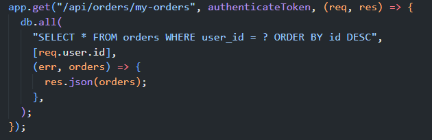
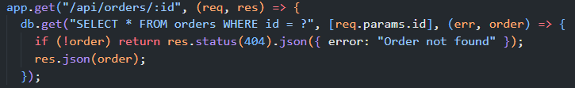

# [HW5][Performance][BUG][Orders API] GET /api/orders/:id thiếu authentication hoặc ownership enforcement theo requirement

## Found by Test Case

- `READ_HEAVY / LOAD` — `GET /api/orders/:id`.
- Discovered during source verification for the production LOAD plan.
- Confirmation method: `SOURCE_VERIFICATION` and `REQUIREMENT_VERIFICATION`; no request was executed while creating this report.

## Requirement liên quan

- `api_specification.md:110-146`: phần Cart & Orders yêu cầu `Authorization: Bearer <token>` và documents `GET /api/orders/:id`.
- `README.md:164-168` (`FR-11`): người dùng chỉ xem được đơn hàng của chính mình.
- `README.md:278-280` (`SEC-02`): API có tính bảo mật phải yêu cầu JWT token hợp lệ.

`README.md` tự xác định là System Requirements Specification và mô tả yêu cầu nghiệp vụ đúng của EShop. Vì vậy `FR-11` là nguồn `AUTHORITATIVE` cho ownership; API specification là nguồn hỗ trợ cho authentication/order-detail endpoint. Issue không chỉ dựa vào generic security best practice.

## Severity / Priority

- **Severity:** Major
- **Priority:** P0
- **Classification:** `SECURITY` / `AUTHORIZATION` / `CORRECTNESS`
- **Evidence Quality:** `CONFIRMED`

## Environment

- **Tool:** Source Inspection; HW05 JMeter context
- **OS:** Windows 11
- **Backend:** Node.js / Express.js
- **Database:** SQLite
- **Scenario:** `READ_HEAVY / LOAD`
- **Endpoint:** `GET /api/orders/:id`

## Steps to reproduce

1. Trong disposable runtime, xác định `<another_user_order_id>` thuộc về user khác.
2. Gửi `GET http://localhost:3000/api/orders/<another_user_order_id>` không kèm Authorization header, hoặc với `<non_owner_token>`.
3. Quan sát source/current behavior: route chỉ filter theo order id và không gọi `authenticateToken` hoặc compare `orders.user_id` với caller identity.
4. So sánh với rule FR-11: user chỉ được xem đơn của chính mình.

## Expected result

Order detail phải yêu cầu JWT hợp lệ và chỉ trả order khi `orders.user_id` khớp authenticated user, hoặc trả controlled `401`/`403`/`404` theo API contract. Caller không phải owner không được nhận full order record.

## Actual result

`backend/server.js:344-348` không có middleware hoặc owner filter:

```js
app.get("/api/orders/:id", (req, res) => {
  db.get("SELECT * FROM orders WHERE id = ?", [req.params.id], (err, order) => {
    if (!order) return res.status(404).json({ error: "Order not found" });
    res.json(order);
  });
});
```

Route trả toàn bộ order found theo `id`, không dùng token hay `orders.user_id`.

## Evidence

### Source Evidence

- `backend/server.js:311-318` đã dùng `authenticateToken` và `WHERE user_id = ?` cho `/api/orders/my-orders`.
- `backend/server.js:344-348` thiếu cả hai control trên cho order detail.
- `docs/performance-analysis/task2-optimization-human-review.md:55-64` xác nhận owner-scoping capability tồn tại trong schema nhưng chưa dùng ở detail route.





### HW05 Test Evidence

- Scenario: `READ_HEAVY / LOAD`.
- Raw JTL facts: `1250` samples, `1250` successful, `0` failed, p95 `2 ms`, p99 `3 ms`.
- LOAD run dùng fixture/token approved; success/error metrics không xác nhận owner-authorization coverage.

### Requirement Evidence

- `README.md:164-168`, `278-280` và `api_specification.md:57-64,139-146` như mô tả ở trên.

## Impact

Người không phải owner, hoặc caller không có token, có thể đọc order theo predictable identifier nếu route được expose. Điều này có thể làm lộ thông tin đơn hàng và vi phạm authorization boundary của user order history/detail.

## Suggested fix

Yêu cầu JWT và scope query theo caller identity trước khi serialize response.

```js
app.get("/api/orders/:id", authenticateToken, (req, res) => {
  db.get(
    "SELECT id, total_amount, status, created_at FROM orders WHERE id = ? AND user_id = ?",
    [req.params.id, req.user.id],
    // return a controlled not-found/forbidden response
  );
});
```

Add owner/non-owner/no-token API tests. Đây là contract/security change, nên LOAD design/JMX/assertion cần review trước future comparable rerun. Performance benefit từ response projection/auth check: `UNPROVEN`.

## Performance note

`NOT_A_CONFIRMED_PERFORMANCE_ISSUE`

Issue là authorization/correctness defect được phát hiện trong performance workflow. LOAD metrics thấp không chứng minh issue này là performance defect, cũng không đo benefit của remediation.

## Kết quả Human Review

- **Status:** `CONFIRMED`
- **Evidence Quality:** `CURRENT_SOURCE` + `AUTHORITATIVE_REQUIREMENT` + `DOCUMENTED_API_CONTRACT`.
- **Requirement Source:** `README.md` — Đặc tả Yêu cầu Hệ thống (System Requirements Specification).
- **Requirement Identifier:** `FR-11`; supporting security requirement `SEC-02`.
- **Requirement Statement:** Người dùng chỉ xem được đơn hàng của chính mình; API có tính bảo mật phải yêu cầu JWT token hợp lệ.
- **Severity / Priority quyết định:** `Major` / `P0`.
- **Classification quyết định:** `SECURITY` / `AUTHORIZATION` / `CORRECTNESS`.
- **Recommended Labels:** `bug`, `hw05-perf-testing`, `security`.
- **GitHub Readiness:** `READY_FOR_GITHUB`.
- **Traceability correction:** Requirement evidence được phân loại `AUTHORITATIVE` dựa trên `README.md:1-6,164-168`; source observation không đổi.

## GitHub Issue

- **URL:** [#292](https://github.com/DuyITLOR/group05_eshop/issues/292)

## Related Existing Issue

- **Issue:** [#288](https://github.com/DuyITLOR/group05_eshop/issues/288)
