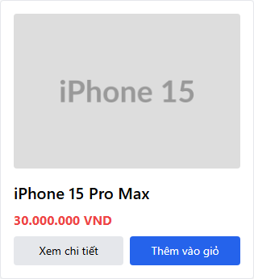

# Title

[HW04][BUG][FR-05][Product Listing] Ảnh sản phẩm có thuộc tính alt rỗng

# Body

## Found by Test Case

`FR05-TC-004`

## Related Requirements

`FR05-R02C`

## Severity / Priority

Severity: `Medium`; Priority: `P2`.

Reason: Product image trong catalog đã kiểm tra có alternative text rỗng, gây ảnh hưởng accessibility trên cả ba browser.

## Environment

| Field                       | Value                                                                                                                                                    |
| --------------------------- | -------------------------------------------------------------------------------------------------------------------------------------------------------- |
| SUT / Feature / Module      | EShop / FR-05 — Product listing and search / Product Listing                                                                                             |
| Browser(s)                  | Chromium, Firefox, WebKit                                                                                                                                |
| OS / Viewport / Zoom        | `NOT_RECORDED_AT_EXECUTION` / `NOT_RECORDED_AT_EXECUTION` / `NOT_RECORDED_AT_EXECUTION`                                                                  |
| Frontend / Backend URL      | `http://localhost:5173` / `http://localhost:3000`                                                                                                        |
| Dataset / Fixture           | `FR05-DATA-001` — approved seed catalog gồm năm product                                                                                                  |
| Execution Date / SUT Commit | 2026-08-09 / `NOT_RECORDED_AT_EXECUTION`                                                                                                                 |
| Run IDs                     | `FR-05-chromium-rerun-tc006-fix-2026-08-09T19-40-49-6875324Z`; `FR-05-firefox-2026-08-09T19-58-55-6329954Z`; `FR-05-webkit-2026-08-09T20-00-12-2824300Z` |

## Preconditions

Public home page khả dụng với approved seed catalog gồm năm product.

## Steps to Reproduce

1. Mở public home page.
2. Xác định `iPhone 15 Pro Max`.
3. Kiểm tra thuộc tính `alt` của product image.

## Expected Result

Mỗi controlled product image có trimmed `alt` value không rỗng.

## Actual Result

Image tồn tại nhưng `alt` là `""`.

## Reproducibility

`Always`

Lỗi được reproduce nhất quán trên Chromium, Firefox và WebKit.

## Impact

Người dùng screen reader không nhận được alternative text có ý nghĩa cho product image bị ảnh hưởng.

## Browser Coverage

Chromium, Firefox và WebKit: `FAILED` — `PRODUCT_DEFECT`. Xem `docs/execution-results/fr-05-cross-browser-summary.md`.

## Evidence

### Screenshot

 hiển thị product card; screenshot không thể chứng minh thuộc tính không hiển thị trực quan.

### Automation Evidence

`docs/defects/fr-05/runtime-evidence.md` ghi nhận `alt=""`; execution records và HTML reports được liên kết từ `docs/defects/fr-05/FR05-BUG-001-empty-image-alt.md`.

## Technical Observation

UI output quan sát được có thuộc tính `alt` rỗng; root cause chưa được điều tra độc lập.

## Status

`OPEN` — `PRODUCT_DEFECT`; trạng thái publish: `NOT_PUBLISHED`.

## Hashtags

#HW04 #BUG #FR05 #ProductListing #SeverityMedium #PriorityP2 #Chromium #Firefox #WebKit #CrossBrowser #Accessibility

## Suggested GitHub Labels

`bug`, `hw04`, `fr-05`, `severity:medium`, `priority:p2`, `accessibility`, `cross-browser`
